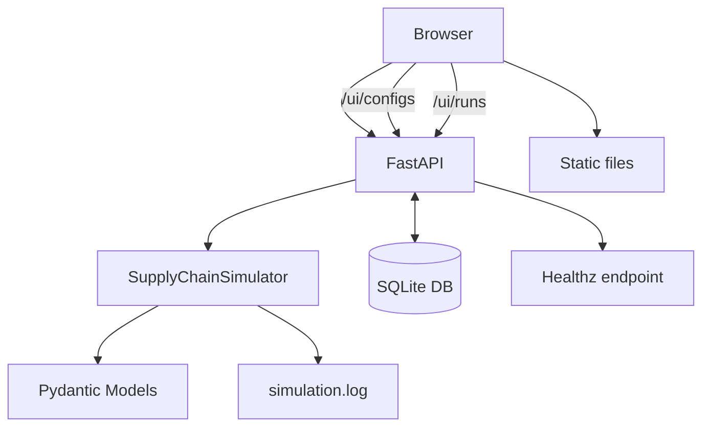
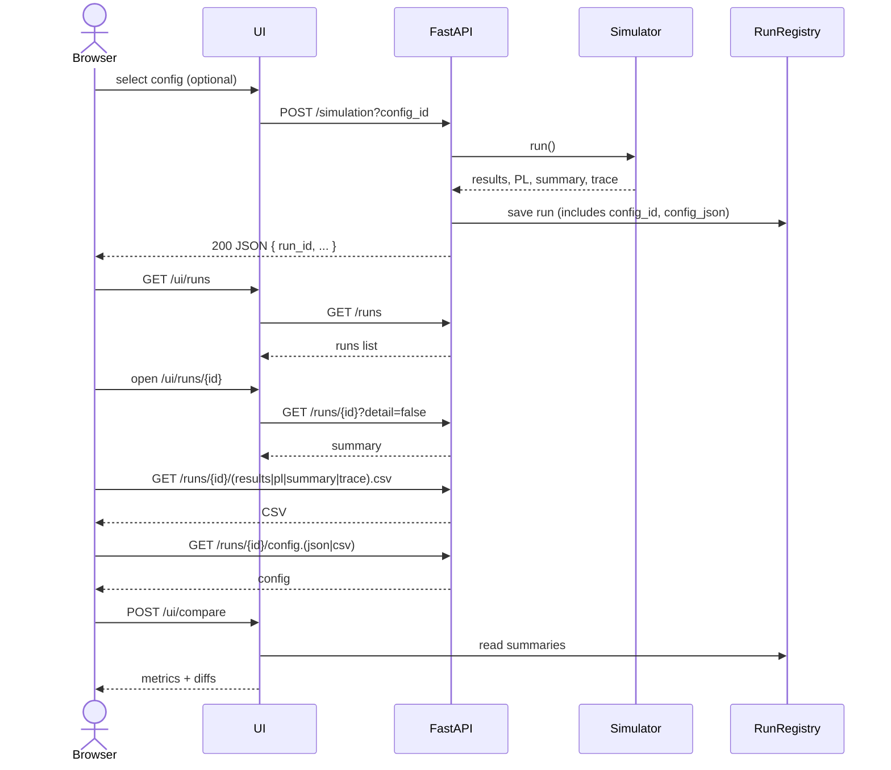

# サプライチェーン計画シミュレーション

[](https://github.com/miumigy/scpln/actions/workflows/ci.yml)

サプライチェーン（店舗/倉庫/工場/資材）をノード/リンクで記述し、需要伝播・在庫/生産・コスト計上を日次でシミュレートします。RunRegistry に実行履歴を保持し、UI から履歴参照・比較・CSVエクスポートが可能です。

## 目次

- 概要 / 構成
- 主な機能
- クイックスタート（起動・停止）
- Web UI ガイド
- API リファレンス（/simulation, /runs, /compare, /jobs, /healthz）
- CSV エクスポート
- RunRegistry の仕様
- 運用コマンド / 環境変数
- 図解（アーキテクチャ / クラス / 時系列）
- 入出力スキーマ（詳細）
- コストトレース仕様（概要）
 - [拡張戦略（エンタープライズ対応）](#拡張戦略エンタープライズ対応)

## 概要 / 構成

```
.
├── main.py                 # エントリ（main:app）。副作用importでAPI/UIを登録
├── app/                    # API/UIモジュール（/simulation, /runs, /compare, /ui/* など）
├── domain/                 # Pydantic モデル定義
├── engine/                 # シミュレーションエンジン
├── static/                 # UI 静的ファイル
├── templates/              # Jinja2 テンプレート
├── scripts/                # 起動/停止/状態確認スクリプト
└── tests/                  # ユニットテスト
```

- 互換API/インポート: `uvicorn main:app`、`from main import SimulationInput, SupplyChainSimulator`
- 物流フローの一元管理: `pending_shipments` に統一（到着日キー）

## 主な機能

- 柔軟な入力: 製品BOM、ノード/リンク、需要モデルをJSONで定義
- 在庫補充: サービスレベルに基づく発注点/目標在庫、MOQ/発注倍数（ノード/リンク両対応）
- 需要伝播・リードタイム・バックオーダー処理
- 収支（固定/変動費）・キャパシティ超過コスト
- UI: タブ表示、フィルタ、CSV ダウンロード
- RunRegistry: 実行履歴の保持・比較・CSV

## クイックスタート（起動・停止）

```bash
bash scripts/serve.sh           # 起動（RELOAD=1 でホットリロード）
bash scripts/status.sh          # 状態確認（PID/ヘルス/ログ）
bash scripts/stop.sh            # 停止
```

アクセス: `http://localhost:8000`（ヘッダ右「ラン履歴」「設定マスタ」は別タブ遷移）

## Web UI ガイド

- メイン画面（index.html）: 入力JSON編集、結果/PL/サマリの表示とCSVダウンロード
  - 設定マスタバー: プルダウン選択で設定を自動読込（change）、『設定マスタ読込』で一覧再取得
- 設定マスタ: `GET /ui/configs`（SQLite 永続化）
  - 一覧/新規/編集/削除
  - 「エディタで開く」で `/?config_id=ID` を付与してメイン画面へ
- ラン履歴: `GET /ui/runs`
  - Refresh: `GET /runs` で一覧再取得
  - チェックボックス → Compare フォームに反映（Use selected）
  - ページャ: 画面下の Prev/Next/Limit で `offset/limit` を制御（サーバは `total/offset/limit` を返却）
  - ソート/フィルタ: Sort/Order セレクトと Schema/Config ID で条件を指定（APIの `sort/order/schema_version/config_id` に連動）
- ラン詳細: `GET /ui/runs/{run_id}`
  - Summary 表示、Artifacts 件数
  - CSV/JSON リンク（results/pl/summary/trace, config.json/config.csv）
  - Refresh summary from API: `GET /runs/{id}?detail=false`
  - Delete: 右下の [Delete this run] でRun削除（確認ダイアログあり）
  
- ジョブ一覧: `GET /ui/jobs`
  - ステータスフィルタ（queued/running/succeeded/failed）、ページング（Prev/Next）
  - 列: `job_id, type, status, submitted_at, started_at, finished_at, run_id`
  - `run_id` からラン詳細へリンク
- ジョブ詳細: `GET /ui/jobs/{job_id}`
  - ステータス・タイムスタンプ・`run_id`リンク・`error`表示
  - 失敗時は [Retry] ボタン、キュー中は [Cancel] ボタンが表示
- 比較UI: `POST /ui/compare`（run_ids カンマ区切り）で metrics/diffs 表示
  - Base/Threshold: 比較画面でベースRunと閾値(%)を指定可能（閾値超えをハイライト）
  - CSV: metrics.csv / diffs.csv をダウンロード（Base/Thresholdをメタ行として含む）

## API リファレンス

- `POST /simulation`
  - クエリ: `include_trace`（bool, 既定 false）
  - クエリ: `config_id`（int｜省略可）選択した設定のID。RunRegistry に保存されます
  - レスポンス: `run_id`, `results`, `daily_profit_loss`/`profit_loss`, `summary`, `cost_trace`
  - 実行記録は RunRegistry に保存

- `GET /runs`
  - 既定: 軽量（`run_id`, `started_at`(ms), `duration_ms`, `schema_version`, `summary`）
  - ページング: `?offset=0&limit=50`（`1..100`）をサポート。レスポンスに `total/offset/limit` を含む
  - ソート/フィルタ: `?sort=started_at|duration_ms|schema_version&order=desc|asc&schema_version=1.0&config_id=123`
  - `?detail=true`: フル（`results`/`daily_profit_loss`/`cost_trace`含む、ページング適用）。既定 `limit=10`。`limit>10` は `400 Bad Request`
  - DBバックエンド時はSQLでソート/フィルタ/ページング（`total` は `COUNT(*)`）

- `GET /runs/{run_id}`
  - 既定: 軽量メタ＋`summary`
  - `?detail=true`: フル（サイズ注意）
  
- `DELETE /runs/{run_id}`
  - 指定したRunを削除（メモリ/DBいずれも対応）。運用注意（認可未実装）

- `POST /compare`
  - ボディ: `{ "run_ids": ["<id1>", "<id2>", ...] }`
  - クエリ: `threshold`（省略可, %）。`diffs[*][metric]` に `hit` を付与
  - クエリ: `base_id`（省略可）。ベースを指定順に固定
  - レスポンス: `metrics`（runごとの主要KPI）と `diffs`（ベース基準の差分）。`threshold/base_id` を含む場合あり

- `GET /healthz`: ヘルスチェック

- ジョブ（Jobs）
  - `POST /jobs/simulation`: シミュレーションをジョブとして投入。ボディは `SimulationInput`、レスポンス `{ job_id }`
  - `GET /jobs/{job_id}`: ジョブの状態を取得（`status=queued|running|succeeded|failed`, `run_id`, `error`, `submitted_at/started_at/finished_at`）
  - `GET /jobs?status=&offset=&limit=`: ジョブ一覧（ページング）。`status` フィルタ対応
  - 備考: 既存 `POST /simulation` は従来通り。将来フラグでジョブ化に委譲可能
  - `POST /jobs/{job_id}/retry`（failed/canceled のみ）: 再キュー投入（`{"params": SimulationInput}`でパラメータ上書き可）
  - `POST /jobs/{job_id}/cancel`（queued のみ）: キャンセル（`status=canceled`）
  - `POST /jobs/aggregate`: 集計ジョブの投入（時間×商品×場所のロールアップ）
    - ボディ例:
      ```json
      {
        "run_id": "<run_id>",
        "dataset": "pl",        
        "bucket": "week",        
        "group_keys": ["node","item"],
        "sum_fields": ["qty","revenue"],
        "product_key": "item",
        "product_level": "category",
        "product_map": {"SKU1": {"category": "C1"}},
        "location_key": "node",
        "location_level": "region",
        "location_map": {"S1": {"region": "R1"}}
      }
      ```
    - 時間集計の厳密カレンダー対応（任意指定）:
      - `date_field`: レコード内の日付/日時フィールド名（例: `"date"`, `"timestamp"`）。指定時は日付ベースで集計
      - `tz`: タイムゾーン（例: `"Asia/Tokyo"`）。UTCやオフセットなしのISO文字列に適用
      - `calendar_mode`: 週の集計方式（`"iso_week"` を指定すると ISO 週番号で集計）
      - 例（ISO週＋JSTで集計）:
        ```json
        {
          "run_id": "<run_id>",
          "dataset": "pl",
          "bucket": "week",
          "group_keys": ["node","item"],
          "date_field": "date",
          "tz": "Asia/Tokyo",
          "calendar_mode": "iso_week"
        }
        ```
      - 挙動:
        - `date_field` 指定時は `bucket=day|week|month` に応じて `YYYY-MM-DD` / `YYYY-Www` / `YYYY-MM` で期間キーを生成
        - `date_field` 未指定時は従来の `day` 整数を基準に `week_start_offset`/`month_len` で集計（後方互換）
        - レコードに `day` と日付の両方がある場合は日付優先
    - レスポンス: `{ "job_id": "..." }`
  - `GET /jobs/{job_id}/result.json` / `GET /jobs/{job_id}/result.csv`: 集計結果の取得（成功時）

- 設定マスタ（Configs）
  - `GET /configs`: 一覧（id, name, created_at/updated_at）
  - `GET /configs/{id}`: 詳細（name, json_text, config(JSON)）
  - `POST /configs`（Form: `name`, `json_text`）: 追加
  - `PUT /configs/{id}`（Form: `name`, `json_text`）: 更新
  - `DELETE /configs/{id}`: 削除

## CSV エクスポート（Runごと）

- `GET /runs/{run_id}/results.csv`: 実行結果
- `GET /runs/{run_id}/pl.csv`: 日次PL
- `GET /runs/{run_id}/summary.csv`: サマリ（`run_id,metric,value`）
- `GET /runs/{run_id}/trace.csv`: コストトレース
- `GET /runs/{run_id}/config.json`: 実行時に使用した設定（config_id と config 本文）
- `GET /runs/{run_id}/config.csv`: 上記を1行CSVでダウンロード

出力ルール
- ネスト辞書はドット区切りでフラット化（例: `flow_costs.production_fixed`）
- 配列は JSON 文字列として埋め込み
- レコードが空でもヘッダは返却
- CSVは `Content-Disposition` を付与し、`text/csv; charset=utf-8` で配信

## RunRegistry の仕様

- プロセス内メモリに最近順で保持（既定50件）
- 保存内容（主な項目）: `run_id`, `started_at`(ms), `duration_ms`, `schema_version`, `summary`, `results`, `daily_profit_loss`, `cost_trace`, `config_id`, `config_json`
- 参照API: `/runs`, `/runs/{id}`（上記参照）

## 運用コマンド / 環境変数

- コマンド: `serve.sh`, `stop.sh`, `status.sh`, `health.sh`
- `SIM_LOG_LEVEL`（既定 INFO）、`SIM_LOG_TO_FILE=1`（ファイル出力）
- `REGISTRY_CAPACITY`（既定 50）: RunRegistry のメモリ保持件数
- `REGISTRY_BACKEND=memory|db`（既定 memory）: RunRegistry のバックエンド選択（`db` でSQLite永続化）
- `SCPLN_DB`（既定 `data/scpln.db`）: SQLite DBパス
- `SIM_LOG_JSON=1`（既定 0）: ログをJSONで出力（`timestamp, level, message, request_id, run_id, ...`）
- `RUNS_DB_MAX_ROWS`（既定 0=無効）: DBバックエンド時、保持する最新Run件数の上限（超過は古い順に自動削除）
 - `JOBS_ENABLED`（既定 1）: ジョブワーカーの有効化
 - `JOBS_WORKERS`（既定 1）: ワーカースレッド数

メトリクス（Prometheus）
- `runs_total`（Counter）: シミュレーション実行回数
- `simulation_duration_ms`（Histogram）: 実行時間（ms）
- `http_requests_total{method,path,status}`（Counter）: HTTPリクエスト数
- `http_request_duration_seconds{method,path,status}`（Histogram）: HTTPレイテンシ（秒）
 - `jobs_enqueued_total{type}`/`jobs_completed_total{type}`/`jobs_failed_total{type}`（Counter）
 - `jobs_duration_seconds{type}`（Histogram）

ログの例（JSON）
```json
{"timestamp":"2025-08-21T03:12:34.567890+00:00","level":"INFO","logger":"root","message":"run_completed","module":"simulation_api","function":"post_simulation","line":48,"request_id":"fbc2...","run_id":"c3a...","event":"run_completed","duration":1234,"results":120,"pl_days":30,"trace_events":456,"schema":"1.0"}
```

ログイベント（主要）
- `http_request_start`: リクエスト開始（`method, path, request_id`）
- `http_request`: リクエスト完了（`method, path, status, request_id`）
- `http_error`: `HTTPException` ハンドリング（`status, method, path, request_id`）
- `http_exception`: 未処理例外（`status=500, method, path, request_id`）
- `run_started`: シミュレーション開始（`run_id`）
- `run_completed`: シミュレーション完了（`run_id, duration, results, pl_days, trace_events, schema`）

ログ設定サンプル（.env）
```dotenv
# JSONロギングを有効化
SIM_LOG_JSON=1
# ログレベル（DEBUG/INFO/WARN/ERROR）
SIM_LOG_LEVEL=INFO
# ファイル出力（simulation.log）を有効化（任意）
SIM_LOG_TO_FILE=1

# （任意）RunRegistry をDB永続化する場合
REGISTRY_BACKEND=db
SCPLN_DB=data/scpln.db
```

Uvicorn ログもJSONに揃える（オプション）
- アプリ内のミドルウェアで `http_request_*` ログを出すため、最も簡単なのはUvicornのログ設定は既定のまま（またはアクセスログを抑制）にし、アプリ側のJSONログへ統一する方法です。
- もしくは `--log-config` を使って Uvicorn の logger/handler をJSON構成にします（サンプルを同梱）。

コマンド例（UvicornのloggerもJSONで出力）
```bash
SIM_LOG_JSON=1 uvicorn main:app \
  --host 0.0.0.0 --port 8000 \
  --log-config configs/uvicorn_logging.json
```

補足
- 上記 `configs/uvicorn_logging.json` は `app.api.JsonFormatter`/`RequestIdFilter` を利用し、`uvicorn.access`/`uvicorn.error`/root をJSON化します。
- 既存の `scripts/serve.sh` でも `SIM_LOG_JSON=1` を有効化すればアプリ側のログはJSONになります。必要に応じて `--log-config` を付与する運用に変更してください。
- 入力 `random_seed`: 需要乱数の再現性確保
- `SCPLN_DB`: SQLite のDBパス（既定 `data/scpln.db`）。未存在時は自動作成

## 図解

### 簡易アーキテクチャ



### クラス図（主要要素）

```mermaid
classDiagram
  class BomItem {+item_name: str; +quantity_per: float}
  class Product {+name: str; +sales_price: float; +assembly_bom: List~BomItem~}
  Product "1" o-- "*" BomItem

  class NetworkLink {
    +from_node: str
    +to_node: str
    +transportation_cost_fixed: float
    +transportation_cost_variable: float
    +lead_time: int
    +capacity_per_day: float
    +allow_over_capacity: bool
    +over_capacity_fixed_cost: float
    +over_capacity_variable_cost: float
    +moq: Dict~str,float~
    +order_multiple: Dict~str,float~
  }

  class BaseNode {
    +name: str
    +initial_stock: Dict~str,float~
    +lead_time: int
    +storage_cost_fixed: float
    +storage_cost_variable: Dict~str,float~
    +backorder_enabled: bool
    +lost_sales: bool
    +review_period_days: int
    +stockout_cost_per_unit: float
    +backorder_cost_per_unit_per_day: float
    +storage_capacity: float
    +allow_storage_over_capacity: bool
    +storage_over_capacity_fixed_cost: float
    +storage_over_capacity_variable_cost: float
  }
  class StoreNode {+service_level: float; +moq; +order_multiple}
  class WarehouseNode {+service_level: float; +moq; +order_multiple}
  class FactoryNode {
    +producible_products: List~str~
    +service_level: float
    +production_capacity: float
    +production_cost_fixed: float
    +production_cost_variable: float
    +allow_production_over_capacity: bool
    +production_over_capacity_fixed_cost: float
    +production_over_capacity_variable_cost: float
    +reorder_point: Dict~str,float~
    +order_up_to_level: Dict~str,float~
    +moq: Dict~str,float~
    +order_multiple: Dict~str,float~
  }
  class MaterialNode {+material_cost: Dict~str,float~}

  BaseNode <|-- StoreNode
  BaseNode <|-- WarehouseNode
  BaseNode <|-- FactoryNode
  BaseNode <|-- MaterialNode

  class CustomerDemand {+store_name: str; +product_name: str; +demand_mean: float; +demand_std_dev: float}

  class SimulationInput {
    +planning_horizon: int
    +products: List~Product~
    +nodes: List~BaseNode-subtypes~
    +network: List~NetworkLink~
    +customer_demand: List~CustomerDemand~
  }
  SimulationInput "1" o-- "*" Product
  SimulationInput "1" o-- "*" NetworkLink
  SimulationInput "1" o-- "*" CustomerDemand
  %% --- Persistence / Registry (概念モデル) ---
  class Config {+id: int; +name: str; +json_text: str; +created_at: int; +updated_at: int}
  class RunRecord {+run_id: str; +started_at: int; +duration_ms: int; +schema_version: str; +summary: dict; +results: list; +daily_profit_loss: list; +cost_trace: list; +config_id: int; +config_json: dict}
  RunRecord "*" o-- "1" Config : optional
```



### 時系列フロー（シーケンス）



## 入出力スキーマ（詳細）

入力（SimulationInput）のサンプル（UIのデフォルトサンプルは `static/default_input.json`）。

```json
{
  "planning_horizon": 2,
  "products": [{"name": "P1", "sales_price": 100.0}],
  "nodes": [
    {"name": "S1", "node_type": "store", "initial_stock": {"P1": 1}, "service_level": 0.0, "backorder_enabled": true}
  ],
  "network": [],
  "customer_demand": [{"store_name": "S1", "product_name": "P1", "demand_mean": 1, "demand_std_dev": 0}],
  "random_seed": 1
}
```

## コストトレース仕様（概要）

- 形式: `SupplyChainSimulator.cost_trace` は日次のコストイベント配列。
- レコード: `{day, node, item, event, qty, unit_cost, amount, account}`（day は 1-based）
- 例: 材料購入、輸送、保管、工場生産（固定/変動）などを発生日に計上し、PL へ集約。

## 拡張戦略（エンタープライズ対応）

本プロジェクトをIBP/S&OPを含むエンタープライズ対応へ段階的に拡張するための戦略は、以下のドキュメントにまとめています。

- [docs/EXPANSION_STRATEGY_JA.md](docs/EXPANSION_STRATEGY_JA.md)
