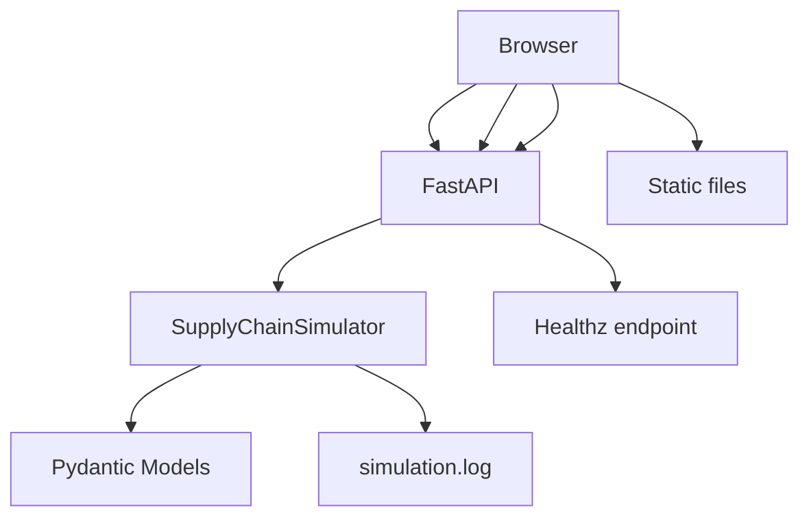
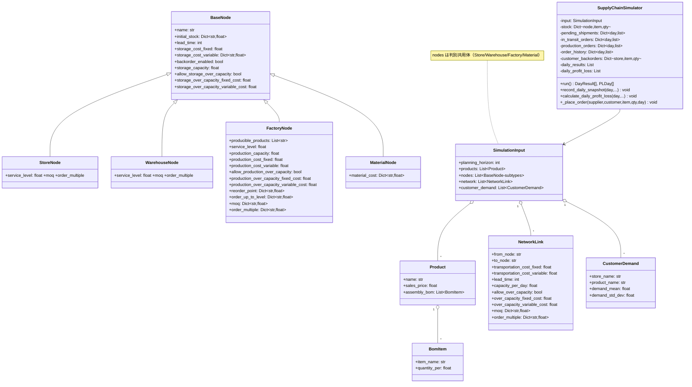
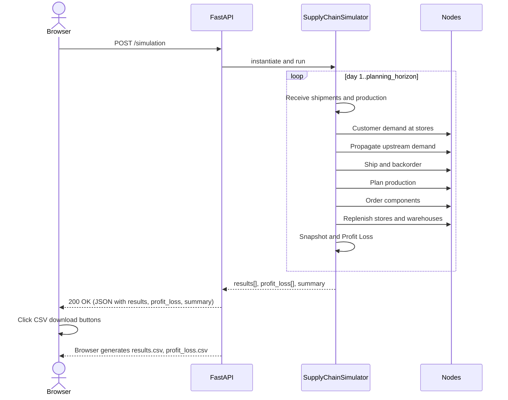

# サプライチェーン計画シミュレーション

[](https://github.com/miumigy/scpln/actions/workflows/ci.yml)

このプロジェクトは、部品表 (BOM) をサポートし、在庫補充ポリシーに基づいたサプライチェーンシミュレーションを提供します。需要の伝播、工場での生産と材料消費、リードタイムを考慮した在庫管理をシミュレートし、日ごとの詳細な結果を可視化します。

## 機能

*   **柔軟なシミュレーション入力**: 製品の部品構成表 (BOM)、ノード（店舗、倉庫、工場、サプライヤー）、ネットワーク接続、顧客需要をJSON形式で柔軟に定義できます。
*   **在庫補充ポリシー**: 各ノードは、サービスレベルに応じて設定された発注点 (`reorder_point`) と目標在庫レベル (`order_up_to_level`) に基づいて、自動的に上流ノードへ発注を行います。最小発注量 (`moq`) と発注倍数（`order_multiple`）は「ノード単位」に加えて「リンク（`network`）単位」でも設定でき、両方が指定された場合はより厳しい制約（MOQは大きい方、発注倍数は両者を同時に満たす倍数＝LCM）を適用します。
*   **需要の伝播と在庫管理**: 下流ノードで発生した需要（顧客需要や発注）は、サプライチェーンを遡って上流ノードの需要として適切に伝播されます。
*   **リードタイムの考慮**: 発注から入荷までのリードタイムがシミュレーションに反映され、輸送中の在庫が管理されます。
*   **詳細な日次シミュレーション結果の表形式表示**: シミュレーション結果は、日ごとの各ノード・各品目に関する詳細な指標が表形式で表示されます。
*   **収支機能**: 各ノードの保管費用、フローコスト（材料原価、生産、輸送）を固定費・変動費に分けて計算し、日別の収支表を表示します。
*   **キャパシティ制約**: フロー（輸送・生産）とストック（保管）にキャパシティを設定可能。超過を許容/不許可の選択と、許容時の追加固定・変動費の計上に対応。
*   **UI改善**: タブ切り替えUI、実行結果のノード・品目フィルタ機能、数値のカンマ区切り整数表示。
*   **KPIサマリ**: フィルレート、需要/販売/欠品合計、BOピーク、平均在庫（ノード種別）、収益・コスト・利益を集計表示。
*   **エクスポート/フィルタ**: 結果/収支のCSVダウンロード、日範囲フィルタ（From/To）に対応。

## セットアップと起動

1.  **Pythonの確認**: Python 3.9以上がインストールされていることを確認してください。
2.  **プロジェクトルートへ移動**:
    ```bash
    cd <このリポジトリのルート>
    ```
3.  **起動スクリプトでサーバ起動（推奨）**:
    ```bash
    bash scripts/serve.sh                 # 通常起動
    RELOAD=1 bash scripts/serve.sh        # コード変更を自動再起動
    # 以降は http://localhost:8000 へアクセス
    ```
    - 初回実行時は `.venv` を自動作成し、`requirements.txt` を元に依存関係をインストールします。
4.  **サーバ停止**:
    ```bash
    bash scripts/stop.sh
    ```
5.  **手動でのセットアップ/起動（参考）**:
    ```bash
    python3 -m venv .venv
    source .venv/bin/activate
    pip install -r requirements.txt
    uvicorn main:app --host 0.0.0.0 --port 8000 --loop asyncio
    ```

## シミュレーションの実行 (Web UI)

1.  **ブラウザでアクセス**: `http://localhost:8000` を開きます。
2.  **シミュレーション実行**: JSONエディタのサンプル入力を使うか独自定義を貼り付け、「シミュレーション実行」をクリックします。
    - デフォルトのサンプル入力は `static/default_input.json` から自動読込されます（`static/js/main.js` 内にベタ書きはありません）。
3.  **APIドキュメント**
    - OpenAPI UI: `http://localhost:8000/docs`
    - ReDoc: `http://localhost:8000/redoc`
    - 健康監視: `GET /healthz`

## 運用コマンド

- 起動: `bash scripts/serve.sh`（`RELOAD=1` で自動再起動）
- 停止: `bash scripts/stop.sh`
- ステータス表示: `bash scripts/status.sh`（PID/ポート/ヘルス/直近ログ）
- ヘルスチェックのみ: `bash scripts/health.sh`

### 環境変数（ログ/再現性）

- `SIM_LOG_LEVEL`: ログレベルを指定（`DEBUG`/`INFO`/`WARNING`/`ERROR`、既定 `INFO`）。
- `SIM_LOG_TO_FILE`: `1` で `simulation.log` にも出力（既定は標準出力のみ）。
- 入力フィールド `random_seed`: 需要乱数の再現性を担保（指定時のみ固定）。

例:
```bash
SIM_LOG_LEVEL=DEBUG SIM_LOG_TO_FILE=1 bash scripts/serve.sh
```

## ヘルスチェック

- エンドポイント: `GET /healthz`
- 確認例:
  ```bash
  curl -fsS http://localhost:8000/healthz && echo ok
  ```

## シミュレーション入力 (JSON構造)

シミュレーションの入力は、以下の構造を持つJSONオブジェクトです。`index.html` のJSONエディタに表示されているサンプル入力は、この構造の具体例です。

```json
{
    "planning_horizon": 100,
    "products": [
        {
            "name": "完成品A",
            "sales_price": 1500,
            "assembly_bom": [
                { "item_name": "材料X", "quantity_per": 2 },
                { "item_name": "材料Y", "quantity_per": 5 }
            ]
        },
        {
            "name": "完成品B",
            "sales_price": 1800,
            "assembly_bom": [
                { "item_name": "材料Y", "quantity_per": 3 },
                { "item_name": "材料Z", "quantity_per": 4 }
            ]
        }
    ],
    "nodes": [
        { "name": "店舗1", "node_type": "store", "initial_stock": { "完成品A": 30, "完成品B": 10 }, "lead_time": 3, "service_level": 0.95, "moq": {"完成品A": 10, "完成品B": 10}, "order_multiple": {"完成品A": 5, "完成品B": 5}, "storage_capacity": 200, "allow_storage_over_capacity": true, "storage_over_capacity_variable_cost": 0.2, "storage_cost_fixed": 100, "storage_cost_variable": {"完成品A": 0.5, "完成品B": 0.5}, "backorder_enabled": true },
        { "name": "店舗2", "node_type": "store", "initial_stock": { "完成品A": 25, "完成品B": 5 }, "lead_time": 3, "service_level": 0.95, "moq": {"完成品A": 10, "完成品B": 10}, "order_multiple": {"完成品A": 5, "完成品B": 5}, "storage_capacity": 200, "allow_storage_over_capacity": true, "storage_over_capacity_variable_cost": 0.2, "storage_cost_fixed": 100, "storage_cost_variable": {"完成品A": 0.5, "完成品B": 0.5}, "backorder_enabled": true },
        { "name": "中央倉庫", "node_type": "warehouse", "initial_stock": { "完成品A": 100, "完成品B": 50 }, "lead_time": 7, "service_level": 0.90, "moq": {"完成品A": 30, "完成品B": 30}, "order_multiple": {"完成品A": 10, "完成品B": 10}, "storage_capacity": 1000, "allow_storage_over_capacity": false, "storage_cost_fixed": 500, "storage_cost_variable": {"完成品A": 0.2, "完成品B": 0.2}, "backorder_enabled": true },
        { "name": "組立工場", "node_type": "factory", "producible_products": ["完成品A", "完成品B"], "initial_stock": { "完成品A": 50, "完成品B": 20, "材料X": 500, "材料Y": 800, "材料Z": 600 }, "lead_time": 14, "production_capacity": 50, "allow_production_over_capacity": true, "production_over_capacity_fixed_cost": 2000, "production_over_capacity_variable_cost": 10, "reorder_point": {"材料X": 200, "材料Y": 400, "材料Z": 300}, "order_up_to_level": {"材料X": 500, "材料Y": 800, "材料Z": 600}, "moq": {"材料X": 50, "材料Y": 100, "材料Z": 100}, "order_multiple": {"材料X": 25, "材料Y": 50, "材料Z": 50}, "storage_capacity": 2000, "allow_storage_over_capacity": true, "storage_over_capacity_variable_cost": 0.1, "production_cost_fixed": 10000, "production_cost_variable": 50, "storage_cost_fixed": 1000, "storage_cost_variable": {"完成品A": 0.3, "完成品B": 0.3, "材料X": 0.1, "材料Y": 0.1, "材料Z": 0.1}, "backorder_enabled": true },
        { "name": "サプライヤーX", "node_type": "material", "initial_stock": { "材料X": 10000 }, "lead_time": 30, "material_cost": {"材料X": 100}, "storage_cost_fixed": 20, "storage_cost_variable": {"材料X": 0.01}, "backorder_enabled": true },
        { "name": "サプライヤーY", "node_type": "material", "initial_stock": { "材料Y": 10000 }, "lead_time": 20, "material_cost": {"材料Y": 20}, "storage_cost_fixed": 20, "storage_cost_variable": {"材料Y": 0.01}, "backorder_enabled": true },
        { "name": "サプライヤーZ", "node_type": "material", "initial_stock": { "材料Z": 10000 }, "lead_time": 25, "material_cost": {"材料Z": 30}, "storage_cost_fixed": 20, "storage_cost_variable": {"材料Z": 0.01}, "backorder_enabled": true }
    ],
    "network": [
        { "from_node": "中央倉庫", "to_node": "店舗1", "transportation_cost_fixed": 200, "transportation_cost_variable": 3, "capacity_per_day": 80, "allow_over_capacity": true, "over_capacity_fixed_cost": 100, "over_capacity_variable_cost": 1, "lead_time": 3, "moq": {"完成品A": 20, "完成品B": 20}, "order_multiple": {"完成品A": 10, "完成品B": 10} },
        { "from_node": "中央倉庫", "to_node": "店舗2", "transportation_cost_fixed": 200, "transportation_cost_variable": 3, "capacity_per_day": 80, "allow_over_capacity": true, "over_capacity_fixed_cost": 100, "over_capacity_variable_cost": 1, "lead_time": 3, "moq": {"完成品A": 20, "完成品B": 20}, "order_multiple": {"完成品A": 10, "完成品B": 10} },
        { "from_node": "組立工場", "to_node": "中央倉庫", "transportation_cost_fixed": 500, "transportation_cost_variable": 2, "capacity_per_day": 200, "allow_over_capacity": false, "lead_time": 7 },
        { "from_node": "サプライヤーX", "to_node": "組立工場", "transportation_cost_fixed": 1000, "transportation_cost_variable": 1, "capacity_per_day": 300, "allow_over_capacity": true, "over_capacity_variable_cost": 0.5, "lead_time": 30 },
        { "from_node": "サプライヤーY", "to_node": "組立工場", "transportation_cost_fixed": 1000, "transportation_cost_variable": 1, "lead_time": 20 },
        { "from_node": "サプライヤーZ", "to_node": "組立工場", "transportation_cost_fixed": 1000, "transportation_cost_variable": 1, "lead_time": 25 }
    ],
    "customer_demand": [
        { "store_name": "店舗1", "product_name": "完成品A", "demand_mean": 15, "demand_std_dev": 2 },
        { "store_name": "店舗2", "product_name": "完成品A", "demand_mean": 10, "demand_std_dev": 2 },
        { "store_name": "店舗1", "product_name": "完成品B", "demand_mean": 8,  "demand_std_dev": 1.5 },
        { "store_name": "店舗2", "product_name": "完成品B", "demand_mean": 6,  "demand_std_dev": 1.0 }
    ]
}
```

### 複数店舗の追加（JSONのみで可能）

以下の3箇所にエントリを追加するだけで、店舗をいくつでも増やせます（コード変更不要）。

1) `nodes` に店舗ノードを追加

```
{ "name": "店舗2", "node_type": "store", "initial_stock": { "完成品A": 25 }, "service_level": 0.95, "moq": {"完成品A": 10}, "order_multiple": {"完成品A": 5}, "storage_capacity": 200, "allow_storage_over_capacity": true, "storage_cost_fixed": 100, "storage_cost_variable": {"完成品A": 0.5}, "backorder_enabled": true }
```

2) `network` に上流とのリンクを追加（例: 倉庫→店舗2）

```
{ "from_node": "中央倉庫", "to_node": "店舗2", "transportation_cost_fixed": 200, "transportation_cost_variable": 3, "lead_time": 3, "moq": {"完成品A": 20}, "order_multiple": {"完成品A": 10} }
```

3) `customer_demand` に当該店舗の需要を追加

```
{ "store_name": "店舗2", "product_name": "完成品A", "demand_mean": 10, "demand_std_dev": 2 }
```

UIのデフォルトサンプルは `static/default_input.json` にあり、複数店舗（例: 店舗2）を含む構成になっています。

## 発注ロジック（在庫ポジションの定義）

発注判断はノード種別ごとに「在庫ポジション（Inventory Position, IP）」を用いて行います。IPには未着のパイプライン在庫も含め、過剰発注を防ぎます。

- 店舗（Store）/ 倉庫（Warehouse）
  - 需要モデル: サービスレベルに基づく標準偏差付きの需要（店舗は顧客需要、倉庫は配下店舗の合算需要プロファイル）
  - 発注点: `order_up_to = z * σ * sqrt(LT) + μ * (LT + 1)`
  - 在庫ポジション（当日の発注判定時）:
    - 店舗: `IP = 手持ち在庫 + 将来の入荷予定 - 顧客バックオーダー`
    - 倉庫: `IP = 手持ち在庫 + 将来の入荷予定 - 将来の出荷確定分（店舗向け）`
  - 将来の入荷予定: `pending_shipments`（および互換の `in_transit_orders`）から当日より後に着荷予定の数量を集計します。
  - 将来の出荷確定分: 倉庫が将来出荷予定として持つ `pending_shipments`（リンク: 倉庫→店舗）の合計を控除します。

- 工場（Factory）
  - 完成品（Store/Warehouse同様にサービスレベル制御）
    - `IP = 手持ち在庫 + 将来の完成予定（production_orders）`
  - 資材（Min-Max/補充点方式）
    - `IP = 手持ち在庫 + 将来の入荷予定（pending_shipments/in_transit）`
    - `IP <= reorder_point` のとき `order_up_to_level` まで補充（MOQ・発注倍数を適用）

- MOQ/発注倍数の適用
  - ノード側・リンク側の両方を考慮します。
  - MOQは大きい方を採用。
  - 発注倍数は両者が整数なら最小公倍数（LCM）へ丸め、それ以外は順次切り上げ。

これらの修正により、サプライヤ側の不足でバックオーダーが繰り越された場合でも、将来の入荷/出荷確定分を織り込んだ発注量となり、供給回復時の在庫膨張（雪だるま）を抑制します。

### バックオーダー設定（任意）

- 各ノードで `backorder_enabled` を設定可能です。
- 既定値: すべてのノードで `true`（必要に応じて `false` を指定してください）。
- 動作: 出荷日に在庫不足が発生した場合、`true` のノードは不足分を翌日以降に繰り越して再出荷を試みます。`false` のノードは不足分をその日の `shortage` として確定し、繰り越しません。

### リードタイムの設定

- 輸送リードタイムは `network[].lead_time` に設定してください（注文から到着までの日数）。
- 工場の生産リードタイムは工場ノードの `lead_time` を使用します。
- 店舗・倉庫・資材ノードの `lead_time` は輸送には使用しません。

## シミュレーション仕様（要点）

- 需要の定義: すべてのノード・品目で `demand = sales + shortage` が成立します。
- 需要の発生日: 上流ノードの需要は「注文日 + `network.lead_time`（リンクの輸送LT）」の出荷日に発生します。
- バックオーダー:
  - 各ノードは `backorder_enabled` が `true` の場合、出荷日に不足した数量を翌日以降に繰越して再出荷を試みます。
  - 店舗は顧客バックオーダーを保持し、入荷後に可能な範囲で自動出荷して消化します。
  - 実行結果表の「Backorder」は、未出荷の繰越分（上流の不足繰越＋店舗の顧客バックオーダー）の当日残高です。
  - 補充判断は在庫ポジション（上記「発注ロジック」参照）に基づき、未着のパイプラインや将来の出荷確定分を反映します。

## シミュレーション出力

シミュレーション結果は、日ごとの各ノード・各品目に関する以下の指標が表形式で表示されます。

*   **Day**: シミュレーションの日数
*   **Node**: ノード名
*   **Item**: 品目名
*   **Start Stock**: その日の開始時点の在庫
*   **Incoming**: その日に入荷した数量
*   **Demand**: その日に発生した需要（下流からの発注を含む）
*   **Sales**: その日に販売/供給された数量
*   **Consumption**: 工場で消費された材料の数量
*   **Produced**: 工場で生産された製品の数量
*   **Shortage**: その日に発生した欠品数量
*   **Backorder**: 未出荷の繰越残高（上流の不足繰越＋店舗の顧客バックオーダー）
*   **End Stock**: その日の終了時点の在庫
*   **Ordered**: その日に発注された数量

収支表は、以下の詳細なコスト分類で表示されます。

*   **Revenue**
*   **Material Cost**
*   **Flow Costs**
    *   Material Transport (Fixed/Variable)
    *   Production (Fixed/Variable)
    *   Warehouse Transport (Fixed/Variable)
    *   Store Transport (Fixed/Variable)
    
  計上ルール（概要）:
  - 輸送コストは「出荷日」に計上（固定費はリンクあたり1回/日、変動費は出荷数量比例）。
  - 材料原価は「資材→工場」の実出荷数量 × サプライヤーの `material_cost[item]`。
  - 生産費は当日の `produced` に応じて変動費、当日生産があれば固定費を計上。
*   **Stock Costs**
    *   Material Storage (Fixed/Variable)
    *   Factory Storage (Fixed/Variable)
    *   Warehouse Storage (Fixed/Variable)
    *   Store Storage (Fixed/Variable)
*   **Total Cost**
*   **Profit/Loss**

### サマリ/CSVダウンロード

- サマリ表示: APIのレスポンスには `summary` を含み、UIの「サマリ」タブで集計を表形式表示します（キーは「Summary（レスポンス）」参照）。
- 結果CSV: 画面の「結果CSV」ボタンから `results.csv` をダウンロード可能（ブラウザ内生成、From/Toで日範囲フィルタ適用）。
  - 列: `Day, Node, Item, StartStock, Incoming, Demand, Sales, Consumption, Produced, Shortage, Backorder, EndStock, Ordered`
- 収支CSV: 画面の「収支CSV」ボタンから `profit_loss.csv` をダウンロード可能（ブラウザ内生成）。
  - 列: `Day, Revenue, MaterialCost, Flow_Material_Fixed, Flow_Material_Variable, Flow_Production_Fixed, Flow_Production_Variable, Flow_Warehouse_Fixed, Flow_Warehouse_Variable, Flow_Store_Fixed, Flow_Store_Variable, Stock_Material_Fixed, Stock_Material_Variable, Stock_Factory_Fixed, Stock_Factory_Variable, Stock_Warehouse_Fixed, Stock_Warehouse_Variable, Stock_Store_Fixed, Stock_Store_Variable, TotalCost, ProfitLoss`

## バックアップ（任意・手動）

`backup_script.py` を実行すると、`main.py` と `index.html` を `backup/` ディレクトリにタイムスタンプ付きで保存します（自動ではありません）。

```bash
python backup_script.py
ls backup/   # 例: main_YYYYMMDD_HHMMSS.py, index_YYYYMMDD_HHMMSS.html
```

## API 仕様（概要）

- エンドポイント一覧
  - `POST /simulation`: シミュレーション実行（本文は下記の入力スキーマ）。
  - `GET /healthz`: ヘルスチェック（`{"status":"ok"}` を返します）。
  - `GET /`: フロントエンド（`index.html`）を返します。

- `POST /simulation`
  - ヘッダ: `Content-Type: application/json`
  - リクエスト本文: 「入力スキーマ（SimulationInput）」参照
  - 成功時（200）レスポンス: `{"message": str, "results": DayResult[], "profit_loss": PLDay[], "summary": Summary}`
  - 失敗時: 422（バリデーション）、500（予期せぬエラー）など

## クラス構造

- データモデル: すべて `pydantic.BaseModel` で定義（`main.py`）。
  - `BomItem`/`Product`: 製品とBOMを表現（品目名・使用量、販売単価を保持）。
  - `NetworkLink`: ノード間リンク（固定/変動の輸送費、リードタイム、日次キャパ、超過許容と超過コスト、品目別MOQ・発注倍数）。
  - `BaseNode`: ノード共通（名称、初期在庫、保管費、保管キャパ/超過可否と超過コスト、`backorder_enabled`）。
    - `StoreNode`/`WarehouseNode`: `service_level` に基づく補充、任意の `moq`/`order_multiple` を保持。
    - `FactoryNode`: 生産対象、`service_level`、生産キャパ/費用、超過政策/コスト、部材の `reorder_point`/`order_up_to_level`/`moq`/`order_multiple`。
    - `MaterialNode`: 仕入れ品目と品目別 `material_cost`。
    - これらは判別共用体 `AnyNode`（識別子 `node_type`）として入力に束ねられます。
  - `CustomerDemand`: 店舗×製品ごとの需要分布パラメータ（平均・標準偏差）。
  - `SimulationInput`: ルート入力（計画日数、`products`、`nodes`、`network`、`customer_demand`）。

- シミュレーションエンジン: `SupplyChainSimulator`（`main.py`）。
  - 状態管理: `stock`、`pending_shipments`（到着日キーでスケジュール。未来日は期末未着）、`production_orders`、`order_history`、`customer_backorders`、集計（`daily_results`、`daily_profit_loss`、累計 `cumulative_ordered/received`）。
  - 事前計算: `_get_topological_order`（処理順）、`_calculate_warehouse_demand_profiles`/`_calculate_factory_demand_profiles`（需要集約）。
  - 主処理: `run()` が日次ループで入荷処理→需要伝播→補充発注（店舗・倉庫はサービスレベル法）→生産計画/部材発注（工場）→スナップショット/収支計算を実施。
  - 補助: `_place_order`（LTを考慮して `pending_shipments` に登録）、`record_daily_snapshot`、`calculate_daily_profit_loss`。
  - 補足: サービスレベルのz値は `_service_level_z`（SciPy未導入時は `statistics.NormalDist` にフォールバック）。

## APIとクラスの対応

- `POST /simulation`
  - 入力: `SimulationInput`（`products: Product[]`, `nodes: AnyNode[]`＝`StoreNode`/`WarehouseNode`/`FactoryNode`/`MaterialNode`、`network: NetworkLink[]`, `customer_demand: CustomerDemand[]`）
  - 実装: FastAPIハンドラ `run_simulation()` が `SupplyChainSimulator` を生成し `run()` を呼び出し。
  - 主要クラス/関数: `SupplyChainSimulator.run` → `record_daily_snapshot`（日次の `DayResult` 相当を生成）, `calculate_daily_profit_loss`（日次の `PLDay` 相当を生成）。
  - 出力: `{ message: str, results: DayResult[], profit_loss: PLDay[] }`。

- `GET /healthz`
  - 入出力: モデルなし。`{"status":"ok"}` を返却。
  - 用途: ランタイム/デプロイ監視。

- `GET /`
  - 入出力: モデルなし。`index.html` を返す（`HTMLResponse`）。
  - 用途: Web UI 配信。

## 図解

### 簡易アーキテクチャ



### クラス図（主要要素）



### 時系列フロー（シーケンス）



## 入出力スキーマ定義

- 入力: `SimulationInput`
  - `planning_horizon`（int>0）: 計画日数
  - `random_seed`（int｜省略可）: 需要乱数の再現性確保のためのシード
  - `products`（Product[]）
    - Product: `name`（str）, `sales_price`（>=0）, `assembly_bom`（BomItem[]）
    - BomItem: `item_name`（str）, `quantity_per`（>0）
  - `nodes`（AnyNode[]: 識別子 `node_type` によるUnion）
    - 共通（BaseNode）: `name`（str）, `initial_stock`（{item: qty}）,
      `lead_time`（>=0）, `storage_cost_fixed`（>=0）, `storage_cost_variable`（{item: >=0}）, 
      `backorder_enabled`（bool, 既定 true）, `storage_capacity`（>0 | 省略=∞）, 
      `allow_storage_over_capacity`（bool, 既定 true）, 
      `storage_over_capacity_fixed_cost`（>=0）, `storage_over_capacity_variable_cost`（>=0）
    - StoreNode（`node_type: "store"`）: `service_level`（0..1）, `moq`（{item: >=0}）, `order_multiple`（{item: >=0}）
    - WarehouseNode（`node_type: "warehouse"`）: `service_level`（0..1）, `moq`, `order_multiple`
    - FactoryNode（`node_type: "factory"`）:
      `producible_products`（str[]）, `service_level`（0..1）, `production_capacity`（>0 | 省略=∞）, 
      `production_cost_fixed`（>=0）, `production_cost_variable`（>=0）, 
      `allow_production_over_capacity`（bool, 既定 true）, 
      `production_over_capacity_fixed_cost`（>=0）, `production_over_capacity_variable_cost`（>=0）, 
      `reorder_point`（{item: >=0}）, `order_up_to_level`（{item: >=0}）, 
      `moq`（{item: >=0}）, `order_multiple`（{item: >=0}）
    - MaterialNode（`node_type: "material"`）: `material_cost`（{item: >=0}）
  - `network`（NetworkLink[]）
    - NetworkLink: `from_node`（str）, `to_node`（str）, 
      `transportation_cost_fixed`（>=0）, `transportation_cost_variable`（>=0）, 
      `lead_time`（>=0）, `capacity_per_day`（>0 | 省略=∞）, `allow_over_capacity`（bool, 既定 true）, 
      `over_capacity_fixed_cost`（>=0）, `over_capacity_variable_cost`（>=0）, 
      `moq`（{item: >=0}）, `order_multiple`（{item: >=0}）
  - `customer_demand`（CustomerDemand[]）
    - CustomerDemand: `store_name`（str）, `product_name`（str）, 
      `demand_mean`（>=0）, `demand_std_dev`（>=0）

- 出力: 200 OK（`POST /simulation`）
  - ルート: `message`（str）, `results`（DayResult[]）, `profit_loss`（PLDay[]）
  - DayResult: `day`（int, 1始まり）, `nodes`（{node_name: {item_name: Metrics}}）
    - Metrics（数値は原則 >=0）:
      - `start_stock`, `incoming`, `demand`, `sales`, `consumption`, `produced`, `shortage`, `backorder_balance`, `end_stock`, `ordered_quantity`
  - PLDay: `day`（int）, `revenue`（>=0）, `material_cost`（>=0）, 
    `flow_costs`（オブジェクト）, `stock_costs`（オブジェクト）, `total_cost`（>=0）, `profit_loss`（実数）
    - `flow_costs` キー: 
      `material_transport_fixed`, `material_transport_variable`,
      `production_fixed`, `production_variable`,
      `warehouse_transport_fixed`, `warehouse_transport_variable`,
      `store_transport_fixed`, `store_transport_variable`
    - `stock_costs` キー:
      `material_storage_fixed`, `material_storage_variable`,
      `factory_storage_fixed`, `factory_storage_variable`,
      `warehouse_storage_fixed`, `warehouse_storage_variable`,
      `store_storage_fixed`, `store_storage_variable`

備考
- PSI恒等: すべてのノード・品目で `demand = sales + shortage`。
- 在庫フロー: `end = start + incoming + produced − sales − consumption`。
- 累積整合: 「発注合計 = 受入合計 + 期末の未着（翌日以降の到着予定）」が成立（`pending_shipments` の未来日合計）。
- MOQ/発注倍数: ノードとリンクの双方を適用（倍数が整数のときLCM、その他は切上げ）。

## パラメータ詳細

### MOQ / 発注倍数の設定

- 対応ノード:
  - 工場（部品購買）: `moq`, `order_multiple`
  - 倉庫/店舗（上流への補充）: `moq`, `order_multiple`（任意）
- 丸め順序: `qty_to_order` を計算後、(1) `moq` 未満なら `moq` へ繰上げ、(2) `order_multiple` があれば倍数へ繰上げ（切上げ）。
- 単位: すべて品目の基準単位（EA）。ケース入数等は `order_multiple` で表現してください。

### キャパシティ設定

- 輸送リンク（`network[]`）:
  - `capacity_per_day`: 1日あたりの輸送キャパシティ（数量）。未指定時は無制限。
  - `allow_over_capacity`: 超過許容（true/false）。trueの場合、超過量に対するコストを設定可能。
  - `over_capacity_fixed_cost`, `over_capacity_variable_cost`: 超過発生日に1回の固定費、超過数量×単価の変動費。
- 生産（工場ノード）:
  - `production_capacity`: 1日あたりの生産キャパシティ（既存）。
  - `allow_production_over_capacity`: 超過許容（true/false）。
  - `production_over_capacity_fixed_cost`, `production_over_capacity_variable_cost`: 超過発生日に固定費/超過数量×単価を追加計上。
- 保管（全ノード）:
  - `storage_capacity`: ノード全体の保管キャパシティ（全品目合計数量）。
  - `allow_storage_over_capacity`: 超過許容（true/false）。falseの場合、入荷はキャパシティまでで残りは翌日へ持ち越し。
  - `storage_over_capacity_fixed_cost`, `storage_over_capacity_variable_cost`: 許容時の追加コスト（固定/超過数量×単価）。

## 再現シナリオ（バックオーダー誘発）

バックオーダーが発生する状況下での挙動確認用の最小構成です。READMEの「発注ロジック」に基づき、将来の入荷/出荷確定分を在庫ポジションに反映して過剰発注を抑制することを確認できます。

- 手順: Web UI の設定JSONに以下を貼り付けて実行します。
- 観察ポイントは下記の通りです。

```json
{
  "planning_horizon": 30,
  "products": [
    {"name": "完成品A", "sales_price": 1500, "assembly_bom": [
      {"item_name": "材料X", "quantity_per": 2},
      {"item_name": "材料Y", "quantity_per": 5}
    ]}
  ],
  "nodes": [
    {"name": "店舗1", "node_type": "store", "initial_stock": {"完成品A": 5}, "service_level": 0.95, "moq": {"完成品A": 10}, "order_multiple": {"完成品A": 5}, "storage_capacity": 200, "allow_storage_over_capacity": true, "storage_cost_fixed": 100, "storage_cost_variable": {"完成品A": 0.5}, "backorder_enabled": true},
    {"name": "中央倉庫", "node_type": "warehouse", "initial_stock": {"完成品A": 0}, "service_level": 0.90, "moq": {"完成品A": 30}, "order_multiple": {"完成品A": 10}, "storage_capacity": 500, "allow_storage_over_capacity": false, "storage_cost_fixed": 500, "storage_cost_variable": {"完成品A": 0.2}, "backorder_enabled": true},
    {"name": "組立工場", "node_type": "factory", "producible_products": ["完成品A"], "initial_stock": {"完成品A": 0, "材料X": 200, "材料Y": 400}, "lead_time": 14, "production_capacity": 50, "allow_production_over_capacity": true, "production_over_capacity_fixed_cost": 2000, "production_over_capacity_variable_cost": 10, "reorder_point": {"材料X": 100, "材料Y": 200}, "order_up_to_level": {"材料X": 300, "材料Y": 600}, "moq": {"材料X": 50, "材料Y": 100}, "order_multiple": {"材料X": 25, "材料Y": 50}, "storage_capacity": 1000, "allow_storage_over_capacity": true, "storage_cost_fixed": 1000, "storage_cost_variable": {"完成品A": 0.3, "材料X": 0.1, "材料Y": 0.1}, "backorder_enabled": true},
    {"name": "サプライヤーX", "node_type": "material", "initial_stock": {"材料X": 10000}, "material_cost": {"材料X": 100}, "backorder_enabled": true},
    {"name": "サプライヤーY", "node_type": "material", "initial_stock": {"材料Y": 10000}, "material_cost": {"材料Y": 20}, "backorder_enabled": true}
  ],
  "network": [
    {"from_node": "中央倉庫", "to_node": "店舗1", "transportation_cost_fixed": 200, "transportation_cost_variable": 3, "capacity_per_day": 50, "allow_over_capacity": false, "lead_time": 3, "moq": {"完成品A": 20}, "order_multiple": {"完成品A": 10}},
    {"from_node": "組立工場", "to_node": "中央倉庫", "transportation_cost_fixed": 500, "transportation_cost_variable": 2, "capacity_per_day": 100, "allow_over_capacity": false, "lead_time": 7},
    {"from_node": "サプライヤーX", "to_node": "組立工場", "transportation_cost_fixed": 1000, "transportation_cost_variable": 1, "capacity_per_day": 200, "allow_over_capacity": true, "lead_time": 30},
    {"from_node": "サプライヤーY", "to_node": "組立工場", "transportation_cost_fixed": 1000, "transportation_cost_variable": 1, "capacity_per_day": 200, "allow_over_capacity": true, "lead_time": 20}
  ],
  "customer_demand": [
    {"store_name": "店舗1", "product_name": "完成品A", "demand_mean": 20, "demand_std_dev": 3}
  ]
}
```

観察ポイント
- 初期数日で店舗は欠品し、顧客バックオーダーが増加します。
- 倉庫にも在庫が無く、倉庫→店舗の出荷はバックオーダーとして繰り越されます。
- 補充発注では、店舗は「将来の入荷予定 − 顧客BO」を、倉庫は「将来の入荷予定 − 将来の出荷確定分」を在庫ポジションに反映するため、日々の発注量が雪だるま式に増加せず、供給回復時の過大在庫化を抑制します。

## テスト

- 事前準備: 仮想環境で依存関係をインストール（`pip install -r requirements.txt`）。
- 実行: `bash scripts/test.sh`

検証内容
- PSI恒等: `demand = sales + shortage`
- 在庫フロー: `end = start + incoming + produced − sales − consumption`
- 累積整合: `合計発注 = 合計受入 + 期末輸送中`
- 発注制約: ノード/リンクの `MOQ` と（整数の）`order_multiple` 満足
- BO誘発下の安定性: リードタイム内の連日発注が単調非増加（雪だるま抑制）

### CI（GitHub Actions）

- 本リポジトリには GitHub Actions のワークフロー（`.github/workflows/ci.yml`）を用意しています。
- すべてのブランチへの push / PR で以下を自動実行します。
  - Python 3.12 セットアップ
  - `pip install -r requirements.txt`
  - `python -m unittest discover` によるユニットテスト

### 最小スモーク（CLIでの即時確認）

Webサーバを起動せず、最小構成で3日分のシミュレーションが実行できることを確認します。

```bash
# 仮想環境を利用
PYTHONPATH=. .venv/bin/python - <<'PY'
from main import SimulationInput, SupplyChainSimulator
sim=SupplyChainSimulator(SimulationInput(**{
  "planning_horizon":3,
  "products":[{"name":"A","sales_price":100,"assembly_bom":[]}],
  "nodes":[
    {"name":"S","node_type":"store","initial_stock":{"A":0},"service_level":0.0,"backorder_enabled":True},
    {"name":"W","node_type":"warehouse","initial_stock":{"A":0},"service_level":0.0,"backorder_enabled":True},
    {"name":"F","node_type":"factory","producible_products":["A"],"initial_stock":{"A":0},"lead_time":1,"production_capacity":100,"service_level":0.0,"backorder_enabled":True}
  ],
  "network":[{"from_node":"W","to_node":"S","lead_time":1},{"from_node":"F","to_node":"W","lead_time":1}],
  "customer_demand":[{"store_name":"S","product_name":"A","demand_mean":5,"demand_std_dev":0}],
  "random_seed":0
}))
sim.run()
print("smoke-ok")
PY
```

### Summary（レスポンス）

`summary` は以下のキーを含むシンプルな集計です。

- `planning_days`: 計画日数
- `fill_rate`: 店舗の販売数量/需要数量
- `store_demand_total`, `store_sales_total`: 店舗の需要/販売合計
- `customer_shortage_total`, `network_shortage_total`: 顧客/ネットワーク欠品合計
- `avg_on_hand_by_type`: ノード種別ごとの平均在庫（end_stockの日平均）
- `backorder_peak`, `backorder_peak_day`: 顧客BOのピーク値と発生日
- `revenue_total`, `cost_total`, `profit_total`, `profit_per_day_avg`
- `top_shortage_items`: 欠品上位（店舗/品目）

## 今後の拡張案

- 需要予測の高度化: 現在のランダムな需要パターンに加え、季節性やトレンドなどのより複雑な需要パターンを導入。
- リードタイムの変動性: リードタイムに不確実性（ランダムな変動）を導入し、より現実的なシミュレーションを実現。
- 異なる在庫ポリシーの比較: Min-Max法以外（固定発注量方式、定期発注方式など）を実装し、比較分析。
- 特定シナリオ分析: 供給ショックや需要急増などのシナリオをプリセット化し、ワンクリックで検証。
