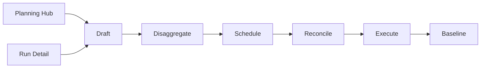
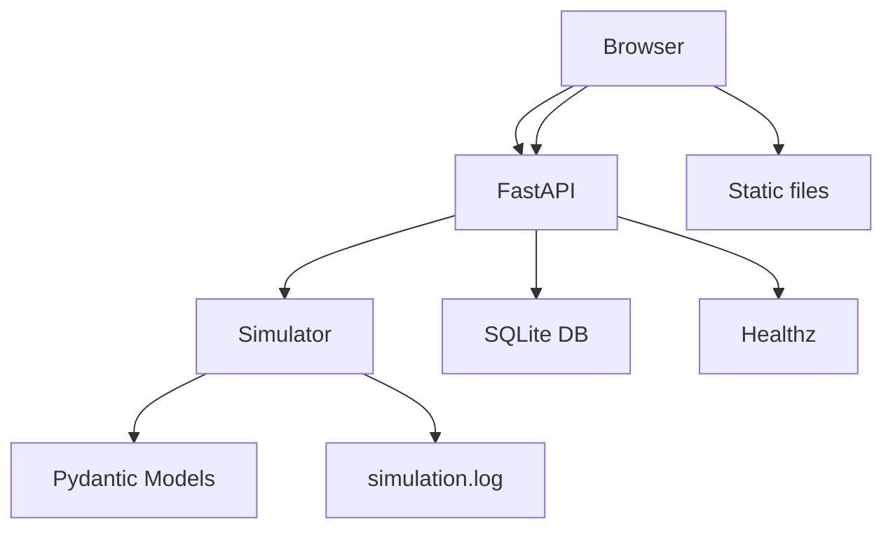
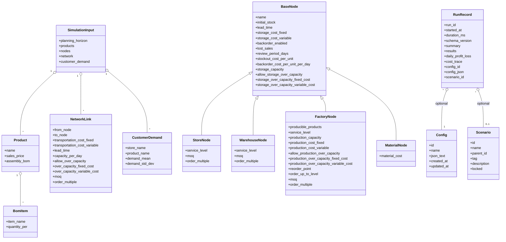
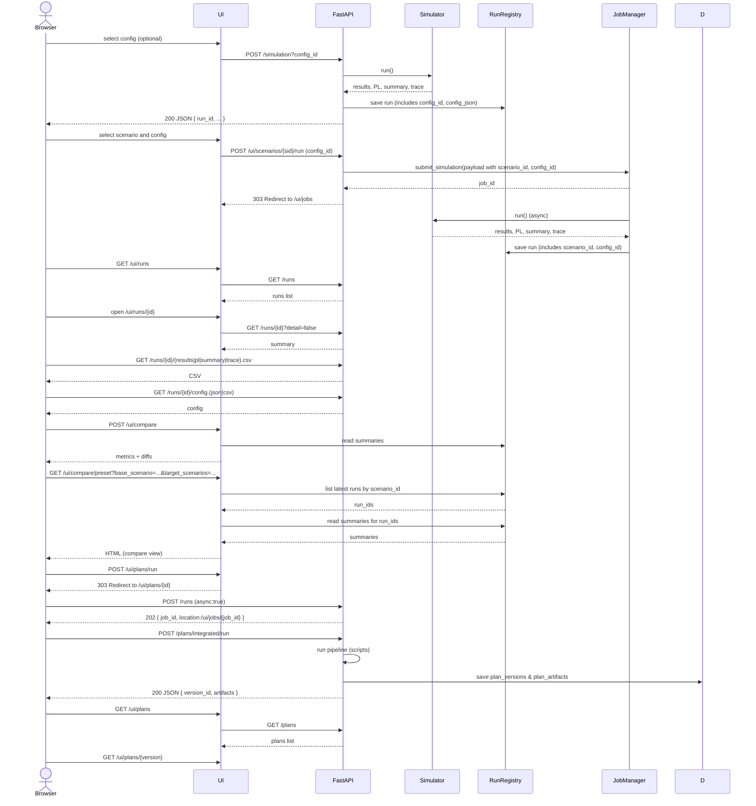
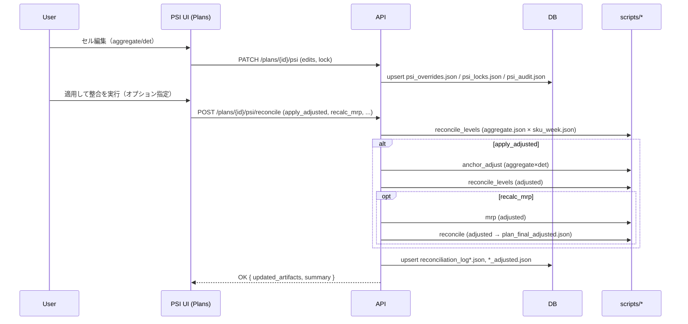

# サプライチェーン計画シミュレーション

[](https://github.com/miumigy/scpln/actions/workflows/ci.yml)

サプライチェーン（店舗/倉庫/工場/資材）をノード/リンクで記述し、需要伝播・在庫/生産・コスト計上を日次でシミュレートします。RunRegistry に実行履歴を保持し、UI から履歴参照・比較・CSVエクスポートが可能です。

## 目次

- [概要](#概要)
- [システム構成](#システム構成)
- [主な機能](#主な機能)
- [クイックスタート（起動・停止）](#クイックスタート起動停止)
  - [環境変数とシークレットの扱い（重要）](#環境変数とシークレットの扱い重要)
  - [開発用フック（.env の混入防止）](#開発用フックenv-の混入防止)
- [設定と運用](#設定と運用)
  - [推奨設定（CI/ローカル）](#推奨設定cilocal)
  - [運用コマンド / 環境変数](#運用コマンド--環境変数)
  - [DBバックアップ/復元](#dbバックアップ復元)
  - [マイグレーション（Alembic）](#マイグレーションalembic)
  - [観測性（ログ/メトリクス/OTel）](#観測性ログメトリクスotel)
- [Web UI ガイド](#web-ui-ガイド)
  - [Web UI 詳細（抜粋）](#web-ui-詳細抜粋)
- [API リファレンス](#api-リファレンス)
- [入力スキーマ（SimulationInput）](#入力スキーマsimulationinput)
- [CSV エクスポート（Runごと）](#csv-エクスポートrunごと)
- [コストトレース仕様（概要）](#コストトレース仕様概要)
- [RunRegistry の仕様](#runregistry-の仕様)
- [階層マスタの適用](#階層マスタの適用)
- [集約計画/詳細計画パイプライン](#集約計画詳細計画パイプライン)
  - [一括実行](#一括実行)
  - [Web UI（集約計画/詳細計画）](#web-ui集約計画詳細計画)
- [図解](#図解)
  - [簡易アーキテクチャ](#簡易アーキテクチャ)
  - [クラス図（主要要素）](#クラス図主要要素)
  - [時系列フロー（シーケンス）](#時系列フローシーケンス)
- [拡張戦略（残る拡張のみ）](#拡張戦略残る拡張のみ)
- [PSI 編集ワークフロー](#psi-workflow)
  - [Lock Manager（検索・一括操作）](#lock-manager)

## 概要

### システム構成

```
.
├── main.py                 # エントリ（main:app）。副作用importでAPI/UIを登録
├── app/                    # API/UIモジュール（/simulation, /runs, /compare, /ui/* など）
├── domain/                 # Pydantic モデル定義
├── engine/                 # シミュレーションエンジン
├── static/                 # UI 静的ファイル
├── templates/              # Jinja2 テンプレート
├── scripts/                # 起動/停止/状態確認スクリプト
└── tests/                  # ユニットテスト
```

- 互換API/インポート: `uvicorn main:app`、`from main import SimulationInput, SupplyChainSimulator`
- 物流フローの一元管理: `pending_shipments` に統一（到着日キー）

## 主な機能

- 柔軟な入力: 製品BOM、ノード/リンク、需要モデルをJSONで定義
- 在庫補充: サービスレベルに基づく発注点/目標在庫、MOQ/発注倍数（ノード/リンク両対応）
- 需要伝播・リードタイム・バックオーダー処理
- 収支（固定/変動費）・キャパシティ超過コスト
- UI: タブ表示、フィルタ、CSV ダウンロード
- RunRegistry: 実行履歴の保持・比較・CSV
  - バックエンド: 既定でDB永続化（SQLite `data/scpln.db`）。環境変数 `REGISTRY_BACKEND=memory|db` で切替可能（`scripts/serve.sh`は未指定時にdbへフォールバック）
  - 容量上限: `RUNS_DB_MAX_ROWS` を指定すると古いRunを自動クリーンアップ（DBのみ）

## クイックスタート（起動・停止）

```bash
bash scripts/serve.sh           # 起動（RELOAD=1 でホットリロード）
bash scripts/status.sh          # 状態確認（PID/ヘルス/ログ）
bash scripts/stop.sh            # 停止
```

アクセス: `http://localhost:8000`
- 入口統合（Planning Hub）
  - 推奨入口: `/ui/plans`（Planの作成→実行→結果確認まで一貫）
  - ルート `/` は `/ui/plans` へリダイレクト（P-06）
  - 旧UI `/ui/planning` は廃止しました（完全移行済み）。
  - API概要は `docs/API-OVERVIEW-JA.md` を参照。用語は `docs/TERMS-JA.md` に準拠。
- ヘッダ右のナビ: 「プラン一覧」「ラン履歴」「シナリオ一覧」「設定マスタ」「ジョブ一覧」「階層マスタ」「集約/詳細計画」
  - いずれも別タブ遷移（UI内ルーティングではなくHTTPナビゲーション）

### Render へのデプロイ（Blueprint）

「Deploy to Render」ボタンから、本リポジトリをRenderにそのままデプロイできます（Web Service / Python）。

1) 以下ボタンをクリックし、RenderにGitHub連携でログイン（または連携済みアカウントでログイン）

[](https://render.com/deploy?repo=https://github.com/miumigy/scpln)

2) Blueprintの内容を確認し「Deploy」。既定では以下設定です:
   - Web Service: `uvicorn main:app --host 0.0.0.0 --port $PORT`
   - Health Check: `/healthz`
   - 環境変数: `REGISTRY_BACKEND=db`, `RUNS_DB_MAX_ROWS=1000`, `AUTH_MODE=none`, `SCPLN_DB=/opt/render/project/src/data/scpln.db`, `JOBS_ENABLED=1`, `JOBS_WORKERS=2`
   - ディスク: Freeプランでは永続ディスクが使えません（本Blueprintはディスク未設定）。
     - DBや`/out`の内容は再デプロイ・再起動で失われます（動作検証には十分）。
     - 永続化が必要な場合はStarter以上にアップグレードし、RenderのUIからディスクを追加してください（例: `/opt/render/project/src/data`）。

3) デプロイ完了後、表示されたURLにアクセス（例: `https://scpln-web.onrender.com`）。ホーム画面が表示されます。

注意:
- Freeプランではスリープやビルド時間制限があります。スリープ復帰時の初回応答が遅くなることがあります。
- ディスク容量は用途に応じて調整してください。`/out` に可視化用CSV（`report.csv`）や生成物が保存されます。
- 認証は既定で無効（`AUTH_MODE=none`）です。公開環境では `AUTH_MODE=apikey|basic` とシークレットを設定してください。

### GitHubリリース作成で自動デプロイ

リリース公開（Release published）をトリガにRenderへデプロイを行うGitHub Actionsを追加しています（`.github/workflows/deploy-render.yml`）。

事前準備（GitHub Secrets いずれか）:
- 推奨: `RENDER_API_KEY` と `RENDER_SERVICE_ID`（Render APIでDeployを作成）
  - API Key: Renderダッシュボード → Account → API Keys で作成
  - Service ID: 対象サービスの詳細ページURLに含まれる `srv-...`
- 代替: `RENDER_DEPLOY_HOOK_URL`（Deploy Hookで再デプロイ）
  - サービス詳細 → Deploy hooks → 生成したURLをSecretに設定

動作:
- Release published または 手動実行（workflow_dispatch）で起動
- `RENDER_API_KEY`/`RENDER_SERVICE_ID` があればAPI経由でデプロイ、無ければ `RENDER_DEPLOY_HOOK_URL` にPOSTします

注意:
- Deploy Hookはサービス設定のブランチ最新をデプロイします（タグ固定は不可）。特定タグのデプロイが必要な場合は、Render APIの高度な設定をご利用ください。

### Render Freeプランのスリープ対策（任意）

Render Freeでは一定時間アクセスがないとスピンダウンされます。ICMPによる`ping`は効果がないため、HTTPリクエストを定期的に送る必要があります。本リポジトリには、curlで `/healthz`（なければ`/`）を叩く keep-alive ワークフロー（`.github/workflows/curl-render.yml`、ワークフロー名: Keep Render Awake (curl)）を同梱しています。

設定手順:
- GitHub の Repository Secrets または Variables に以下のいずれかを設定
  - 推奨: `RENDER_PING_URL`（例: `https://scpln-web.onrender.com`）
  - 代替: `RENDER_SERVICE_URL`（同上）
- ワークフローは上記を自動解決し、`GET /healthz` → `GET /` の順でリトライ付きで実行します。
- 既定のスケジュールは5分間隔で起動し、ジョブ内で1分ごとに20回HTTPアクセス（約20分継続）します。スケジュールの遅延（>15分）にも耐えるよう、連続アクセスでギャップを最小化します。
- URLの指定がない場合、既定で `https://scpln-web.onrender.com` にアクセスします（リポジトリ変数/シークレット `RENDER_PING_URL` または `RENDER_SERVICE_URL` を設定するとその値が優先されます）。

よくある躓き:
- 環境別（Environment）シークレットにのみ設定した場合、ジョブで `environment:` を指定していないと参照できません。Repository Secrets/Variables 側に設定してください。
- URL末尾のスラッシュ有無に依存しないよう、ワークフロー側で正規化しています。

注意:
- 無料枠の制限やRenderの利用規約に留意してください。恒常運用は有料プラン＋永続ディスクの利用を推奨します
永続化: `.env` に `SCPLN_DB=data/scpln.db` や `RUNS_DB_MAX_ROWS=1000` を設定可能。未設定でも `scripts/serve.sh` によりRunRegistryはDBバックエンド（REGISTRY_BACKEND=db）で起動します。

### 環境変数とシークレットの扱い（重要）

- `.env` はGitにコミットしないでください（機密方針）。
- 初期設定は `configs/env.example` をコピーしてローカルに `.env` を作成し、必要に応じて値を編集してください。
  - 例: `cp configs/env.example .env`
- 認証キー等のシークレット値（例: `API_KEY_VALUE`）は必ず各自の環境で固有値に変更してください。
- 既に公開履歴に含まれてしまったシークレットは失効・ローテーションしてください。

### 開発用フック（.env の混入防止）

- ローカルで Git フックを有効化すると、`.env` の誤コミットをブロックします。
  - 有効化: `bash scripts/enable_hooks.sh`
  - 解除: `git config --unset core.hooksPath`（必要時）

## Web UI ガイド

- メイン画面（index.html）: 入力JSON編集、結果/PL/サマリの表示とCSVダウンロード
  - 設定マスタバー: プルダウン選択で設定を自動読込（change）、『設定マスタ読込』で一覧再取得
- 設定マスタ: `GET /ui/configs`（SQLite 永続化）
  - 一覧/新規/編集/削除
  - 「エディタで開く」で `/?config_id=ID` を付与してメイン画面へ
- ラン履歴: `GET /ui/runs`
  - Refresh: `GET /runs` で一覧再取得
  - チェックボックス → Compare フォームに反映（Use selected）
  - ページャ: 画面下の Prev/Next/Limit で `offset/limit` を制御（サーバは `total/offset/limit` を返却）
  - ソート/フィルタ: Sort/Order セレクトと Schema/Config ID で条件を指定（APIの `sort/order/schema_version/config_id` に連動）
  - フェーズ1統合: Planning Hub（`/ui/plans`）の冒頭に「最近のラン（直近5件）」を表示します（`GET /runs?limit=5&sort=started_at&order=desc`）。主要KPI（`fill_rate/profit_total`）と詳細リンクを表示。
  - フェーズ2追加: 「保存ビュー」をサポート（ローカル保存）。現在のURLコピーで共有可能。
  - フェーズ3追加: meta列（BASE/APP/AR）、Hide archived トグルを追加
- ラン詳細: `GET /ui/runs/{run_id}`
  - Summary 表示、Artifacts 件数
  - CSV/JSON リンク（results/pl/summary/trace, config.json/config.csv）
  - Refresh summary from API: `GET /runs/{id}?detail=false`
  - Delete: 右下の [Delete this run] でRun削除（確認ダイアログあり）
  
- ジョブ一覧: `GET /ui/jobs`
  - ステータスフィルタ（queued/running/succeeded/failed）、ページング（Prev/Next）
  - 列: `job_id, type, status, submitted_at, started_at, finished_at, run_id`
  - `run_id` からラン詳細へリンク
- ジョブ詳細: `GET /ui/jobs/{job_id}`
  - ステータス・タイムスタンプ・`run_id`リンク・`error`表示
  - 失敗時は [Retry] ボタン、キュー中は [Cancel] ボタンが表示
- 比較UI: `POST /ui/compare`（run_ids カンマ区切り）で metrics/diffs 表示
  - 共有用 GET ページ: `GET /ui/compare/show?run_ids={id1},{id2}&base_id={id1}&threshold=5&keys=fill_rate,profit_total`
  - Base/Threshold: 比較画面でベースRunと閾値(%)を指定可能（閾値超えをハイライト）
  - CSV: metrics.csv / diffs.csv をダウンロード（Base/Thresholdをメタ行として含む）
  - ショートカット: ラン詳細の「Baselineと比較」でベースラインとの比較ページを開く
- シナリオ一覧: `GET /ui/scenarios`
  - シナリオの新規作成、編集、削除が可能。
  - 各シナリオに対して、既存の設定（Config）を選択してシミュレーションを実行できる。
  - 表示項目: シナリオID、名前、親ID、タグ、説明、ロック状態、作成日時、更新日時。

## API リファレンス

### Simulation
- 概要: シミュレーションを同期実行し、RunRegistryへ記録します。

- `POST /simulation`
  - クエリ: `include_trace`（bool, 既定 false）
  - クエリ: `config_id`（int｜省略可）選択した設定のID。RunRegistry に保存されます
  - クエリ: `scenario_id`（int｜省略可）シナリオ文脈。RunRegistry に保存されます
  - レスポンス: `run_id`, `results`, `daily_profit_loss`/`profit_loss`, `summary`, `cost_trace`
  - 実行記録は RunRegistry に保存
  - 備考: トップページ（index.html）の「設定マスタ」横に「シナリオ」プルダウンを用意。
    - 「シナリオ」プルダウンは `/scenarios` から一覧を読み込み、選択されたシナリオの ID を `/simulation` へ `scenario_id` クエリとして送信（タグ・階層インデント表示対応）。

### Runs
- 概要: 実行履歴の一覧取得・詳細参照・削除を提供します。

- `GET /runs`
  - 既定: 軽量（`run_id`, `started_at`(ms), `duration_ms`, `schema_version`, `summary`）
  - ページング: `?offset=0&limit=50`（`1..100`）をサポート。レスポンスに `total/offset/limit` を含む
  - ソート/フィルタ: `?sort=started_at|duration_ms|schema_version&order=desc|asc&schema_version=1.0&config_id=123&scenario_id=10`
  - `?detail=true`: フル（`results`/`daily_profit_loss`/`cost_trace`含む、ページング適用）。既定 `limit=10`。`limit>10` は `400 Bad Request`
  - DBバックエンド時はSQLでソート/フィルタ/ページング（`total` は `COUNT(*)`）

- `GET /runs/{run_id}`
  - 既定: 軽量メタ＋`summary`
  - `?detail=true`: フル（サイズ注意）

- `DELETE /runs/{run_id}`
  - 指定したRunを削除（メモリ/DBいずれも対応）。運用注意（認可未実装）

- メタ（承認/ベースライン/アーカイブ）
  - `GET /runs/{run_id}/meta`, `GET /runs/meta?run_ids=a,b`
  - `POST /runs/{run_id}/approve`（ヘッダ `X-User` 任意）
  - `POST /runs/{run_id}/promote-baseline`
  - `POST /runs/{run_id}/archive` / `POST /runs/{run_id}/unarchive`
  - `POST /runs/{run_id}/note` メモ保存（承認依頼の下書き等）
  - `GET /runs/baseline?scenario_id=...` シナリオのベースラインRunの取得

### Saved Views（ラン一覧の保存ビュー）
- 概要: ラン一覧のフィルタ/並び条件をサーバに保存し、後から適用や共有（shared）が可能です。
- `GET /views`: ユーザー所有＋共有ビューの一覧（ヘッダ `X-User` 任意）
- `POST /views`: 追加（ボディ: `name`, `filters`, `shared`）
- `GET /views/{id}`: 単一ビュー取得
- `PUT /views/{id}`: 更新（所有者/管理者のみ）
- `DELETE /views/{id}`: 削除（所有者/管理者のみ）


### Compare
- 概要: 実行結果のKPI比較やプリセット比較UIを提供します。

- `POST /compare`
  - ボディ: `{ "run_ids": ["<id1>", "<id2>", ...] }`
  - クエリ: `threshold`（省略可, %）。`diffs[*][metric]` に `hit` を付与
  - クエリ: `base_id`（省略可）。ベースを指定順に固定
  - レスポンス: `metrics`（runごとの主要KPI）と `diffs`（ベース基準の差分）。`threshold/base_id` を含む場合あり

- `GET /ui/compare/preset`
  - クエリ: `base_scenario`（int, 必須）ベースとなるシナリオID
  - クエリ: `target_scenarios`（string, 必須）比較対象のシナリオID（カンマ区切り）
  - クエリ: `limit`（int, 既定 1）各シナリオから取得する最新Runの数
  - クエリ: `threshold`（float, 省略可）比較結果の閾値（%）
  - クエリ: `keys`（string, 省略可）比較するKPI（カンマ区切り）
  - レスポンス: `compare.html` のHTMLレスポンス（UI表示用）
### Jobs
- 概要: シミュレーションや集計を非同期ジョブとして実行・監視します。
  - `POST /jobs/simulation`: シミュレーションをジョブとして投入。ボディは `SimulationInput`、レスポンス `{ job_id }`
  - `GET /jobs/{job_id}`: ジョブの状態を取得（`status=queued|running|succeeded|failed`, `run_id`, `error`, `submitted_at/started_at/finished_at`）
  - `GET /jobs?status=&offset=&limit=`: ジョブ一覧（ページング）。`status` フィルタ対応
  - 備考: 既存 `POST /simulation` は従来通り。将来フラグでジョブ化に委譲可能
  - `POST /jobs/{job_id}/retry`（failed/canceled のみ）: 再キュー投入（`{"params": SimulationInput}`でパラメータ上書き可）
  - `POST /jobs/{job_id}/cancel`（queued のみ）: キャンセル（`status=canceled`）
  - `POST /jobs/aggregate`: 集計ジョブの投入（時間×商品×場所のロールアップ）
    - ボディ例:
      ```json
      {
        "run_id": "<run_id>",
        "dataset": "pl",        
        "bucket": "week",        
        "group_keys": ["node","item"],
        "sum_fields": ["qty","revenue"],
        "product_key": "item",
        "product_level": "category",
        "product_map": {"SKU1": {"category": "C1"}},
        "location_key": "node",
        "location_level": "region",
        "location_map": {"S1": {"region": "R1"}}
      }
      ```
    - 時間集計の厳密カレンダー対応（任意指定）:
      - `date_field`: レコード内の日付/日時フィールド名（例: `"date"`, `"timestamp"`）。指定時は日付ベースで集計
      - `tz`: タイムゾーン（例: `"Asia/Tokyo"`）。UTCやオフセットなしのISO文字列に適用
      - `calendar_mode`: 週の集計方式（`"iso_week"` を指定すると ISO 週番号で集計）
      - 例（ISO週＋JSTで集計）:
        ```json
        {
          "run_id": "<run_id>",
          "dataset": "pl",
          "bucket": "week",
          "group_keys": ["node","item"],
          "date_field": "date",
          "tz": "Asia/Tokyo",
          "calendar_mode": "iso_week"
        }
        ```
      - 挙動:
        - `date_field` 指定時は `bucket=day|week|month` に応じて `YYYY-MM-DD` / `YYYY-Www` / `YYYY-MM` で期間キーを生成
        - `date_field` 未指定時は従来の `day` 整数を基準に `week_start_offset`/`month_len` で集計（後方互換）
        - レコードに `day` と日付の両方がある場合は日付優先
    - レスポンス: `{ "job_id": "..." }`
  - `GET /jobs/{job_id}/result.json` / `GET /jobs/{job_id}/result.csv`: 集計結果の取得（成功時）
### Configs
- 概要: 設定マスタ（シミュレーション入力テンプレート）のCRUDを提供します。
  - `GET /configs`: 一覧（id, name, created_at/updated_at）
  - `GET /configs/{id}`: 詳細（name, json_text, config(JSON)）
  - `POST /configs`（Form: `name`, `json_text`）: 追加
  - `PUT /configs/{id}`（Form: `name`, `json_text`）: 更新
  - `DELETE /configs/{id}`: 削除
### Scenarios
- 概要: シナリオ（設定の論理グループ）の管理と実行連携を提供します。
  - `GET /scenarios`
    - クエリ: `limit` (int, 既定 200)
    - レスポンス: `{"scenarios": [...]}`
  - `GET /scenarios/{sid}`
    - パス: `sid` (int)
    - レスポンス: シナリオオブジェクト
  - `POST /scenarios`
    - ボディ: `name` (str, 必須), `parent_id` (int, 省略可), `tag` (str, 省略可), `description` (str, 省略可), `locked` (bool, 省略可, 既定 False)
    - レスポンス: `{"id": sid}`
  - `PUT /scenarios/{sid}`
    - パス: `sid` (int)
    - ボディ: 更新するフィールドと値
    - レスポンス: `{"status": "ok"}`
- `DELETE /scenarios/{sid}`
  - パス: `sid` (int)
  - レスポンス: `{"status": "deleted", "id": sid}`
### Health
- 概要: ライフネス/可用性の確認。
- `GET /healthz`: ヘルスチェック

## 入力スキーマ（SimulationInput）

入力のサンプル（UIのデフォルトは `static/default_input.json`）。

```json
{
  "planning_horizon": 2,
  "products": [{"name": "P1", "sales_price": 100.0}],
  "nodes": [
    {"name": "S1", "node_type": "store", "initial_stock": {"P1": 1}, "service_level": 0.0, "backorder_enabled": true}
  ],
  "network": [],
  "customer_demand": [{"store_name": "S1", "product_name": "P1", "demand_mean": 1, "demand_std_dev": 0}],
  "random_seed": 1
}
```

## CSV エクスポート（Runごと）

- `GET /runs/{run_id}/results.csv`: 実行結果
- `GET /runs/{run_id}/pl.csv`: 日次PL
- `GET /runs/{run_id}/summary.csv`: サマリ（`run_id,metric,value`）
- `GET /runs/{run_id}/trace.csv`: コストトレース
- `GET /runs/{run_id}/config.json`: 実行時に使用した設定（config_id と config 本文）
- `GET /runs/{run_id}/config.csv`: 上記を1行CSVでダウンロード

出力ルール
- ネスト辞書はドット区切りでフラット化（例: `flow_costs.production_fixed`）
- 配列は JSON 文字列として埋め込み
- レコードが空でもヘッダは返却
- CSVは `Content-Disposition` を付与し、`text/csv; charset=utf-8` で配信

## コストトレース仕様（概要）

- 形式: `SupplyChainSimulator.cost_trace` は日次のコストイベント配列。
- レコード: `{day, node, item, event, qty, unit_cost, amount, account}`（day は 1-based）
- 例: 材料購入、輸送、保管、工場生産（固定/変動）などを発生日に計上し、PL へ集約。

## RunRegistry の仕様

- プロセス内メモリに最近順で保持（既定50件）
- 保存内容（主な項目）: `run_id`, `started_at`(ms), `duration_ms`, `schema_version`, `summary`, `results`, `daily_profit_loss`, `cost_trace`, `config_id`, `config_json`
- 参照API: `/runs`, `/runs/{id}`（上記参照）

## 設定と運用

### 推奨設定（CI/ローカル）

- REGISTRY_BACKEND=db: ラン履歴の永続化を有効化（SQLite `data/scpln.db`）。
- RUNS_DB_MAX_ROWS=1000 以上: 直近のラン履歴を十分保持（クリーンアップの干渉を回避）。
- SCPLN_DB=data/scpln.db: 既定DBパス（環境に合わせて変更可）。
- AUTH_MODE=none（CI）: 認証を無効化してAPI/UIテストを簡素化。

CIワークフロー（.github/workflows/ci.yml）には上記の既定を反映済みです。テスト内で個別に環境を上書きするケース（例: RUNS_DB_MAX_ROWS=2）とは独立して動作します。

### 運用コマンド / 環境変数

- コマンド: `serve.sh`, `stop.sh`, `status.sh`, `health.sh`
- `SIM_LOG_LEVEL`（既定 INFO）、`SIM_LOG_TO_FILE=1`（ファイル出力）
- `REGISTRY_CAPACITY`（既定 50）: RunRegistry のメモリ保持件数
- `REGISTRY_BACKEND=memory|db`（既定 memory）: RunRegistry のバックエンド選択（`db` でSQLite永続化）
- `SCPLN_DB`（既定 `data/scpln.db`）: SQLite DBパス
- `SIM_LOG_JSON=1`（既定 0）: ログをJSONで出力（`timestamp, level, message, request_id, run_id, ...`）
- `RUNS_DB_MAX_ROWS`（既定 0=無効）: DBバックエンド時、保持する最新Run件数の上限（超過は古い順に自動削除）
 - 運用例: `configs/env.example` を `.env` にコピーし、`REGISTRY_BACKEND=db` と `RUNS_DB_MAX_ROWS` を設定
 - `JOBS_ENABLED`（既定 1）: ジョブワーカーの有効化
 - `JOBS_WORKERS`（既定 1）: ワーカースレッド数
- 認証トグル:
  - `AUTH_MODE`=`none|apikey|basic`（既定 none）
  - APIキー: `API_KEY_HEADER`（既定 `X-API-Key`）, `API_KEY_VALUE`
  - BASIC: `BASIC_USER`, `BASIC_PASS`
  - `scripts/serve.sh` は `.env` を自動読込します（再起動で反映）
 - OpenTelemetry（任意）:
- `OTEL_ENABLED=1` で有効化、`OTEL_SERVICE_NAME`、`OTEL_EXPORTER_OTLP_ENDPOINT`（例: `http://localhost:4318`）
- ジョブ外部キュー（任意）:
  - `JOBS_BACKEND=rq` で有効化、`REDIS_URL`（例: `redis://localhost:6379/0`）、`RQ_QUEUE`（既定 `default`）

## 階層マスタの適用

- `/ui/hierarchy` で商品/場所の階層を登録すると、集計ジョブ（/jobs/aggregate）のロールアップで自動的に参照されます
- 使用方法:
  - `product_level` に `item|category|department`、`location_level` に `region|country` などを指定
  - `product_map`/`location_map` を省略した場合、DBのマスタ（/ui/hierarchyで登録値）が使用されます

## マイグレーション（Alembic）

- 目的: スキーマの変更差分を追跡・適用
- 初期構成: `alembic.ini`, `alembic/env.py`, `alembic/versions/0001_initial.py`
- 使い方:
  - DB指定: `.env` の `SCPLN_DB`（既定 `data/scpln.db`）
  - 反映: `alembic upgrade head`（CIや起動フローに組み込み可）
  - 新規生成: `alembic revision -m "msg"` → `alembic upgrade head`
  - 備考: 既存の `app.db.init_db()` は後方互換のために残置（IF NOT EXISTS）。運用ではAlembicを優先

## 観測性（ログ/メトリクス/OTel）

### メトリクス（Prometheus）
- `runs_total`（Counter）: シミュレーション実行回数
- `simulation_duration_ms`（Histogram）: 実行時間（ms）
- `http_requests_total{method,path,status}`（Counter）: HTTPリクエスト数
- `http_request_duration_seconds{method,path,status}`（Histogram）: HTTPレイテンシ（秒）
 - `jobs_enqueued_total{type}`/`jobs_completed_total{type}`/`jobs_failed_total{type}`（Counter）
 - `jobs_duration_seconds{type}`（Histogram）

ログの例（JSON）
```json
{"timestamp":"2025-08-21T03:12:34.567890+00:00","level":"INFO","logger":"root","message":"run_completed","module":"simulation_api","function":"post_simulation","line":48,"request_id":"fbc2...","run_id":"c3a...","event":"run_completed","duration":1234,"results":120,"pl_days":30,"trace_events":456,"schema":"1.0"}
```

ログイベント（主要）
- `http_request_start`: リクエスト開始（`method, path, request_id`）
- `http_request`: リクエスト完了（`method, path, status, request_id`）
- `http_error`: `HTTPException` ハンドリング（`status, method, path, request_id`）
- `http_exception`: 未処理例外（`status=500, method, path, request_id`）
- `run_started`: シミュレーション開始（`run_id`）
- `run_completed`: シミュレーション完了（`run_id, duration, results, pl_days, trace_events, schema`）

ログ設定サンプル（.env）
```dotenv
# JSONロギングを有効化
SIM_LOG_JSON=1
# ログレベル（DEBUG/INFO/WARN/ERROR）
SIM_LOG_LEVEL=INFO
# ファイル出力（simulation.log）を有効化（任意）
SIM_LOG_TO_FILE=1

# （任意）RunRegistry をDB永続化する場合
REGISTRY_BACKEND=db
SCPLN_DB=data/scpln.db
```

Uvicorn ログもJSONに揃える（オプション）
- アプリ内のミドルウェアで `http_request_*` ログを出すため、最も簡単なのはUvicornのログ設定は既定のまま（またはアクセスログを抑制）にし、アプリ側のJSONログへ統一する方法です。
- もしくは `--log-config` を使って Uvicorn の logger/handler をJSON構成にします（サンプルを同梱）。

### ログ設定（JSON出力）

コマンド例（UvicornのloggerもJSONで出力）
```bash
SIM_LOG_JSON=1 uvicorn main:app \
  --host 0.0.0.0 --port 8000 \
  --log-config configs/uvicorn_logging.json
```

補足
- 上記 `configs/uvicorn_logging.json` は `app.api.JsonFormatter`/`RequestIdFilter` を利用し、`uvicorn.access`/`uvicorn.error`/root をJSON化します。
- 既存の `scripts/serve.sh` でも `SIM_LOG_JSON=1` を有効化すればアプリ側のログはJSONになります。必要に応じて `--log-config` を付与する運用に変更してください。
- 入力 `random_seed`: 需要乱数の再現性確保
- `SCPLN_DB`: SQLite のDBパス（既定 `data/scpln.db`）。未存在時は自動作成

### DBバックアップ/復元

- 取得: `bash scripts/backup_db.sh`（`SCPLN_DB`が指すDBを`backup/`へコピー）
- 復元: `bash scripts/restore_db.sh backup/scpln_YYYYmmdd_HHMMSS.db`

## Web UI 詳細（抜粋）

- `/ui/runs`
  - ページャ: First/Prev/Next/Last とページ番号ジャンプ（Page x/y）。`limit`/`sort`/`order`/`schema_version`/`config_id` は localStorage に保存・復元
  - ソート: 列見出し（started_at/duration_ms/schema_version）クリックで昇順/降順を切替（↑/↓を表示）
  - 比較: 行チェック→Use selected→Compare、または Compare selected で直接比較
  - CSV: 各行から `results.csv`/`pl.csv`/`summary.csv`/`trace.csv` を直接ダウンロード可能（res/pl/sum/trace リンク）
- `/ui/jobs`
  - 集計ジョブ: run_id/dataset/bucket に加え、`date_field`/`tz`/`calendar_mode`、`week_start_offset`/`month_len`、`product_map`/`location_map`(JSON)を指定可能
  - プリセット: フォーム値をローカルに保存/読込/削除（localStorage）。繰り返しの集計設定を一括適用
  - プリセットの共有: Export（JSONファイル）/Import に対応し、チーム内で設定を共有可能
- 入力支援: 最新Runから `group_keys`/`sum_fields` 候補を自動推測し、datalist へ提示
 - `/ui/scenarios`（フェーズ2の土台）
    - シナリオ一覧/追加のUI（名前/タグ/親ID/説明）
    - API: `GET /scenarios`, `GET /scenarios/{id}`, `POST /scenarios`, `PUT /scenarios/{id}`, `DELETE /scenarios/{id}`
    - シナリオからのシミュレーション実行: シナリオ一覧から設定を選択し、シミュレーションジョブを投入
    - シナリオ比較プリセット: ベースシナリオとターゲットシナリオを指定し、最新の実行結果を比較

<!-- 図解セクションはパイプライン説明の後方へ移動しました -->

 

## 集約計画/詳細計画パイプライン

設計と詳細手順は整合ガイドに集約しています。READMEでは最小限の実行方法のみを示します。

- 整合ガイド: [集約↔詳細 計画の統合・整合ガイド](docs/AGG_DET_RECONCILIATION_JA.md)（擬似コード／パラメタ早見／FAQ／サンプル）

### 整合トラブルシュート（PSI/分配）

- violationが解消されない／分配されない場合の確認点
  - ロック確認: 行/セルがロックされていると分配対象外（Lock Managerで解除）
  - period表記の整合: Aggregate.period が `YYYY-MM` または `YYYY-Www` でも、DET抽出は以下を許容（実装済）
    - `det.period == per`（ISO週キー同士の一致）
    - `det.week == per`（Aggregate側がISO週キーをperiodに持つ場合）
    - `_week_to_month(det.week) == per`（週→月の対応）
  - 上り同期: DETセルを編集すると対応するAGG行へ自動ロールアップ（ロック済み行/セルは除外、APIパラメタ`no_auto`で無効化）
  - 供給フィールド: DETの供給は `supply` が無ければ `supply_plan` を集計（reconcile_levels で対応済）
  - Tol設定: UIの TolAbs/TolRel を一時的に緩めて差分の性質を確認
  - 認証: 環境変数でAPIキーが有効な場合、UI実行時にも `localStorage.api_key` が必要

- 単体検証（コマンド例）
  - 差分ログ生成（適用後の一時出力を使用）
    - `PYTHONPATH=. python3 scripts/reconcile_levels.py -i out/psi_apply_<version>/aggregate.json out/psi_apply_<version>/sku_week.json -o out/psi_apply_<version>/reconciliation_log.json --version <version> --tol-abs 1e-6 --tol-rel 1e-6`
  - before/after比較CSV出力
    - `PYTHONPATH=. python3 scripts/export_reconcile_csv.py -i out/reconciliation_log.json -o out/reconciliation_before.csv --label before`
    - adjusted がある場合: `-j out/reconciliation_log_adjusted.json --label2 after`
- サンプル入力: samples/planning/（2025-01〜2025-12の月次を含み、年内フル≒365日をカバー）

-実行方法（最小）
- UI: `/ui/plans` → 「新規Plan作成（統合Run）」で実行（作成後に詳細へ）
- API: `POST /plans/integrated/run`（同期, 従来） または `POST /runs`（アダプタ, P-16）
  - 例（/runs, 同期）: `{ "pipeline":"integrated", "async": false, "options": { "input_dir":"samples/planning", "weeks":4, "lt_unit":"day" } }`
  - 例（/runs, 非同期）: `{ "pipeline":"integrated", "async": true,  "options": { ... } }`（`/ui/jobs/{job_id}` で進捗確認）
- スクリプト: `bash scripts/run_planning_pipeline.sh -I samples/planning -o out --weeks 4`
  - プリセット: `--preset det_near|agg_far|blend`（`--cutover-date` と併用）

出力（out/）
- aggregate.json / sku_week.json / mrp.json / plan_final.json / reconciliation_log.json / report.csv
- 任意（anchor適用・adjusted指定時）: sku_week_adjusted.json / reconciliation_log_adjusted.json / mrp_adjusted.json / plan_final_adjusted.json / report_adjusted.csv

補足
- v2ポリシー（DET_near/AGG_far/blend）やパラメタの意味は整合ガイドを参照
- スモーク: `python scripts/spill_smoke.py -i out/plan_final.json`

### 計画立案フロー（簡略）

- Draft: 集約入力を確認（family×period）
- Disaggregate: SKU×週へ配賦（需要/供給/在庫）
- Schedule: MRPで予定オーダ生成（能力・在庫制約反映）
- Reconcile: cutover/anchor/tolerance で整合（調整後DETは任意）
- Execute: PlanをもとにRunを実施、KPI確認、承認/ベースライン化



### UI導線（最小）

- Planning Hub: `/ui/plans`（推奨入口）
- Run詳細: 「このRunからPlanを作成」ボタン（scenario_id と config_json を可能な範囲で引継ぎ、Planバージョンを即時作成→Plan詳細へ遷移）
- Plan詳細: 「再整合」「統合Run（新規Plan作成）」「Plan & Run（自動補完）」を用意。必要に応じてジョブ投入（非同期）も可能

命名規則（Run起点）
- version_id: `run-{runId先頭8}-{YYYYMMDDHHmmss}`（UIで自動付与。重複回避のため時刻サフィックス付）
- カスタマイズ: Run一覧のバルク操作欄で `Version prefix` と `Timestamp` を設定可能（ローカル保存）。Run詳細の作成ボタンも同設定を参照

## 図解

### 簡易アーキテクチャ



### クラス図（主要要素）



## RBAC と通知（オプション）

- RBAC 有効化: `RBAC_ENABLED=1`
  - 承認/昇格/アーカイブの許可ロール（カンマ区切り）
    - `RBAC_APPROVE_ROLES`（既定: `approver,lead,admin`）
    - `RBAC_PROMOTE_ROLES`（既定: `approver,lead,admin`）
    - `RBAC_ARCHIVE_ROLES`（既定: `planner,admin`）
  - ヘッダ: `X-Role`, `X-User` を付与
- 通知（Webhook）
  - `NOTIFY_WEBHOOK_URLS` にカンマ区切りでURL指定
  - 送出イベント: `run_approved`, `run_promoted_baseline`, `run_archived`, `run_unarchived`

### 時系列フロー（シーケンス）



## 拡張戦略（残る拡張のみ）

今後の拡張項目（認証/予測/最適化/外部統合/SRE など）は、下記ドキュメントに「残る拡張のみ」を絞って掲載しています。

- [docs/EXPANSION_STRATEGY_JA.md](docs/EXPANSION_STRATEGY_JA.md)

<a id="psi-workflow"></a>
## PSI 編集ワークフロー（MVP/フェーズ2）

- 目的: 各粒度（Aggregate: family×period、Detail: sku×week）のPSI（需要/供給/在庫/バックログ）をUIで参照・編集し、差分をサーバに保存。必要に応じて再整合（adjusted/MRP）を実行。
- UI: `/ui/plans/{id}` の PSI タブ
  - 表示/編集: スプレッドシート状。セル編集→「変更を保存」で差分を `psi_overrides.json` に保存
  - ロック: 行ロック対応（鍵チェック＋lockモードで保存）。ロックは `psi_locks.json`
  - 再整合: 「適用して整合を実行」で差分ログ（`reconciliation_log.json`）を更新
  - オプション: apply_adjusted / recalc_mrp / lt_unit / weeks / anchor_policy / cutover_date / recon_window_days / tol_abs / tol_rel / calendar_mode / carryover / carryover_split / input_dir を指定可能
  - CSV: Export/Import（ヘッダ付CSV）
- API（Plans）
  - `GET /plans/{version_id}/psi`: level=aggregate|det, q, limit, offset。オーバレイ適用後を返却
  - `PATCH /plans/{version_id}/psi`: { level, edits:[{key, fields}], lock? }。監査は `psi_audit.json` に追記
  - `POST /plans/{version_id}/psi/reconcile`: オーバレイ適用→reconcile_levels、必要に応じて adjusted/MRP を実行
  - `GET /plans/{version_id}/psi.csv`: 現在levelのCSV出力

注意: CSVインポートは簡易パーサ（クオート/エスケープ非対応）。単純カンマ区切りで運用してください。

### PSI の使い方（UI手順）
- /ui/plans/{version_id} → PSI タブを開く
- 表示切替: level（aggregate|detail）、テキストフィルタ、limit で件数調整
- 編集: ✎アイコンと破線枠のセルが編集可能。セルを直接編集→黄色ハイライト（未保存）→「変更を保存」
  - 行ロック: 行の鍵チェック＋ロックモード（lock/unlock/toggle）を選び保存
  - CSV: Exportで現在表示をCSVダウンロード、貼付欄でCSVをインポートし「CSVを適用（保存）」
- 再整合: 「再整合オプション」（必要時）を設定し「適用して整合を実行」
  - 既定: reconcile_levels（before差分）を更新
  - adjusted: apply_adjusted をON＋anchor_policy と cutover_date を指定（windowやtoleranceも任意）
- MRP: recalc_mrp をON（apply_adjustedと併用）。lt_unit/weeks を必要に応じて指定
  - 実行後: Diff/Validate で結果を確認。Artifactsに *_adjusted.json が追加されます

#### 監査ログ（PSIタブ）
- 監査セクションを開いて、level/q/limit を指定→「再読込」
- 表示項目: ts（ISO8601）、level（aggregate|det）、type（edit|lock）、key(s)、fields/lock
- 保存対象: plan_artifacts の `psi_audit.json` に追記（最大1万件を保持）

#### 分配オプション（Aggregate→Detail）
- 目的: Aggregate（family×period）で編集した需要/供給/バックログをDetail（sku×week）へ比例配分で投影
- 設定:
  - weight_mode: current（現値比例, 既定）/ equal（均等）/ demand / supply_plan
  - 丸め: demand/supply_plan/backlog 各フィールドに step を指定可（最寄りの倍数に丸め、総和は再スケール）
- 注意:
  - detの行ロック/セルロックは配分対象外（アンロック分へ再正規化）
  - 週→月の紐付けはISO週（週の月曜日）で月を判定

#### ロック（行/セル）
- 行ロック: PSIタブの鍵チェック＋ロックモード（lock/unlock/toggle）で保存
- セルロック: セルを選択→[Lock cell]/[Unlock cell]
- 内部キー例: `det:week=2025-W01,sku=SKU1`（行）、`det:week=2025-W01,sku=SKU1:field=demand`（セル）

##### Lock Manager（検索・一括操作）
- 画面内の Lock Manager セクションで、family/週接頭辞（YYYY-W）/field で検索→ロック一覧表示
- 一括操作:
  - Lock filtered / Unlock filtered（検索条件に一致する行/セルをまとめてロック/解除）
  - Unlock selected（一覧でチェックした項目のみ解除）
- API: 
  - `GET /plans/{id}/psi/locks_detail?family=F1&week_prefix=2025-W01&field=demand`
  - `POST /plans/{id}/psi/locks/lock` / `.../unlock`（body: { level:'det', family?, week_prefix?, field?, keys? })

#### 承認ワークフロー（MVP）
- APIキー（X-API-Key）
  - 環境変数 `API_KEY_VALUE` を設定すると、PATCH/approve/reconcile にAPIキーが必須
  - UIは `localStorage.api_key` を自動付与
- 手順:
  - Submit: PSIタブでメモを付けて提出（/psi/submit）→ 状態は pending
  - Approve: 承認（/psi/approve）。チェックONで承認後に自動整合（差分ログ/オプション反映）
  - 状態は `psi_state.json` に保存、監査も `psi_audit.json` に追記

### 計画プロセス（PSIを含む）Mermaid


