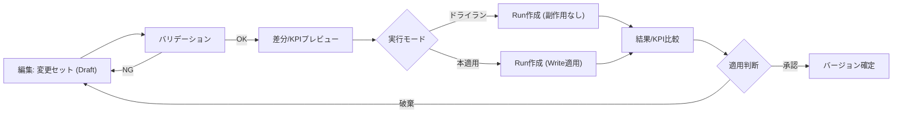
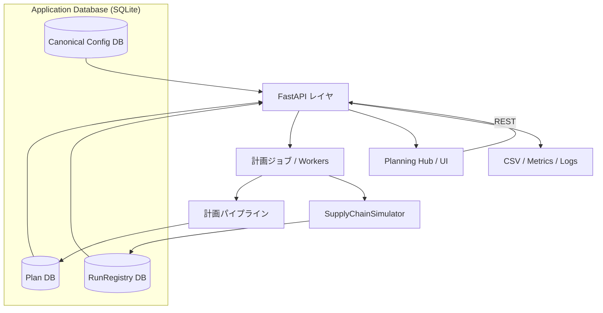

# サプライチェーン計画シミュレーション

[](https://github.com/miumigy/scpln/actions/workflows/ci.yml)

店舗・倉庫・工場・資材をノード/リンクでモデル化し、日次PSIシミュレーションと集約（月次/ファミリ）↔詳細（週次/SKU）の計画整合を同じプラットフォームで扱える統合環境です。Planning Hub UI、計画パイプライン、REST API、RunRegistry（履歴・比較）を組み合わせ、需要計画の検証から供給調整・KPI評価までを一貫して実施できます。

---

## ハイライト

- **多粒度整合**: 集約→詳細への按分と、詳細→集約へのロールアップを同一バージョン上で管理。編集やロックを尊重した双方向同期を自動化。
- **Planning Hub UI**: Planの作成・プレビュー・再整合・実行までをタブで横断。Diff、KPI、CSVエクスポートにより意思決定を支援。
- **Canonical設定管理**: `/ui/configs` からCanonical設定のバージョン一覧、差分比較、JSON/Plan成果物インポート、整合チェックを一元提供。詳細な統合ロードマップは `docs/config_integration_plan.md` を参照。
- **シミュレーション & RunRegistry**: BOM・能力・サービスレベルを考慮した日次シミュレーションを実行し、Run履歴をDBに永続化して比較・再利用。運用ルールとフォールバックは `docs/run_registry_operations.md` に整理。
- **自動化とAPI**: `/plans/integrated/run` や `/runs` を通じたジョブ投入、再整合API、CSVエクスポート、メトリクスを公開。CLI/CIからスクリプト連携が可能。

---

## コンポーネント概要

### 1. Planning Hub（/ui/plans）
- Planのバージョン管理・閲覧・ロールアップ/分配編集・ロック管理を提供。
- PSI編集は比例配分・ロック遵守で双方向同期。差分ログ、Carryover、Schedule、Compare をタブで確認。
- `docs/TUTORIAL-JA.md` にUI操作ハンズオンを用意。

### 2. Canonical設定管理 (/ui/configs)
- Canonical設定バージョンの閲覧・詳細確認・JSONダウンロード・差分比較を提供します。
- 検証済みの設定のみをDBに保存し、入力ソースとしてJSONファイルやPlan成果物（`canonical_snapshot.json`）を受け付けます。
- 差分ページでは、品目・ノード・BOMなどのエンティティごとに追加/削除/変更されたキーの一覧と件数を可視化します。
- UI経由でインポートされた設定には、どのRun/Planと紐づくか追跡するための `ui_import` 属性が付与されます。
- 使い始めるには、`/ui/configs` の「サンプルをインポート」ボタンを利用するか、`python3 scripts/seed_canonical.py --save-db` を実行してサンプル設定をDBに直接ロードします。
- サーバが異なるデータベースを参照している場合（`SCPLN_DB`環境変数）、`--db-path $SCPLN_DB` を指定してサンプルをロードしてください。

Canonical設定統合の設計原則と移行履歴は `docs/config_integration_plan.md` に一次情報として維持しています。RunRegistry 側の恒久運用ルールおよびフォールバック手順は `docs/run_registry_operations.md` を参照してください。

#### UX背景と狙い
- 入口の分散や再実行手順の煩雑さを解消し、「編集→差分確認→実行→結果確認」を一貫体験として提供。
- 実行前に差分とKPIインパクトを標準化されたプレビューで確認し、ドライランと本適用を安全に切り分け。
- Run API を単一経路に統一し、履歴・比較・再実行の観測性と再現性を高める。

#### 設計原則
- 単一入口・文脈一貫・1アクション実行を徹底し、いつでも後戻りできる状態を維持。
- 差分プレビューを需要・在庫・サービスレベル・MOQ・キャパシティ・PLの共通フォーマットで表示。
- シナリオ、パイプライン、ラン、変更セット、バージョンといった用語を統一し、操作とデータモデルを揃える。

#### Plan/Run情報モデル（Planning Hub全体設計の要点）
Planning Hub全体設計ドキュメントから、PlanとRunの関係を理解するための主要要素だけを抽出しています。
- シナリオ: 需要・在庫・政策・制約のバージョン集合。
- 変更セット: シナリオに対する差分（ドラフト→レビュー→適用/破棄）。
- Plan: Config/Run/Job を束ねる中核オブジェクト。`state` は `draft → aggregated → disaggregated → scheduled → executed` を遷移し、上流を編集した際は下流成果物を再生成待ちにマーキング。
- パイプライン: 版管理されたDAG。Planの実行は Run API を通じて `dry` と `apply` の二段階で記録。
- Run: シナリオ版 × パイプライン版 × 条件（期間/スコープ/環境）の組み合わせ。ログ・KPI差分・成果物を監査用途で保持。



#### 現状の対応状況
- Plan DB化（Canonical設定DB化）と、それに対応するUI（`/ui/plans`, `/ui/configs`）の主要機能実装を完了しています。
- これには、Planのバージョン管理、ロールアップ/分配編集、差分プレビュー、PSIシミュレーション連携（RunRegistry）が含まれます。

#### PSIシミュレーション/Run Registry（A）とPlanning Hub統合Plan（B）の連携
- B側のPlanning HubでPlanを編集し「Plan & Run」を実行すると、集約→詳細→再整合パイプラインの完了後にA側のPSIシミュレーション（Run）が同じ入力でキューされ、RunRegistryに記録されます。
- 生成された `version_id` ↔ `run_id` の対応が保証されるため、Plan詳細画面（B）とRun履歴（A）のどちらからでも同一シナリオのKPI・ログ・成果物にアクセスできます。
- Aで得たサービスレベルや在庫・コストの実績値を、Bの差分/KPIプレビューと突き合わせて「計画（集約・詳細）→実行（PSIシミュレーション）→振り返り」のループを回せます。
- 代表的な運用: ① Bで変更セットを作成→差分/KPIを確認 → ② 「Plan & Run」でRunを実行 → ③ AのRunRegistryで結果を検証 → ④ BのPlanを確定/再調整。


### 2. 計画パイプライン（Aggregate ↔ Detail）
- `aggregate` → `allocate` → `mrp` → `reconcile_levels` → `plan_final` をDAGとして実行。
- `docs/AGG_DET_RECONCILIATION_JA.md` にアルゴリズム、パラメタ、検証手順を整理。
- `tests/test_psi_sync.py` でDET⇄AGG同期を回帰テスト化（CI `quick-planning-tests`）。

### 3. PSIシミュレーション & RunRegistry（Aコンポーネント）
- `SimulationInput`（domain/models）をもとに `SupplyChainSimulator` が日次PSIとコストを算定。
- Run結果は `data/scpln.db` の RunRegistry に保存し、`/runs` や `/ui/runs` から再参照可能。
- Run比較API・トレースエクスポートでKPI分析を自動化。
- Planning Hub（B）から渡されたシナリオやcutover/anchor等のPlanパラメタをRunRegistryが保持することで、A⇔B間で同じバージョンIDを軸にトレースできます。

RunRegistry の標準運用フロー、監視、フォールバック手順は `docs/run_registry_operations.md` を参照してください。

---

## クイックスタート

### 1. 環境準備

```bash
python3 -m venv .venv
source .venv/bin/activate
pip install -r requirements.txt
```

### 2. サービス起動

```bash
bash scripts/serve.sh        # uvicorn main:app を起動（RELOAD=1でホットリロード）
bash scripts/status.sh       # ヘルスチェック / ログ確認
```

ブラウザで `http://localhost:8000` を開くと Planning Hub が表示されます。入口は `/ui/plans` に統一されています。

### 3. 設定の準備と計画実行

本システムは、すべての設定をバージョン管理された「Canonical設定」としてDBで管理します。

**1. サンプル設定のロード**

まず、標準のサンプル設定をDBにロードします。これにより、すぐにUIで確認できる計画の元データが作成されます。

```bash
# 仮想環境を有効化していることを確認
PYTHONPATH=. python3 scripts/seed_canonical.py --save-db
```

成功すると、`canonical_config_versions.id=...` のようにバージョンIDが出力されます。

**2. 計画の実行**

- **UIから実行（推奨）**: ブラウザで `http://localhost:8000/ui/plans` を開き、「新規Plan作成（統合Run）」ボタンをクリックします。ダイアログで、先ほど作成した設定バージョン（通常は最新のもの）を選択し、計画を実行します。

- **APIから実行**: `POST /plans/integrated/run` エンドポイントに対して、`config_version_id` を含むJSONペイロードを送信することで、計画ジョブを起動できます。

計画が完了すると、成果物（`plan_final.json`）やKPIレポート（`report.csv`）が生成され、UI上で確認・ダウンロードできます。

---

## 計画パイプライン概要（要約）


- **下り（Aggregate→Detail）**: `scripts/allocate.py` が需要・供給・バックログをSKU×週へ分解。ロック・重み・カットオーバーに対応。
- **上り（Detail→Aggregate）**: `PATCH /plans/{version}/psi` のDET編集が自動でAGGに集計。`tests/test_psi_sync.py` が保存則を検証。
- **再整合**: `/plans/{version}/psi/reconcile` や `/plans/integrated/run` でcutover/anchor/tolを指定し、差分ログやCarryoverを生成。

---

## ドキュメントマップ（MECE）

| カテゴリ | 目的 | ドキュメント |
| --- | --- | --- |
| **オンボーディング / 用語** | UI操作と共通用語の理解 | `docs/TUTORIAL-JA.md`, `docs/TERMS-JA.md` |
| **計画パイプライン** | 集約↔詳細整合、UX計画、導入手順 | `docs/AGG_DET_RECONCILIATION_JA.md` |
| **設定・DB統合** | Canonical設定とRunRegistry統合の背景・意思決定記録 | `docs/config_integration_plan.md` |
| **API / 自動化** | REST/CSVエンドポイント、ジョブ投入の概要 | `docs/API-OVERVIEW-JA.md` |
| **運用・セキュリティ** | シークレット対応、バックアップ、CI設定 | `docs/SECRET_ROTATION_JA.md`, `.github/workflows/*` |
| **クラス設計** | SimulationInput系モデルとエンジン連携 | `docs/CLASS_DESIGN_JA.md` |
| **RunRegistry運用** | Plan中心Run運用手順とレガシー停止手順 | `docs/run_registry_operations.md` |
| **ロードマップ / リリース** | 拡張テーマ・リリース履歴 | `docs/EXPANSION_STRATEGY_JA.md`, `CHANGELOG.md` |

各ドキュメントは上記カテゴリに収め、重複内容はリンクで参照し合う構成としています。README は概要と導線を提供し、詳細は個別ドキュメントに委譲します。

---

## API & 実行エントリ

| 用途 | エンドポイント / スクリプト | 備考 |
| --- | --- | --- |
| 一括計画実行 | `POST /plans/integrated/run` / `scripts/run_planning_pipeline.py` | 同期/非同期、cutover・anchor指定可（`.sh` は互換ラッパ） |
| PSI編集 | `PATCH /plans/{version}/psi` | DET/AGG 双方向。`no_auto` で自動同期停止 |
| 差分ログ再生成 | `POST /plans/{version}/psi/reconcile` | tol, anchor, carryover, adjust を制御 |
| Run実行（抽象） | `POST /runs` | `pipeline=integrated` を既存パイプラインに委譲 |
| KPIレポート | `/plans/{version}/summary`, `/compare`, `/schedule.csv` など | UIタブからのDLに対応 |

メトリクス（Prometheus）やヘルスチェックは `/metrics`, `/healthz` から取得できます。

---

## 開発・運用メモ

- **テスト**: `source .venv/bin/activate && PYTHONPATH=. pytest`。CIは `tests`, `quick-planning-tests`, `ci.yml` で構成。`tests/test_psi_sync.py` と `tests/test_planning_pipeline.py` を重点監視。
- **データベース**: 既定は SQLite (`data/scpln.db`)。`SCPLN_DB` で接続先を変更。バックアップは `backup_script.py` を使用。
- **RunRegistry 管理**: `REGISTRY_BACKEND=db|memory`, `RUNS_DB_MAX_ROWS` でポリシー設定。古いRunは自動クリーンアップ。
- **環境変数**: 認証 `AUTH_MODE=apikey|basic|none`、ジョブ実行 `JOBS_ENABLED=1`、APIキーはUI側`localStorage.api_key` と合わせて設定。
- **CI/CD**: GitHub Actions（`ci.yml`, `tests.yml`, `quick-planning-tests.yml`）。Renderへの自動デプロイは `deploy-render.yml` を参照。
- **ログ/メトリクス**: `simulation.log`, `server.log`, Prometheus `/metrics`。OpenTelemetry連携は `render.yaml` で設定可能。

---

## アーキテクチャ



`main.py` が FastAPI アプリを起動し、副作用インポートで API / UI ルートを登録します。計画パイプラインは API 経由で非同期ジョブとして実行され、その結果はすべて Application Database に永続化されます。UI は API を通じてこれらのDBから情報を取得し、ユーザーに表示します。

---

## 変更履歴・拡張

- 変更履歴: `CHANGELOG.md`
- 拡張戦略: `docs/EXPANSION_STRATEGY_JA.md`
- 既知の制約や今後の改善点は `docs/AGG_DET_RECONCILIATION_JA.md` を参照してください。

---

## ライセンス

MIT License で公開しています。詳細は `LICENSE` を参照ください。ドキュメントやコードを再利用する場合は出典を明示してください。
