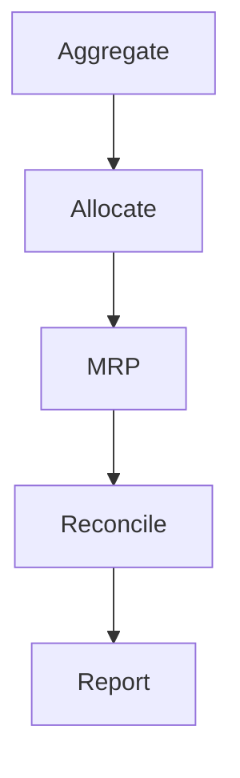
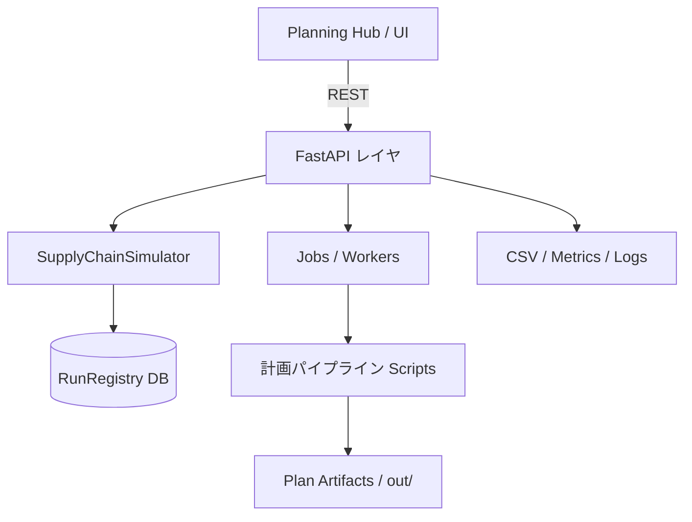

# サプライチェーン計画シミュレーション

[](https://github.com/miumigy/scpln/actions/workflows/ci.yml)

店舗・倉庫・工場・資材をノード/リンクでモデル化し、日次PSIシミュレーションと集約（月次/ファミリ）↔詳細（週次/SKU）の計画整合を同じプラットフォームで扱える統合環境です。Planning Hub UI、計画パイプライン、REST API、RunRegistry（履歴・比較）を組み合わせ、需要計画の検証から供給調整・KPI評価までを一貫して実施できます。

---

## ハイライト

- **多粒度整合**: 集約→詳細への按分と、詳細→集約へのロールアップを同一バージョン上で管理。編集やロックを尊重した双方向同期を自動化。
- **Planning Hub UI**: Planの作成・プレビュー・再整合・実行までをタブで横断。Diff、KPI、CSVエクスポートにより意思決定を支援。
- **シミュレーション & RunRegistry**: BOM・能力・サービスレベルを考慮した日次シミュレーションを実行し、Run履歴をDBに永続化して比較・再利用。
- **自動化とAPI**: `/plans/integrated/run` や `/runs` を通じたジョブ投入、再整合API、CSVエクスポート、メトリクスを公開。CLI/CIからスクリプト連携が可能。

---

## コンポーネント概要

### 1. Planning Hub（/ui/plans）
- Planのバージョン管理・閲覧・ロールアップ/分配編集・ロック管理を提供。
- PSI編集は比例配分・ロック遵守で双方向同期。差分ログ、Carryover、Schedule、Compare をタブで確認。
- `docs/TUTORIAL-JA.md` にUI操作ハンズオンを用意。

### 2. 計画パイプライン（Aggregate ↔ Detail）
- `aggregate` → `allocate` → `mrp` → `reconcile_levels` → `plan_final` をDAGとして実行。
- `docs/AGG_DET_RECONCILIATION_JA.md` にアルゴリズム、パラメタ、検証手順を整理。
- `tests/test_psi_sync.py` でDET⇄AGG同期を回帰テスト化（CI `quick-planning-tests`）。

### 3. シミュレーション & RunRegistry
- `SimulationInput`（domain/models）をもとに `SupplyChainSimulator` が日次PSIとコストを算定。
- Run結果は `data/scpln.db` の RunRegistry に保存し、`/runs` や `/ui/runs` から再参照可能。
- Run比較API・トレースエクスポートでKPI分析を自動化。

---

## クイックスタート

### 1. 環境準備

```bash
python3 -m venv .venv
source .venv/bin/activate
pip install -r requirements.txt
```

### 2. サービス起動

```bash
bash scripts/serve.sh        # uvicorn main:app を起動（RELOAD=1でホットリロード）
bash scripts/status.sh       # ヘルスチェック / ログ確認
```

ブラウザで `http://localhost:8000` を開くと Planning Hub が表示されます。入口は `/ui/plans` に統一されています。

### 3. サンプル計画を実行

```bash
PYTHONPATH=. python3 scripts/plan_aggregate.py -i samples/planning -o out/aggregate.json
PYTHONPATH=. python3 scripts/allocate.py -i out/aggregate.json -I samples/planning -o out/sku_week.json --weeks 4 --round int
PYTHONPATH=. python3 scripts/mrp.py -i out/sku_week.json -I samples/planning -o out/mrp.json --weeks 4 --lt-unit day
PYTHONPATH=. python3 scripts/reconcile.py -i out/sku_week.json out/mrp.json -I samples/planning -o out/plan_final.json --weeks 4 --cutover-date 2025-09-01 --recon-window-days 7
PYTHONPATH=. python3 scripts/reconcile_levels.py -i out/aggregate.json out/sku_week.json -o out/reconciliation_log.json --version v-local --tol-abs 1e-6 --tol-rel 1e-6
```

Planning Hub UI の「新規Plan作成（統合Run）」から同等の処理を一括実行できます。詳細は `docs/TUTORIAL-JA.md` を参照してください。

---

## 計画パイプライン概要（要約）



- **下り（Aggregate→Detail）**: `scripts/allocate.py` が需要・供給・バックログをSKU×週へ分解。ロック・重み・カットオーバーに対応。
- **上り（Detail→Aggregate）**: `PATCH /plans/{version}/psi` のDET編集が自動でAGGに集計。`tests/test_psi_sync.py` が保存則を検証。
- **再整合**: `/plans/{version}/psi/reconcile` や `/plans/integrated/run` でcutover/anchor/tolを指定し、差分ログやCarryoverを生成。

---

## ドキュメントマップ（MECE）

| カテゴリ | 目的 | ドキュメント |
| --- | --- | --- |
| **オンボーディング / 用語** | UI操作と共通用語の理解 | `docs/TUTORIAL-JA.md`, `docs/TERMS-JA.md` |
| **計画パイプライン** | 集約↔詳細整合、UX計画、導入手順 | `docs/AGG_DET_RECONCILIATION_JA.md`, `docs/PLANNING-HUB-UX-PLAN.md` |
| **API / 自動化** | REST/CSVエンドポイント、ジョブ投入の概要 | `docs/API-OVERVIEW-JA.md` |
| **運用・セキュリティ** | シークレット対応、バックアップ、CI設定 | `docs/SECRET_ROTATION_JA.md`, `.github/workflows/*` |
| **ロードマップ / リリース** | 拡張テーマ・リリース履歴 | `docs/EXPANSION_STRATEGY_JA.md`, `docs/release-notes-v0.5.0.md` |

各ドキュメントは上記カテゴリに収め、重複内容はリンクで参照し合う構成としています。README は概要と導線を提供し、詳細は個別ドキュメントに委譲します。

---

## API & 実行エントリ

| 用途 | エンドポイント / スクリプト | 備考 |
| --- | --- | --- |
| 一括計画実行 | `POST /plans/integrated/run` / `scripts/run_planning_pipeline.sh` | 同期/非同期、cutover・anchor指定可 |
| PSI編集 | `PATCH /plans/{version}/psi` | DET/AGG 双方向。`no_auto` で自動同期停止 |
| 差分ログ再生成 | `POST /plans/{version}/psi/reconcile` | tol, anchor, carryover, adjust を制御 |
| Run実行（抽象） | `POST /runs` | `pipeline=integrated` を既存パイプラインに委譲 |
| KPIレポート | `/plans/{version}/summary`, `/compare`, `/schedule.csv` など | UIタブからのDLに対応 |

メトリクス（Prometheus）やヘルスチェックは `/metrics`, `/healthz` から取得できます。

---

## 開発・運用メモ

- **テスト**: `source .venv/bin/activate && PYTHONPATH=. pytest`。CIは `tests`, `quick-planning-tests`, `ci.yml` で構成。`tests/test_psi_sync.py` と `tests/test_planning_pipeline.py` を重点監視。
- **データベース**: 既定は SQLite (`data/scpln.db`)。`SCPLN_DB` で接続先を変更。バックアップは `backup_script.py` を使用。
- **RunRegistry 管理**: `REGISTRY_BACKEND=db|memory`, `RUNS_DB_MAX_ROWS` でポリシー設定。古いRunは自動クリーンアップ。
- **環境変数**: 認証 `AUTH_MODE=apikey|basic|none`、ジョブ実行 `JOBS_ENABLED=1`、APIキーはUI側`localStorage.api_key` と合わせて設定。
- **CI/CD**: GitHub Actions（`ci.yml`, `tests.yml`, `quick-planning-tests.yml`）。Renderへの自動デプロイは `deploy-render.yml` を参照。
- **ログ/メトリクス**: `simulation.log`, `server.log`, Prometheus `/metrics`。OpenTelemetry連携は `render.yaml` で設定可能。

---

## アーキテクチャ



`main.py` が FastAPI アプリを起動し、副作用インポートで API / UI ルートを登録します。計画パイプラインは CLI スクリプトとして独立実行も可能です。

---

## 変更履歴・拡張

- 変更履歴: `docs/release-notes-v0.5.0.md`
- 拡張戦略: `docs/EXPANSION_STRATEGY_JA.md`
- 既知の制約や今後の改善点は `docs/AGG_DET_RECONCILIATION_JA.md` および `docs/PLANNING-HUB-UX-PLAN.md` を参照してください。

---

## ライセンス

リポジトリ内のライセンス表記に従います。ドキュメントやコードを再利用する場合は出典を明示してください。
