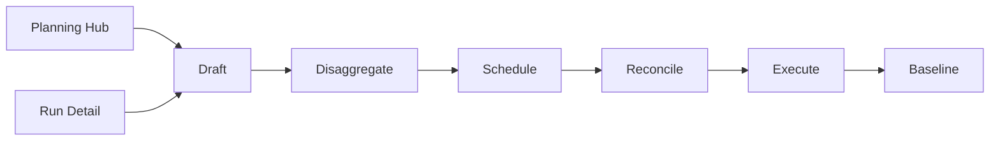
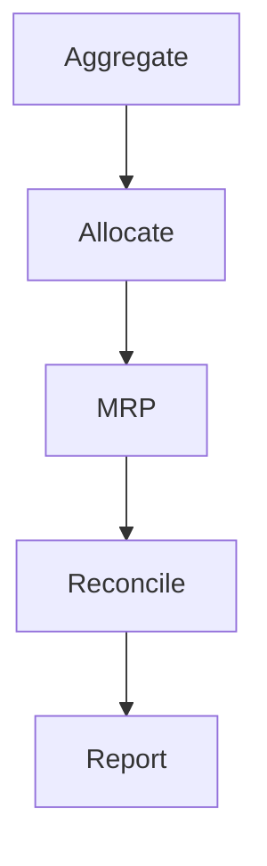
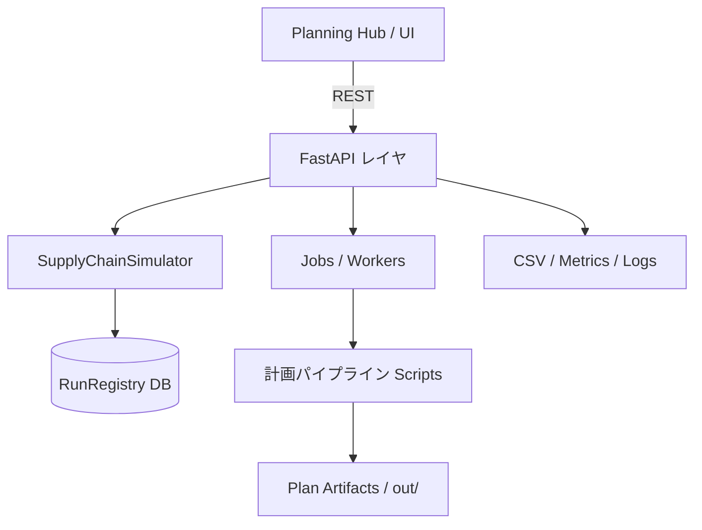

# サプライチェーン計画シミュレーション

[](https://github.com/miumigy/scpln/actions/workflows/ci.yml)

店舗・倉庫・工場・資材をノード/リンクでモデル化し、日次PSIシミュレーションと集約（月次/ファミリ）↔詳細（週次/SKU）の計画整合を同じプラットフォームで扱える統合環境です。Planning Hub UI、計画パイプライン、REST API、RunRegistry（履歴・比較）を組み合わせ、需要計画の検証から供給調整・KPI評価までを一貫して実施できます。

---

## ハイライト

- **多粒度整合**: 集約→詳細への按分と、詳細→集約へのロールアップを同一バージョン上で管理。編集やロックを尊重した双方向同期を自動化。
- **Planning Hub UI**: Planの作成・プレビュー・再整合・実行までをタブで横断。Diff、KPI、CSVエクスポートにより意思決定を支援。
- **シミュレーション & RunRegistry**: BOM・能力・サービスレベルを考慮した日次シミュレーションを実行し、Run履歴をDBに永続化して比較・再利用。
- **自動化とAPI**: `/plans/integrated/run` や `/runs` を通じたジョブ投入、再整合API、CSVエクスポート、メトリクスを公開。CLI/CIからスクリプト連携が可能。

---

## コンポーネント概要

### 1. Planning Hub（/ui/plans）
- Planのバージョン管理・閲覧・ロールアップ/分配編集・ロック管理を提供。
- PSI編集は比例配分・ロック遵守で双方向同期。差分ログ、Carryover、Schedule、Compare をタブで確認。
- `docs/TUTORIAL-JA.md` にUI操作ハンズオンを用意。

### 2. 計画パイプライン（Aggregate ↔ Detail）
- `aggregate` → `allocate` → `mrp` → `reconcile_levels` → `plan_final` をDAGとして実行。
- `docs/AGG_DET_RECONCILIATION_JA.md` にアルゴリズム、パラメタ、検証手順を整理。
- `tests/test_psi_sync.py` でDET⇄AGG同期を回帰テスト化（CI `quick-planning-tests`）。

### 3. シミュレーション & RunRegistry
- `SimulationInput`（domain/models）をもとに `SupplyChainSimulator` が日次PSIとコストを算定。
- Run結果は `data/scpln.db` の RunRegistry に保存し、`/runs` や `/ui/runs` から再参照可能。
- Run比較API・トレースエクスポートでKPI分析を自動化。

---

## クイックスタート

### 1. 環境準備

```bash
python3 -m venv .venv
source .venv/bin/activate
pip install -r requirements.txt
```

### 2. サービス起動

```bash
bash scripts/serve.sh        # uvicorn main:app を起動（RELOAD=1でホットリロード）
bash scripts/status.sh       # ヘルスチェック / ログ確認
```

ブラウザで `http://localhost:8000` を開くと Planning Hub が表示されます。入口は `/ui/plans` に統一されています。

### 3. サンプル計画を実行

- UI: `/ui/plans` → 「新規Plan作成（統合Run）」で実行（作成後に詳細へ）
- API: `POST /plans/integrated/run`（同期, 従来） または `POST /runs`（アダプタ, P-16）
  - 例（/runs, 同期）: `{ "pipeline":"integrated", "async": false, "options": { "input_dir":"samples/planning", "weeks":4, "lt_unit":"day" } }`
  - 例（/runs, 非同期）: `{ "pipeline":"integrated", "async": true,  "options": { ... } }`（`/ui/jobs/{job_id}` で進捗確認）
- スクリプト: `bash scripts/run_planning_pipeline.sh -I samples/planning -o out --weeks 4`
  - プリセット: `--preset det_near|agg_far|blend`（`--cutover-date` と併用）

Planning Hub UI の「新規Plan作成（統合Run）」から同等の処理を一括実行できます。詳細は `docs/TUTORIAL-JA.md` を参照してください。

### 4. DBバックアップ・リストア

- 取得: `bash scripts/backup_db.sh`（`SCPLN_DB`が指すDBを`backup/`へコピー）
- 復元: `bash scripts/restore_db.sh backup/scpln_YYYYmmdd_HHMMSS.db`

## Web UI 詳細（抜粋）

- `/ui/runs`
  - ページャ: First/Prev/Next/Last とページ番号ジャンプ（Page x/y）。`limit`/`sort`/`order`/`schema_version`/`config_id` は localStorage に保存・復元
  - ソート: 列見出し（started_at/duration_ms/schema_version）クリックで昇順/降順を切替（↑/↓を表示）
  - 比較: 行チェック→Use selected→Compare、または Compare selected で直接比較
  - CSV: 各行から `results.csv`/`pl.csv`/`summary.csv`/`trace.csv` を直接ダウンロード可能（res/pl/sum/trace リンク）
- `/ui/jobs`
  - 集計ジョブ: run_id/dataset/bucket に加え、`date_field`/`tz`/`calendar_mode`、`week_start_offset`/`month_len`、`product_map`/`location_map`(JSON)を指定可能
  - プリセット: フォーム値をローカルに保存/読込/削除（localStorage）。繰り返しの集計設定を一括適用
  - プリセットの共有: Export（JSONファイル）/Import に対応し、チーム内で設定を共有可能
- 入力支援: 最新Runから `group_keys`/`sum_fields` 候補を自動推測し、datalist へ提示
 - `/ui/scenarios`（フェーズ2の土台）
    - シナリオ一覧/追加のUI（名前/タグ/親ID/説明）
    - API: `GET /scenarios`, `GET /scenarios/{id}`, `POST /scenarios`, `PUT /scenarios/{id}`, `DELETE /scenarios/{id}`
    - シナリオからのシミュレーション実行: シナリオ一覧から設定を選択し、シミュレーションジョブを投入
    - シナリオ比較プリセット: ベースシナリオとターゲットシナリオを指定し、最新の実行結果を比較

<!-- 図解セクションはパイプライン説明の後方へ移動しました -->

 

## 集約計画/詳細計画パイプライン

設計と詳細手順は整合ガイドに集約しています。READMEでは最小限の実行方法のみを示します。

- 整合ガイド: [集約↔詳細 計画の統合・整合ガイド](docs/AGG_DET_RECONCILIATION_JA.md)（擬似コード／パラメタ早見／FAQ／サンプル）

### 整合トラブルシュート（PSI/分配）

- violationが解消されない／分配されない場合の確認点
  - ロック確認: 行/セルがロックされていると分配対象外（Lock Managerで解除）
  - period表記の整合: Aggregate.period が `YYYY-MM` または `YYYY-Www` でも、DET抽出は以下を許容（実装済）
    - `det.period == per`（ISO週キー同士の一致）
    - `det.week == per`（Aggregate側がISO週キーをperiodに持つ場合）
    - `_week_to_month(det.week) == per`（週→月の対応）
  - 上り同期: DETセルを編集すると対応するAGG行へ自動ロールアップ（ロック済み行/セルは除外、APIパラメタ`no_auto`で無効化）
  - 供給フィールド: DETの供給は `supply` が無ければ `supply_plan` を集計（reconcile_levels で対応済）
  - Tol設定: UIの TolAbs/TolRel を一時的に緩めて差分の性質を確認
  - 認証: 環境変数でAPIキーが有効な場合、UI実行時にも `localStorage.api_key` が必要

- 単体検証（コマンド例）
  - 差分ログ生成（適用後の一時出力を使用）
    - `PYTHONPATH=. python3 scripts/reconcile_levels.py -i out/psi_apply_<version>/aggregate.json out/psi_apply_<version>/sku_week.json -o out/psi_apply_<version>/reconciliation_log.json --version <version> --tol-abs 1e-6 --tol-rel 1e-6`
  - before/after比較CSV出力
    - `PYTHONPATH=. python3 scripts/export_reconcile_csv.py -i out/reconciliation_log.json -o out/reconciliation_before.csv --label before`
    - adjusted がある場合: `-j out/reconciliation_log_adjusted.json --label2 after`
- サンプル入力: samples/planning/（2025-01〜2025-12の月次を含み、年内フル≒365日をカバー）

-実行方法（最小）
- UI: `/ui/plans` → 「新規Plan作成（統合Run）」で実行（作成後に詳細へ）
- API: `POST /plans/integrated/run`（同期, 従来） または `POST /runs`（アダプタ, P-16）
  - 例（/runs, 同期）: `{ "pipeline":"integrated", "async": false, "options": { "input_dir":"samples/planning", "weeks":4, "lt_unit":"day" } }`
  - 例（/runs, 非同期）: `{ "pipeline":"integrated", "async": true,  "options": { ... } }`（`/ui/jobs/{job_id}` で進捗確認）
- スクリプト: `bash scripts/run_planning_pipeline.sh -I samples/planning -o out --weeks 4`
  - プリセット: `--preset det_near|agg_far|blend`（`--cutover-date` と併用）

出力（out/）
- aggregate.json / sku_week.json / mrp.json / plan_final.json / reconciliation_log.json / report.csv
- 任意（anchor適用・adjusted指定時）: sku_week_adjusted.json / reconciliation_log_adjusted.json / mrp_adjusted.json / plan_final_adjusted.json / report_adjusted.csv

補足
- v2ポリシー（DET_near/AGG_far/blend）やパラメタの意味は整合ガイドを参照
- スモーク: `python scripts/spill_smoke.py -i out/plan_final.json`

### 計画立案フロー（簡略）

- Draft: 集約入力を確認（family×period）
- Disaggregate: SKU×週へ配賦（需要/供給/在庫）
- Schedule: MRPで予定オーダ生成（能力・在庫制約反映）
- Reconcile: cutover/anchor/tolerance で整合（調整後DETは任意）
- Execute: PlanをもとにRunを実施、KPI確認、承認/ベースライン化




Planning Hub UI の「新規Plan作成（統合Run）」から同等の処理を一括実行できます。詳細は `docs/TUTORIAL-JA.md` を参照してください。

---

## 計画パイプライン概要（要約）



- **下り（Aggregate→Detail）**: `scripts/allocate.py` が需要・供給・バックログをSKU×週へ分解。ロック・重み・カットオーバーに対応。
- **上り（Detail→Aggregate）**: `PATCH /plans/{version}/psi` のDET編集が自動でAGGに集計。`tests/test_psi_sync.py` が保存則を検証。
- **再整合**: `/plans/{version}/psi/reconcile` や `/plans/integrated/run` でcutover/anchor/tolを指定し、差分ログやCarryoverを生成。

---

## ドキュメントマップ（MECE）

| カテゴリ | 目的 | ドキュメント |
| --- | --- | --- |
| **オンボーディング / 用語** | UI操作と共通用語の理解 | `docs/TUTORIAL-JA.md`, `docs/TERMS-JA.md` |
| **計画パイプライン** | 集約↔詳細整合、UX計画、導入手順 | `docs/AGG_DET_RECONCILIATION_JA.md`, `docs/PLANNING-HUB-UX-PLAN.md` |
| **API / 自動化** | REST/CSVエンドポイント、ジョブ投入の概要 | `docs/API-OVERVIEW-JA.md` |
| **運用・セキュリティ** | シークレット対応、バックアップ、CI設定 | `docs/SECRET_ROTATION_JA.md`, `.github/workflows/*` |
| **クラス設計** | SimulationInput系モデルとエンジン連携 | `docs/CLASS_DESIGN_JA.md` |
| **ロードマップ / リリース** | 拡張テーマ・リリース履歴 | `docs/EXPANSION_STRATEGY_JA.md`, `CHANGELOG.md` |

各ドキュメントは上記カテゴリに収め、重複内容はリンクで参照し合う構成としています。README は概要と導線を提供し、詳細は個別ドキュメントに委譲します。

---

## API & 実行エントリ

| 用途 | エンドポイント / スクリプト | 備考 |
| --- | --- | --- |
| 一括計画実行 | `POST /plans/integrated/run` / `scripts/run_planning_pipeline.sh` | 同期/非同期、cutover・anchor指定可 |
| PSI編集 | `PATCH /plans/{version}/psi` | DET/AGG 双方向。`no_auto` で自動同期停止 |
| 差分ログ再生成 | `POST /plans/{version}/psi/reconcile` | tol, anchor, carryover, adjust を制御 |
| Run実行（抽象） | `POST /runs` | `pipeline=integrated` を既存パイプラインに委譲 |
| KPIレポート | `/plans/{version}/summary`, `/compare`, `/schedule.csv` など | UIタブからのDLに対応 |

メトリクス（Prometheus）やヘルスチェックは `/metrics`, `/healthz` から取得できます。

---

## 開発・運用メモ

- **テスト**: `source .venv/bin/activate && PYTHONPATH=. pytest`。CIは `tests`, `quick-planning-tests`, `ci.yml` で構成。`tests/test_psi_sync.py` と `tests/test_planning_pipeline.py` を重点監視。
- **データベース**: 既定は SQLite (`data/scpln.db`)。`SCPLN_DB` で接続先を変更。バックアップは `backup_script.py` を使用。
- **RunRegistry 管理**: `REGISTRY_BACKEND=db|memory`, `RUNS_DB_MAX_ROWS` でポリシー設定。古いRunは自動クリーンアップ。
- **環境変数**: 認証 `AUTH_MODE=apikey|basic|none`、ジョブ実行 `JOBS_ENABLED=1`、APIキーはUI側`localStorage.api_key` と合わせて設定。
- **CI/CD**: GitHub Actions（`ci.yml`, `tests.yml`, `quick-planning-tests.yml`）。Renderへの自動デプロイは `deploy-render.yml` を参照。
- **ログ/メトリクス**: `simulation.log`, `server.log`, Prometheus `/metrics`。OpenTelemetry連携は `render.yaml` で設定可能。

---

## アーキテクチャ



`main.py` が FastAPI アプリを起動し、副作用インポートで API / UI ルートを登録します。計画パイプラインは CLI スクリプトとして独立実行も可能です。

---

## 変更履歴・拡張

- 変更履歴: `CHANGELOG.md`
- 拡張戦略: `docs/EXPANSION_STRATEGY_JA.md`
- 既知の制約や今後の改善点は `docs/AGG_DET_RECONCILIATION_JA.md` および `docs/PLANNING-HUB-UX-PLAN.md` を参照してください。

---

## ライセンス

MIT License で公開しています。詳細は `LICENSE` を参照ください。ドキュメントやコードを再利用する場合は出典を明示してください。
