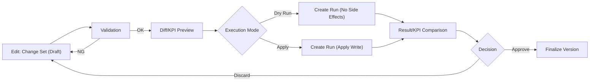

# Supply Chain Planning MVP

[](https://github.com/miumigy/scpln/actions/workflows/ci.yml)

This repository provides an integrated environment that models stores, warehouses, factories, and materials as nodes and links. It runs daily PSI simulations and keeps aggregated (monthly/family) and detailed (weekly/SKU) plans reconciled on the same platform. By combining the Planning Hub UI, planning pipelines, REST APIs, and the RunRegistry for history and comparison, you can execute the full loop from demand validation to supply adjustment and KPI review.

👉 Looking for the Japanese version? Read [README_JA.md](README_JA.md).

---

## Highlights

- **Multi-granularity reconciliation**: Manage top-down allocation and bottom-up rollups within the same plan version, with bidirectional sync that respects edits and locks.
- **Planning Hub UI**: Navigate plan creation, preview, reconciliation, and execution across tabs. Diff views, KPIs, and CSV exports support rapid decision making.
- **Canonical configuration management**: `/ui/configs` offers version browsing, diff comparison, JSON and plan artifact import, and consistency checks in a single place. See `docs/config_integration_plan.md` for the detailed roadmap.
- **Simulation & RunRegistry**: Run daily PSI simulations that respect BOMs, capacity, and service level targets, then persist each run for comparison and reuse.
- **Automation and APIs**: Submit jobs through `/runs`, trigger reconciliation APIs, and expose CSV exports and metrics. Everything can be orchestrated from CLI tools or CI workflows.

---

## Component overview

### 1. Planning Hub (`/ui/plans`)
- Provides plan version management, browsing, rollup/allocation editing, and lock administration.
- PSI editing performs proportional allocation with lock awareness, and tabs expose diffs, carryover, schedules, and comparisons.
- Hands-on UI walkthroughs are available in `docs/TUTORIAL.md`.

### 2. Canonical configuration management (`/ui/configs`)
- View versions, inspect details, download JSON, and compare diffs for canonical configurations.
- Only validated configurations are persisted to the database; inputs can be JSON files or plan artifacts such as `canonical_snapshot.json`.
- Diff pages visualize added, removed, and changed keys for entities like items, nodes, and BOMs.
- Configurations imported through the UI receive a `ui_import` attribute to trace which run/plan they originated from.
- To get started, click “Import sample” in `/ui/configs` or run `python3 scripts/seed_canonical.py --save-db` to load sample data directly.
- If the server points to a different database (via the `SCPLN_DB` environment variable), pass `--db-path $SCPLN_DB` when loading samples.

Design principles and migration history for canonical integration are documented across the relevant papers.

#### UX motivation
- Remove fragmented entry points and complex rerun steps by offering a single flow: edit → review diffs → execute → review results.
- Preview diffs and KPI impact in a standardized view before execution to keep dry runs and live application safe.
- Consolidate all execution through the Run API to improve observability and reproducibility for history, comparisons, and reruns.

#### Design principles
- Maintain a single entry point with consistent context and one-action execution, so users can always revert safely.
- Show diff previews for demand, inventory, service level, MOQ, capacity, and P&L metrics in a common format.
- Align vocabulary—scenario, pipeline, run, change set, version—between UI actions and data models.

#### Plan/Run information model (Planning Hub essentials)
The following elements summarize the relationship between plans and runs from the broader Planning Hub design document:
- **Scenario**: A versioned collection of demand, inventory, policy, and constraint data.
- **Change set**: Differences applied to a scenario, progressing from draft to review to applied/discarded.
- **Plan**: The central object that groups configs, runs, and jobs. Its `state` transitions through `draft → aggregated → disaggregated → scheduled → executed`, and upstream edits mark downstream artifacts for regeneration.
- **Pipeline**: A versioned DAG. Plan executions are recorded through the Run API with a two-step `dry` and `apply` process.
- **Run**: A combination of scenario version, pipeline version, and execution parameters (horizon, scope, environment). Runs keep logs, KPI deltas, and artifacts for auditability.



#### Current coverage
- Core functionality for plan database support (canonical configuration persistence) and the corresponding UIs (`/ui/plans`, `/ui/configs`) is complete.
- This includes plan versioning, rollup/allocation editing, diff previews, and PSI simulation integration via the RunRegistry.

#### Coordination between PSI simulation / RunRegistry (component A) and Planning Hub plans (component B)
- When a plan is edited in the Planning Hub and “Execute plan” is triggered, the aggregate → detail → reconciliation pipeline finishes first, then queues a PSI simulation (run) on the same inputs, recording it in the RunRegistry.
- Because every `version_id` and `run_id` pair is synchronized, KPI dashboards, logs, and artifacts are reachable from both the plan detail screen (B) and run history (A).
- Service levels, inventory, and cost actuals from A can be contrasted against B’s diff/KPI preview to close the loop of plan (aggregate/detail) → execution (PSI simulation) → review.
- Typical workflow: (1) create a change set in B and review diffs/KPIs → (2) execute the plan to create a run → (3) inspect the result in A’s RunRegistry → (4) finalize or adjust the plan in B.

### 3. Planning pipeline (Aggregate ↔ Detail)
- Executes the DAG `aggregate → allocate → mrp → reconcile_levels → plan_final`.
- Algorithms, parameters, and validation flows are documented in `docs/AGG_DET_RECONCILIATION.md`.
- `tests/test_psi_sync.py` provides regression coverage for DET↔AGG synchronization (CI job `quick-planning-tests`).

### 4. PSI simulation & RunRegistry (component A)
- `SupplyChainSimulator` computes daily PSI and costs from the `SimulationInput` models in `domain/models`.
- Run results are persisted to `data/scpln.db` and can be revisited via `/runs` or `/ui/runs`.
- KPI analysis is automated through the run comparison API and trace exports.
- Plan parameters such as scenario IDs, cutovers, and anchors are stored alongside runs, enabling bidirectional traceability between components A and B.

---

## Quick start

### 1. Prepare the environment

```bash
python3 -m venv .venv
source .venv/bin/activate
pip install -r requirements.txt
```

### 2. Start services

Use the following commands to launch the API server and the developer database client:

```bash
# Start both the API server and the DB client
bash scripts/serve.sh

# Start only the API server
bash scripts/serve.sh api

# Start only the developer DB client (Datasette)
bash scripts/serve.sh db

# Stop all running services
bash scripts/stop.sh
```

