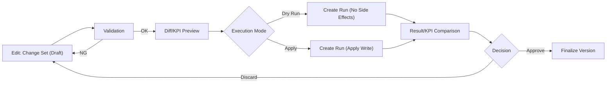

# サプライチェーン計画MVP

[](https://github.com/miumigy/scpln/actions/workflows/ci.yml)

👉 英語版は [README.md](README.md) を参照してください。

店舗・倉庫・工場・資材をノード/リンクでモデル化し、日次PSIシミュレーションと集約（月次/ファミリ）↔詳細（週次/SKU）の計画整合を同じプラットフォームで扱える統合環境です。Planning Hub UI、計画パイプライン、REST API、RunRegistry（履歴・比較）を組み合わせ、需要計画の検証から供給調整・KPI評価までを一貫して実施できます。

---

## ハイライト

- **多粒度整合**: 集約→詳細への按分と、詳細→集約へのロールアップを同一バージョン上で管理。編集やロックを尊重した双方向同期を自動化。
- **Planning Hub UI**: Planの作成・プレビュー・再整合・実行までをタブで横断。Diff、KPI、CSVエクスポートにより意思決定を支援。
- **Canonical設定管理**: `/ui/configs` からCanonical設定のバージョン一覧、差分比較、JSON/Plan成果物インポート、整合チェックを一元提供。詳細な統合ロードマップは `docs/config_integration_plan.md` を参照。
- **シミュレーション & RunRegistry**: BOM・能力・サービスレベルを考慮した日次シミュレーションを実行し、Run履歴をDBに永続化して比較・再利用。
- **自動化とAPI**: `/runs` を通じたジョブ投入、再整合API、CSVエクスポート、メトリクスを公開。CLI/CIからスクリプト連携が可能で、Planning Hub UI（`execute_auto`/`create_and_execute`）から発生したPlanも `plans_created_total` へカウントされて `/metrics` に追記され、API計測と揃います。

---

## コンポーネント概要

### 1. Planning Hub（/ui/plans）
- Planのバージョン管理・閲覧・ロールアップ/分配編集・ロック管理を提供。
- PSI編集は比例配分・ロック遵守で双方向同期。差分ログ、Carryover、Schedule、Compare をタブで確認。
- プラン詳細では `/ui/plans/{version_id}/delete` へのPOSTを通じて PlanRepository/アーティファクト/Run参照を一括削除し、`/ui/plans` へ戻る削除フローを提供。
- `docs/TUTORIAL-JA.md` にUI操作ハンズオンを用意。

### 2. Canonical設定管理 (/ui/configs)
- Canonical設定バージョンの閲覧・詳細確認・JSONダウンロード・差分比較を提供します。
- 検証済みの設定のみをDBに保存し、入力ソースとしてJSONファイルやPlan成果物（`canonical_snapshot.json`）を受け付けます。
- 差分ページでは、品目・ノード・BOMなどのエンティティごとに追加/削除/変更されたキーの一覧と件数を可視化します。
- UI経由でインポートされた設定には、どのRun/Planと紐づくか追跡するための `ui_import` 属性が付与されます。
- 使い始めるには、`/ui/configs` の「サンプルをインポート」ボタンを利用するか、`python3 scripts/seed_canonical.py --save-db` を実行してサンプル設定をDBに直接ロードします。
- サーバが異なるデータベースを参照している場合（`SCPLN_DB`環境変数）、`--db-path $SCPLN_DB` を指定してサンプルをロードしてください。

Canonical設定統合の設計原則や移行の経緯は、関連ドキュメントで補完されています。

#### Planning入力CLI（Import / Export）
UIに加えて、正規化された `planning_input_sets` テーブルを直接読み書きするCLIを提供しています。

| 目的 | コマンド | 補足 |
|------|----------|------|
| CSV/JSON を `planning_input_sets` へ取り込み | `PYTHONPATH=. python scripts/import_planning_inputs.py -i samples/planning --version-id 101 --label weekly_refresh` | `--validate-only`, `--apply-mode merge|replace`, `--json` などを指定可能。ランタイムで `samples/planning` に依存せずDBへ入力を登録。 |
| InputSet を CSV 出力 | `PYTHONPATH=. python scripts/export_planning_inputs.py --label weekly_refresh --include-meta --zip` | `out/planning_inputs_<label>` に `samples/planning` 互換ファイルを生成。`--zip` でアーカイブ化し、UIダウンロードやCI成果物に活用。 |
| InputSetイベント履歴を表示 | `PYTHONPATH=. python scripts/show_planning_input_events.py --label weekly_refresh --limit 30 --json` | `planning_input_set_events` の `upload/update/approve/revert` 履歴をJSONまたはテキストで出力。監査ログやCI通知に利用可能。 |

同じ履歴は REST API `GET /api/plans/input_sets/{label}/events?limit=100` からも取得できます。Planning Hub の「History」表と同じペイロードで返却されるため、Runbookや監査エクスポートにそのまま流用できます。

標準フロー:
1. 整備済みCSV/JSON（またはCI成果物）を import CLI で取り込み、対象バージョンに紐づく入力セットを登録。
2. Planning Hub や API で登録済みラベルを参照して計画生成（`/plans/create_and_execute` へ `"input_set_label":"weekly_refresh"` を渡す）。
3. export CLI でPlan作成時に利用した入力を再出力し、監査・再現性確保や下流共有に利用。

API での指定例:

```bash
curl -sS http://localhost:8000/plans/create_and_execute \
  -H 'content-type: application/json' \
  -d '{
        "config_version_id": 14,
        "input_set_label": "weekly_refresh",
        "round_mode": "int",
        "lt_unit": "day"
      }' | jq .
```

#### InputSet承認・監査フロー
- Import/UIアップロード直後のInputSetは `draft` ステータスです。`/ui/plans/input_sets/{label}` の「Review」タブで承認（draft→ready）または差戻し（ready→draft）を実行すると、`approved_by/approved_at/review_comment` が記録され、`planning_input_set_events` に `approve/revert` が追加されます。
- 履歴は CLI (`scripts/show_planning_input_events.py --label <label> --json`) や REST (`GET /api/plans/input_sets/{label}/events`) から取得し、`evidence/input_sets/<label>/<YYYYMMDD>/` に JSON と Historyスクリーンショットを保管します。
- Diff確認は `/ui/plans/input_sets/{label}/diff` で行い、初回アクセス時に `scripts/export_planning_inputs.py --diff-against` をバックグラウンドで実行して `tmp/input_set_diffs/` にキャッシュします。
- より詳細な運用手順やCLIフォールバックは [docs/runbook_planning_inputs_JA.md](docs/runbook_planning_inputs_JA.md) を参照してください。

#### Legacy / Missing 警告への対応
- Plan/Run詳細には **Legacy mode**（`input_set_label` 無し）と **Missing InputSet**（ラベルはあるがDBに存在しない）の警告カードが表示されます。
- Legacy mode の場合は承認済みInputSetを指定してPlanを再実行するのが基本運用。再実行できない場合は `scripts/export_planning_inputs.py --label <label> --include-meta --zip` で使用入力をエクスポートし、例外理由とともにRunへ添付します。
- Missing InputSet の場合は `scripts/import_planning_inputs.py -i out/planning_inputs_<label> --version-id <id> --label <label>` で過去のCSVバンドルを再登録するか、Planを現行Readyセットに付け替えます。
- いずれも `planning_input_set_events` に対応ログ（UIまたは `log_planning_input_set_event`）を残し、Runbook記載のSlackチャンネルへ報告してください。

#### Planning入力セット監視とDiffジョブ
- `input_set_diff_jobs_total{result="success|failure"}`、`input_set_diff_cache_hits_total`、`input_set_diff_cache_stale_total` のメトリクスでDiffジョブとキャッシュの健全性を追跡。`monitoring/input_set_diff.rules.yml` では失敗連続をアラートし、`grafana/dashboards/planning_input_sets.json` でヒット率や平均生成時間を可視化します。
- `tmp/input_set_diffs/{label}__{against}.json` を削除しUIでDiffを再アクセスするとDiffが再生成されます。必要なら `PYTHONPATH=. .venv/bin/python scripts/export_planning_inputs.py --label foo --diff-against bar` で手動Diffをエクスポートして監査証跡として保管してください。
- 証跡は `evidence/input_sets/{label}/{YYYYMMDD}/`（Historyスクリーンショット＋`events.json`）にまとめてRunbookどおりセキュアにアーカイブ。`rg -n "input_set_diff_job_failed" uvicorn.out` で直近のログを追跡し、`planning_input_set_events` に `diff_job_id` を書き戻してHistoryタブで共有します。

#### UX背景と狙い
- 入口の分散や再実行手順の煩雑さを解消し、「編集→差分確認→実行→結果確認」を一貫体験として提供。
- 実行前に差分とKPIインパクトを標準化されたプレビューで確認し、ドライランと本適用を安全に切り分け。
- Run API を単一経路に統一し、履歴・比較・再実行の観測性と再現性を高める。

#### 設計原則
- 単一入口・文脈一貫・1アクション実行を徹底し、いつでも後戻りできる状態を維持。
- 差分プレビューを需要・在庫・サービスレベル・MOQ・キャパシティ・PLの共通フォーマットで表示。
- シナリオ、パイプライン、ラン、変更セット、バージョンといった用語を統一し、操作とデータモデルを揃える。

#### Plan/Run情報モデル（Planning Hub全体設計の要点）
Planning Hub全体設計ドキュメントから、PlanとRunの関係を理解するための主要要素だけを抽出しています。
- シナリオ: 需要・在庫・政策・制約のバージョン集合。
- 変更セット: シナリオに対する差分（ドラフト→レビュー→適用/破棄）。
- Plan: Config/Run/Job を束ねる中核オブジェクト。`state` は `draft → aggregated → disaggregated → scheduled → executed` を遷移し、上流を編集した際は下流成果物を再生成待ちにマーキング。
- パイプライン: 版管理されたDAG。Planの実行は Run API を通じて `dry` と `apply` の二段階で記録。
- Run: シナリオ版 × パイプライン版 × 条件（期間/スコープ/環境）の組み合わせ。ログ・KPI差分・成果物を監査用途で保持。



#### 現状の対応状況
- Plan DB化（Canonical設定DB化）と、それに対応するUI（`/ui/plans`, `/ui/configs`）の主要機能実装を完了しています。
- これには、Planのバージョン管理、ロールアップ/分配編集、差分プレビュー、PSIシミュレーション連携（RunRegistry）が含まれます。

#### PSIシミュレーション/Run Registry（A）とPlanning Hub統合Plan（B）の連携
- B側のPlanning HubでPlanを編集し「計画実行」を行うと、集約→詳細→再整合パイプラインの完了後にA側のPSIシミュレーション（Run）が同じ入力でキューされ、RunRegistryに記録されます。
- 生成された `version_id` ↔ `run_id` の対応が保証されるため、Plan詳細画面（B）とRun履歴（A）のどちらからでも同一シナリオのKPI・ログ・成果物にアクセスできます。
- Aで得たサービスレベルや在庫・コストの実績値を、Bの差分/KPIプレビューと突き合わせて「計画（集約・詳細）→実行（PSIシミュレーション）→振り返り」のループを回せます。
- 代表的な運用: ① Bで変更セットを作成→差分/KPIを確認 → ② 「計画実行」でRunを実行 → ③ AのRunRegistryで結果を検証 → ④ BのPlanを確定/再調整。


### 3. 計画パイプライン（Aggregate ↔ Detail）
- `aggregate` → `allocate` → `mrp` → `reconcile_levels` → `plan_final` をDAGとして実行。
- `docs/AGG_DET_RECONCILIATION_JA.md` にアルゴリズム、パラメタ、検証手順を整理。
- `tests/test_psi_sync.py` でDET⇄AGG同期を回帰テスト化（CI `quick-planning-tests`）。

### 4. PSIシミュレーション & RunRegistry（Aコンポーネント）
- `SimulationInput`（domain/models）をもとに `SupplyChainSimulator` が日次PSIとコストを算定。
- Run結果は `data/scpln.db` の RunRegistry に保存し、`/runs` や `/ui/runs` から再参照可能。
- Run比較API・トレースエクスポートでKPI分析を自動化。
- Planning Hub（B）から渡されたシナリオやcutover/anchor等のPlanパラメタをRunRegistryが保持することで、A⇔B間で同じバージョンIDを軸にトレースできます。

---

## クイックスタート

### 1. 環境準備

```bash
python3 -m venv .venv
source .venv/bin/activate
pip install -r requirements.txt
```

### 2. サービス起動

以下のコマンドでAPIサーバーや開発用DBクライアントを起動します。

```bash
# APIサーバーとDBクライアントの両方を起動
bash scripts/serve.sh

# APIサーバーのみを起動
bash scripts/serve.sh api

# 開用DBクライアント (Datasette) のみを起動
bash scripts/serve.sh db

# 起動中のサービスをすべて停止
bash scripts/stop.sh
```
