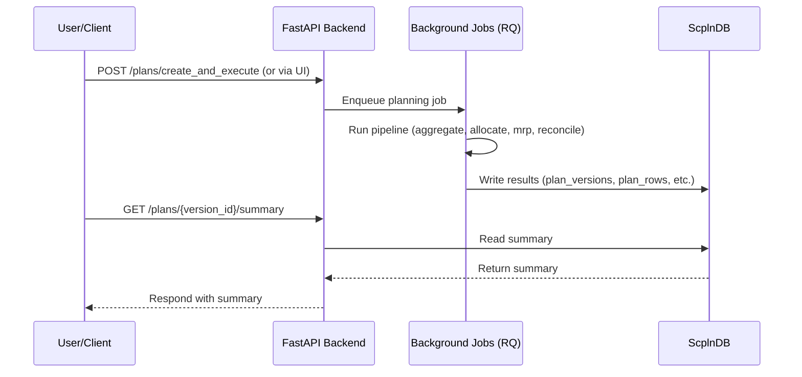

# Aggregate ↔ Detail Planning Reconciliation Guide

Purpose and scope:

- Systematize the design, algorithms, and validation steps required to keep aggregate (AGG) and detail (DET) plans aligned within the same `plan_version`.
- UI flows are covered in `docs/TUTORIAL.md`, and the overall UX is summarized in the “Planning Hub” section of the README.
- For API entry points, see `docs/API-OVERVIEW.md`.

This document is the definitive technical reference linked from the README. It explains conservation rules, cutover and anchor strategies, and validation guidelines in depth.

## Objectives and requirements
- **Single version of truth**: Store both aggregate and detail plans in the same `plan_version` so that they can be cross-referenced, compared, and reconciled.
- **Bidirectional consistency**:
  - Downstream: allocate the aggregate plan into detail while honoring constraints, BOM structure, and capacity.
  - Upstream: roll detail back into aggregate, exposing deltas and residuals.
- **Boundary alignment**: Keep inventory, demand, backlog, and WIP continuous across the boundary between near-term (detail) and long-term (aggregate).
- **Conservation**: Totals for demand, supply, and inventory balance remain equal even after level/granularity conversions.
- **Operations**: Ensure idempotency, staged rollout, manageable runtime, and auditable logs.

## Planning Hub execution UX and unified Run API
- To maintain a single entry point for “edit → diff preview → dry run → apply → review results,” we route executions through the Run API (`POST /runs`).
- Diff previews surface demand, inventory, service level, MOQ/multiples, capacity, and P&L metrics in a common format, and operators confirm the dry-run outcome before applying.
- Plans transition through `draft → aggregated → disaggregated → scheduled → executed`; editing upstream tasks flags downstream artifacts for regeneration.
- The information model is composed of scenarios (input versions), change sets (draft deltas), pipelines (versioned DAGs), and runs (scenario version × pipeline version × parameters). Logs and artifacts are stored per run for auditability.
- UI-triggered runs standardize two stages: `mode=dry` (no side effects) followed by `mode=apply` (committed writes).

## Terminology and assumptions
- **Levels**: `AGG` (aggregate) and `DET` (detail).
- **Granularity**: Time (weekly/monthly vs. daily), item (family vs. SKU), and location (site/network).
- **Boundary date**: `cutover_date`. `< cutover` defaults to detail, while `≥ cutover` defaults to aggregate.
- **Reconciliation window**: `recon_window_days`. Perform strict reconciliation across the boundary for several days (e.g., ±3–7).

## Data model (database)
Planning data is normalized across the following tables:

- `plan_versions`: metadata for each plan version.
  - `version_id` (PK), `created_at`, `base_scenario_id`, `status` (draft/active/superseded), `cutover_date`, `recon_window_days`, `objective`, `note`.
- `plan_rows`: rows per time bucket, item, and location.
  - Common keys: `version_id`, `level` (AGG/DET), `time_bucket` (date or period), `item_key` (SKU or family), `location_key`.
  - Metrics: `demand`, `supply`, `prod_qty`, `ship_qty`, `inventory_open`, `inventory_close`, `backlog`, `capacity_used`, `cost_*`.
  - Meta flags: `source` (aggregate|allocate|mrp|recon|override), `lock_flag`, `quality_flag`.
- `reconciliation_log`: execution history for reconciliation checks, including delta details.
  - `version_id`, `window_start`, `window_end`, `delta_metric`, `delta_value`, `policy`, `run_id`, `summary`.

All of these are produced and persisted via the `POST /plans/create_and_execute` API and can be retrieved with `GET /plans/{version_id}/...` endpoints.

## Planning calendar specification and usage
- Canonical configurations store `PlanningCalendarSpec` entries inside `calendars`. Each period defines `start_date`, `end_date`, and `weeks[*]` (`week_code`, `sequence`, `start_date`, `end_date`, `weight`, optional `attributes`). The `weight` drives proportional allocations.
- `planning_params` contains shared parameters such as `default_anchor_policy` and `recon_window_days`, which are referenced across week allocation and reconciliation steps. `core/config/models.PlanningCalendarSpec` provides the normalized model.
- Pipeline stages (`allocate.py`, `mrp.py`, `reconcile.py`, `anchor_adjust.py`, `reconcile_levels.py`) load `planning_calendar.json` through `scripts/calendar_utils`, unifying week ordering, period-to-week mapping, and inbound-date to week-code conversion.
- When a canonical configuration supplies `planning_calendar.json`, the UI/API/CLI automatically sets `--calendar`. If not, we fall back to `--weeks` (equal split) and record `fallback_weeks` in `inputs_summary.calendar_mode`.
- Samples live in `samples/planning/planning_calendar.json`, and regression cases such as ISO-week crossover or five-week months are covered by `tests/test_calendar_utils.py`.

## Architecture and flow
- Standard phases:
  1. Aggregate (coarse S&OP)
  2. Allocate (aggregate → detail split)
  3. Light MRP/CRP (material and capacity alignment in detail)
  4. Reconcile (detail → aggregate rollup and delta resolution)
  5. Report/KPI
- Orchestration: `plan_integrated(version_id, cutover_date, recon_window_days, policy)` drives the DAG.
- Re-runs: Reuse the same `version_id` for overwrites when inputs/parameters are identical (rows with `lock_flag` remain untouched).

## Reconciliation algorithms (essentials)
- **Aggregate → Detail (allocate)**:
  - Time granularity: distribute weekly/monthly data into days using business-day weights, demand phasing, lead times, and capacity constraints.
  - Item granularity: split families into SKUs using historical mix, promotions, priorities, and service-level weights.
  - Rounding: `round=int|bankers`; residuals are redistributed in order of demand priority, inventory slack, and lowest cost.
- **Detail → Aggregate (roll-up)**:
  - Roll up DET rows sharing the same `version_id` and compute deltas `Δ` versus AGG.
  - Accept when `|Δ| ≤ tol`; otherwise apply policies.
- **Policies (examples)**:
  - `anchor=DET_near`: lock the N days before the boundary to DET and adjust AGG.
  - `anchor=AGG_far`: lock the M periods after the boundary to AGG and redistribute DET.
  - `blend`: blend DET and AGG within the reconciliation window using weighted averages (e.g., triangular weights).
- **Conservation and continuity**:
  - Inventory continuity: `INV_close(t-1) == INV_open(t)` enforced at the boundary.
  - Demand conservation: sum of aggregate-period demand equals the sum of daily demand.
  - Supply conservation: production + procurement + receipts = shipments + inventory delta + scrap.
  - Backlog continuity: `BL_close(t-1) == BL_open(t)`.
- **Constraint handling**:
  - Capacity: keep resource loads under limits; when DET exceeds capacity, push adjustments upstream to AGG (mix review).
  - BOM: maintain consistency between parent demand and component requirements, back-propagating material inventory and lead-time constraints.

### Compatibility notes (PSI / allocation & rollup)

- **Period-key compatibility (aggregate.period vs. detail)**
  - During allocation we treat periods as equivalent when any of the following match:
    - `det.period == agg.period` (ISO week keys like `2025-W03`).
    - `det.week == agg.period` (aggregate period stores the ISO week code).
    - `_week_to_month(det.week) == agg.period` (converting a week like `2025-W01` into `2025-01`).
  - Goal: keep allocation/rollup intact even if UI/CSV mixes `YYYY-MM` and `YYYY-Www` representations.

- **Detail supply field compatibility**
  - `reconcile_levels` prioritizes the `supply` field on DET rows and falls back to `supply_plan` when necessary.
  - PSI detail flows use `supply_plan`, so the rollup aggregates accordingly when comparing against AGG `supply`.

- **Allocation (aggregate → detail) behavior**
  - Default behavior is proportional split with the following weight options (UI `weight_mode`):
    - `current`: use current values; if the sum is zero and the target is positive, fall back to `equal`.
    - `equal`: equal distribution.
    - `weights`: use PSI Weights registered per key; if the total is zero, fall back to `current`.
    - An arbitrary field name (e.g., `demand`) to distribute by that metric.
  - **Respect locks**: row- and cell-level locks are excluded from allocation, and the remaining unlocked rows are renormalized.
  - **Rounding**: apply per-field rounding rules (nearest/floor/ceil plus step). Unlocked rows absorb residuals after rounding.

- **Troubleshooting tips (violations or missing allocation)**
  - Period mismatch: confirm aggregate `period` and detail `week/period` keys align with the compatibility rules.
  - Locks: verify there are no lingering locks for the family × period in the Lock Manager.
  - Supply field: DET rows with only `supply_plan` still aggregate correctly (handled in `reconcile_levels`).
  - Tolerances: tune `tol_abs`/`tol_rel` to understand the nature of deltas.
  - Authentication: when API keys are enabled, include `X-API-Key` for reconciliation endpoints (UI reads from `localStorage.api_key`).

### Current heuristics (pseudo code)
- Split the week list `weeks` into `pre` (`< cutover`), `at` (`= cutover month`), and `post` (`> cutover`).
- Provide `adjust_segment(weeks, start_slack, start_spill, mode)`:
  - `mode=forward`: traditional behavior—spill flows into the next week; slack also moves forward.
  - `mode=det_near|agg_far|blend`: pushes spill outside of the window and returns `end_spill`.
- **DET_near**:
  - `pre = forward(...0,0) → at = det_near(start_slack=pre.slack, start_spill=pre.spill) → post = forward(start_slack=at.slack, start_spill=at.spill)`
- **AGG_far**:
  - `pre1 = forward(...0,0) → at = agg_far(start_slack=pre1.slack, start_spill=pre1.spill)`
  - `pre2 = forward(start_slack=0, start_spill=at.spill) → post = forward(start_slack=at.slack, start_spill=0)`
  - Adopt `pre = pre2`, `at`, `post`.
- **blend**:
  - `pre1 = forward(...0,0) → at = blend(start_slack=pre1.slack, start_spill=pre1.spill)`
  - `share_next =` specified `--blend-split-next` value, otherwise derived dynamically from spill × proximity weights (triangular/linear/quadratic, larger within the window).
  - `spill_prev = at.spill * (1 - share_next)`, `spill_next = at.spill * share_next`.
  - `pre2 = forward(start_slack=0, start_spill=spill_prev) → post = forward(start_slack=at.slack, start_spill=spill_next)`
  - Adopt `pre = pre2`, `at`, `post`.

Notes:
- Conservation holds in every case. `weekly_summary` carries `zone`, `boundary_index`, and `in_window_*` fields to visualize boundaries.
- Tri/lin weights are linear; `quad` emphasizes proximity. `win_w = ceil(window_days/7)` defines the radius.

## Boundary design
- Within the reconciliation window `[cutover-W, cutover+W]`:
  - Before the boundary (`< cutover`): prioritize DET and absorb deltas into AGG (tune forward mix/volume).
  - After the boundary (`≥ cutover`): prioritize AGG and adjust DET allocations to hit aggregate targets.
  - On the boundary date: enforce exact matches between DET closing inventory/backlog/WIP and AGG opening values.
- Exceptions: explicitly lock events such as shutdowns or promotions (`lock_flag`) to prevent changes from either level.
