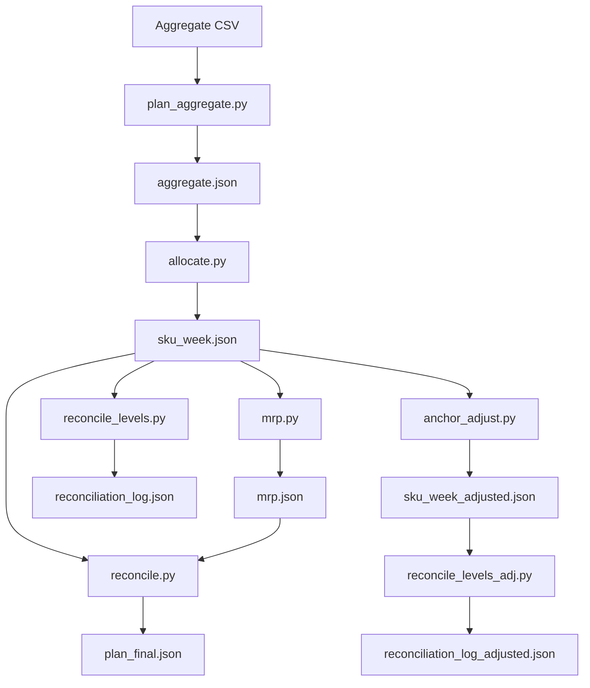

# 集約↔詳細 計画の統合・整合ガイド

本書は、集約レベル計画（例: ファミリ×週/月）と詳細レベル計画（例: SKU×日）の両立・整合を、単一の計画バージョン上で運用するための設計案です。直近は詳細主導、先々は集約主導としつつ、境界での断絶なく整合することを目的とします。

## 目的・要件
- 一貫バージョン: 同一 `plan_version` に集約・詳細の両計画を格納し、相互参照・比較・整合を可能にする。
- 双方向整合:
  - 下り: 集約計画 → 詳細按分（制約・BOM・能力を考慮）
  - 上り: 詳細計画 → 集約ロールアップ（差異・残差の可視化）
- 境界整合: 直近（詳細）と先々（集約）の境目で、在庫・需要・バックログ・WIPが連続する。
- 保存則: 需要・供給・在庫収支のトータルは、レベル/粒度変換後も一致。
- 運用: 再現性（idempotency）、段階的な導入、計算時間の制御、監査可能なログ。

## 用語・前提
- レベル: `AGG`（集約）/`DET`（詳細）。
- 粒度: 時間（週・月 vs 日）、品目（ファミリ vs SKU）、場所（拠点/ネットワーク）。
- 境界日: `cutover_date`。`< cutover` は詳細、`≥ cutover` は集約を原則とする。
- 整合ウィンドウ: `recon_window_days`。境界前後の数日（例: ±3〜7日）で厳格整合を実施。

## データモデル（DB/JSON）
- `plan_versions`:
  - `version_id` (PK), `created_at`, `base_scenario_id`, `status`(draft/active/superseded), `cutover_date`, `recon_window_days`, `objective`, `note`。
- `plan_rows`（正規化、もしくはJSON列に格納）:
  - 共通キー: `version_id`, `level`(AGG/DET), `time_bucket`(date or period), `item_key`(sku or family), `location_key`。
  - 指標: `demand`, `supply`, `prod_qty`, `ship_qty`, `inventory_open`, `inventory_close`, `backlog`, `capacity_used`, `cost_*`。
  - メタ: `source`(aggregate|allocate|mrp|recon|override), `lock_flag`, `quality_flag`。
- `reconciliation_log`:
  - `version_id`, `window_start`, `window_end`, `delta_metric`, `delta_value`, `policy`, `run_id`, `summary`。

JSONスキーマ（簡略）例: `out/plan_final.json`
- `version`: `string`
- `cutover_date`: `YYYY-MM-DD`
- `levels`: `{ "AGG": [...], "DET": [...] }` の配列。各要素は上記キー/指標を保持。

## アーキテクチャとフロー
- フェーズ（標準）:
  1) Aggregate（粗粒度S&OP）
  2) Allocate（按分: 集約→詳細）
  3) MRP/CRPライト（詳細の資材・能力整合）
  4) Reconcile（詳細→集約ロールアップと差の解消）
  5) Report/KPI
- オーケストレーション: `plan_integrated(version_id, cutover_date, recon_window_days, policy)` を中核にDAG実行。
- 再実行: 入力/パラメタが同一なら同一 `version_id` で上書き可能（`lock_flag` がある行は保持）。

## 整合アルゴリズム（要点）
- 集約→詳細（Allocate）:
  - 時間粒度: 週/月→日配分（営業日/稼働日ウェイト、需要位相、リードタイム/キャパ制約）
  - 品目粒度: ファミリ→SKU配分（過去実績ミックス、プロモ、優先度、サービスレベル重み）
  - 丸め: `round=int|bankers`。残差は需要優先・在庫余力・コスト低の順に再配分。
- 詳細→集約（Roll-up）:
  - 同一 `version_id` のDETをロールアップし、AGGとの差分`Δ`を算出。
  - `|Δ| ≤ tol`（許容）なら採用。超過ならポリシー適用。
- ポリシー（例）:
  - `anchor=DET_near`：境界の前`N`日はDETを固定、AGG側を修正。
  - `anchor=AGG_far`：境界の後`M`期間はAGGを固定、DET側を再配分。
  - `blend`：整合ウィンドウでDET/AGGを重み付けブレンド（例: 三角重み）。
- 保存・連続条件:
  - 在庫連続: `INV_close(t-1) == INV_open(t)`（境界日に厳格チェック）。
  - 需要保存: 集約期間合計需要 = 詳細日合計需要。
  - 供給保存: 生産+調達+受入 = 出荷+在庫変動+廃棄。
  - バックログ連続: `BL_close(t-1) == BL_open(t)`。
- 制約反映:
  - 能力: 工程/リソース負荷を上限内に。DETでの超過はAGGに戻し抑制（mix見直し）。
  - BOM: 上位需要→下位展開量の整合、原材料在庫/リードタイム制約の逆伝播。

### v2 ヒューリスティク（擬似コード）
- 週リスト `weeks` を `pre(<cutover)`, `at(=cutover月)`, `post(>cutover)` に分割。
- `adjust_segment(weeks, start_slack, start_spill, mode)` を用意。
  - `mode=forward`: 従来どおり spill を次週へ。slack も次週へ。
  - `mode=det_near|agg_far|blend`: 区間内で発生した spill を区間外へ吐き出し、戻り値 `end_spill` に集約。
- DET_near:
  - `pre=forward(…0,0) → at=det_near(start_slack=pre.slack, start_spill=pre.spill) → post=forward(start_slack=at.slack, start_spill=at.spill)`
- AGG_far:
  - `pre1=forward(…0,0) → at=agg_far(start_slack=pre1.slack, start_spill=pre1.spill)`
  - `pre2=forward(start_slack=0, start_spill=at.spill) → post=forward(start_slack=at.slack, start_spill=0)`
  - 採用: `pre=pre2` / `at` / `post`
- blend:
  - `pre1=forward(…0,0) → at=blend(start_slack=pre1.slack, start_spill=pre1.spill)`
  - `share_next =
      if --blend-split-next 指定: その値
      else: 週別 spill×近接重み（tri|lin|quad）から動的に算出（window内ほど大）`
  - `spill_prev=at.spill*(1-share_next), spill_next=at.spill*share_next`
  - `pre2=forward(start_slack=0, start_spill=spill_prev) → post=forward(start_slack=at.slack, start_spill=spill_next)`
  - 採用: `pre=pre2` / `at` / `post`

メモ:
- いずれも保存則（総量）は維持。`weekly_summary` に `zone/boundary_index/in_window_*` を付与し、境界の可視性を高める。
- 近接重み tri/lin は線形、quad は二次（近接を強調）。`win_w=ceil(window_days/7)` を半径に採用。

## 境界設計
- `cutover_date` 周辺の整合ウィンドウ `[cutover-W, cutover+W]` で以下を実施:
  - 前半（<cutover）: DET優先、AGGとの差分はAGGへ吸収（先々のmix/量を微調整）。
  - 後半（≥cutover）: AGG優先、DETの配分でAGGターゲットに合わせる。
  - 境界日: 在庫・バックログ・WIPの橋渡し（DETの`close`をAGGの`open`へ厳格一致）。
- 例外: 設備停止/販促等のイベントは境界で明示ロック（`lock_flag`）して上位/下位からの変更を禁止。

## 設定パラメタ（例）
- `cutover_date`: `YYYY-MM-DD`
- `recon_window_days`: `int`（既定: 7）
- `agg_time_bucket`: `week|month`、`det_time_bucket`: `day`
- `mix_source`: `history|manual|ml`
- `rounding`: `int|bankers`、`residual_policy`: `demand-priority|cost-min`
- `tol`: 許容誤差（相対/絶対）
- `anchor_policy`: `DET_near|AGG_far|blend`

## API/ジョブ（案）
- `POST /plans/integrated/run`:
  - body: `{ version_id?, base_scenario_id, cutover_date, recon_window_days, params... }`
  - 実行: aggregate→allocate→mrp→reconcile。`version_id` を返却。
- `POST /plans/{version}/reconcile`（再整合のみ）
- `GET /plans/{version}/summary`（KPI・差分・整合ログ）
- `GET /plans/{version}/compare?level=AGG|DET`（ロールアップ比較）

## 入出力スキーマ（抜粋）
- 入力: 需要/在庫/能力/BOM/カレンダー/階層/ミックス。
- 出力: `AGG`/`DET` 計画配列＋整合ログ、KPI（サービスレベル、在庫回転、能力使用率、PL）。

## 検証・KPI
- ハードチェック: 在庫連続/保存、バックログ連続、能力超過なし。
- ソフトチェック: 期間別`Δ`、SKU×拠点×期間の偏差分布、丸め残差の最大/中央値。
- KPI: fill rate、backlog days、inventory turns、capacity util、COGS/variance。

## 実装ステップ（段階導入）
1) v1: 既存パイプラインに `version_id` を通し、DET→AGGロールアップ比較・整合ログ出力を追加。
2) v2: `cutover_date`/`recon_window_days`/`anchor_policy` を導入し、境界整合を実装。
3) v3: API/UI 統合（統合実行・差分可視化・ロック編集）。
4) v4: ヒューリスティク高度化（混雑コスト・優先度・サービスレベル最適化）。

## 失敗時リカバリ
- 仕様: idempotent再実行（同versionで一部上書き）。
- ロールバック: `status=superseded` で旧versionを保持し参照切替。
- ログ: `reconciliation_log` に差分とポリシー適用を記録。

## テスト指針
- 単体: 配分丸め/残差再配分、境界在庫連続、保存則、能力上限処理。
- 結合: サンプルデータで AGG⇄DET 差が tol 内に収まること、境界`open/close`一致。
- 退行: 既存の`aggregate→allocate→mrp→reconcile`が破壊されないこと。

## 付録: 最小例（イメージ）
- `cutover=2025-09-01`, `W=3`。
- 週次AGG需要: family=A, loc=TOKYO, 9/1週=700。
- 日次DET配分: sku=A1/A2、9/1..9/7で営業日ウェイト配分、能力・LTで微調整。
- ロールアップ: DET合計=700、差分=0、境界 8/31 close = 9/1 open を満たす。

---
以上をベースに、段階導入（v1→v4）で統合整合を進めます。既存スクリプト群（aggregate/allocate/mrp/reconcile）に `version_id` と `cutover`/`window` パラメタを順次付与し、整合ログを追加する実装を提案します。

## 実装対応状況（v1/v2）と使い方
- スクリプト（CLI）:
  - `scripts/plan_aggregate.py`: 集約生成（サンプルCSV→`out/aggregate.json`）。
  - `scripts/allocate.py`: 集約→詳細按分（`out/sku_week.json`）。
  - `scripts/mrp.py`: MRPライト（LT/ロット/MOQ、`out/mrp.json`）。
- `scripts/reconcile.py`: 能力を考慮した週次CRPライト整合（`out/plan_final.json`）。
  - anchorポリシー（v2最小）: `--anchor-policy {DET_near|AGG_far|blend}`、`--cutover-date YYYY-MM-DD`、`--recon-window-days N`、`--blend-split-next r(0..1)`（blend時のpost比率; 未指定時は `N/at週数` に基づき動的算定、0.1〜0.9にクリップ）。
  - `scripts/reconcile_levels.py`: AGG↔DETのロールアップ差分ログ（`out/reconciliation_log*.json`）。
  - `scripts/anchor_adjust.py`: anchor=DET_near のDET微調整（`out/sku_week_adjusted.json`）。
  - `scripts/export_reconcile_csv.py`: 差分ログをCSV出力（before/after/compare）。
- API（実装済み）:
  - `POST /plans/integrated/run`: パイプライン一括実行（aggregate→allocate→mrp→reconcile→reconcile_levels）。必要に応じ `anchor_adjust` も実行。
  - `POST /plans/{version}/reconcile`: 既存成果物を再整合・差分再計算。
  - `GET /plans`: 登録済みバージョン一覧。
  - `GET /plans/{version}/summary`: 整合サマリと週次KPI。
  - `GET /plans/{version}/compare`: 差分明細。`violations_only`, `sort`, `limit` パラメタ対応。

### 推奨のローカル実行例（最小）
- 集約→按分→MRP→整合→差分ログ（before）:
  - `PYTHONPATH=. python3 scripts/plan_aggregate.py -i samples/planning -o out/aggregate.json`
  - `PYTHONPATH=. python3 scripts/allocate.py -i out/aggregate.json -I samples/planning -o out/sku_week.json --weeks 4 --round int`
  - `PYTHONPATH=. python3 scripts/mrp.py -i out/sku_week.json -I samples/planning -o out/mrp.json --lt-unit day --weeks 4`
  - `PYTHONPATH=. python3 scripts/reconcile.py -i out/sku_week.json out/mrp.json -I samples/planning -o out/plan_final.json --weeks 4 --cutover-date 2025-09-01 --recon-window-days 7`
  - `PYTHONPATH=. python3 scripts/reconcile_levels.py -i out/aggregate.json out/sku_week.json -o out/reconciliation_log.json --version v-local --cutover-date 2025-09-01 --recon-window-days 7 --tol-abs 1e-6 --tol-rel 1e-6`
- anchor調整（任意）と差分ログ（after）:
  - `PYTHONPATH=. python3 scripts/anchor_adjust.py -i out/aggregate.json out/sku_week.json -o out/sku_week_adjusted.json --cutover-date 2025-09-01 --anchor-policy DET_near -I samples/planning --carryover auto --max-adjust-ratio 0.2`
  - `PYTHONPATH=. python3 scripts/reconcile_levels.py -i out/aggregate.json out/sku_week_adjusted.json -o out/reconciliation_log_adjusted.json --version v-local-adjusted --cutover-date 2025-09-01 --recon-window-days 7 --tol-abs 1e-6 --tol-rel 1e-6`
- 差分CSVエクスポート:
  - `PYTHONPATH=. python3 scripts/export_reconcile_csv.py -i out/reconciliation_log.json -o out/reconciliation_before.csv --label before`
  - `PYTHONPATH=. python3 scripts/export_reconcile_csv.py -i out/reconciliation_log.json -j out/reconciliation_log_adjusted.json -o out/reconciliation_compare.csv --label before --label2 after`

### API実行例
- 一括実行（cutover/anchor指定、adjusted適用込み）:
  - `curl -X POST http://localhost:8000/plans/integrated/run -H 'Content-Type: application/json' -d '{"version_id":"v-demo","cutover_date":"2025-09-01","recon_window_days":7,"anchor_policy":"DET_near","apply_adjusted":true}'`
- 再整合（差分ログ再生成、anchor任意）:
  - `curl -X POST http://localhost:8000/plans/v-demo/reconcile -H 'Content-Type: application/json' -d '{"anchor_policy":"DET_near","cutover_date":"2025-09-01"}'`
- サマリ/比較:
  - `curl http://localhost:8000/plans/v-demo/summary`
  - `curl 'http://localhost:8000/plans/v-demo/compare?violations_only=true&sort=abs_desc&limit=200'`

## 整合ログのスキーマ（確定）
- `reconciliation_log.json`（scripts/reconcile_levels.py出力）:
  - `schema_version`: `recon-aggdet-1.0`
  - `version_id`: 生成時に付与したバージョン名（例: `v1`, `ui`, `job-xxxx`）
  - `cutover`: `{ cutover_date, recon_window_days, anchor_policy }`
  - `inputs_summary`: `{ aggregate_rows, det_rows, families, periods }`
  - `tolerance`: `{ abs, rel }`
  - `summary`: `{ rows, tol_violations, max_abs_delta: { demand, supply, backlog }, boundary: { period, violations, max_abs_delta, top: [...] } }`
  - `deltas`: `[ { family, period, agg_demand, det_demand, delta_demand, rel_demand, ok_demand, ... , ok } ]`

備考:
- `delta_*` は DET−AGG（DETが正の向き）。`ok` は全指標が tol 以内か。
- `boundary_period`（オプション）は `cutover_date` に一致する月/ISO週をタグ付け。
- `*_adjusted.json` は anchor 調整後のDETを対象に同スキーマで再出力。

## anchor調整（DET_near）の出力（概要）
- `sku_week_adjusted.json`（scripts/anchor_adjust.py 出力）:
  - `schema_version`: 元DETを継承（例: `agg-1.0`）
  - `note`: `v2 anchor調整: ...`（自動付与）
  - `cutover`: `{ cutover_date, anchor_policy, recon_window_days }`
  - `rows`: 元DETと同スキーマ。cutover月の `(family, period)` 合計が AGG と一致するよう `demand/supply/backlog` を微調整。
  - `carryover`: 隣接periodへ残差を移した場合のログ（`from_period/to_period/metrics`）。
  - `carryover_summary`: 件数と方向（prev/next）などの要約。

## Mermaid（処理フロー）


## 検証手順（具体）
- 整合ログの閾値: `--tol-abs`, `--tol-rel` を `1e-6` 程度に設定し、`summary.tol_violations=0` を確認。
- 境界一致: `boundary.period` の行で `ok=true` を確認。UI/CSVで `top` の偏差上位を見る。
- 能力整合: `plan_final.json.weekly_summary[*]` の `spill_out=0` または許容内かを確認。
- 回帰: `scripts/run_planning_pipeline.sh`（存在時）を用いて一連の成果物が生成されること。
- スモーク/アサート:
  - `python scripts/spill_smoke.py -i out/plan_final.json` で zone別の `spill_in/out` 合計を俯瞰。
  - `python scripts/spill_assert.py -i out/plan_final.json` で zone毎の `spill_in>eps` の週数が1以下であることを検証（セグメント先頭のみ流入がある想定）。

## 既知の制約/今後の改良
- `reconcile.py` の `--cutover-date/--recon-window-days/--anchor-policy` は段階導入中（v2最小を実装）。
  - DET_near: cutover月内のスピルは区間外（post）へ送る（pre/at/post分割、区間内へは持ち込まない）。
  - AGG_far: cutover月内のスピルを区間外（pre）へ戻す。preは at 由来のスピルを受けて再計算（従来比: post側の改変を抑制）。
  - blend: cutover月内スピルを pre/post に簡易分割（既定 50/50）。preを再計算し、postは at のスラック＋次期スピルを起点に前進。
  - いずれも最小ヒューリスティク（v2）。将来は週内配分の重み関数やウィンドウ連動の比率、工程別能力の精緻化を予定。
- `anchor_adjust.py` は DET_near の最小版。能力・入荷・コストのヘッドルーム重みは簡易指標（CSVで拡張可能）。
- `period` キーは `YYYY-MM` ないし `YYYY-Www` を想定。混在時は `reconcile_levels.py` が簡易推定するため、運用では一貫フォーマットを推奨。

## 運用ベストプラクティス（anchor_adjust × reconcile）
- 基本順序: allocate → mrp → reconcile(v2) → reconcile_levels(before) → anchor_adjust(任意) → reconcile_levels(after) → （必要なら）mrp/reconcile再計算。
- 目的分担:
  - `reconcile(v2)`: 能力観点の「スピルの向き」を制御（DET_near/AGG_far/blend）。cutover月の負荷をどちら側に寄せるかの方針。
  - `anchor_adjust`: DET（SKU×週）を AGG（月×ファミリ）に合わせて微調整（総量保存、carryoverで隣接periodへ分配）。
- 併用の推奨:
  - 先に `reconcile(v2)` で能力整合の方向付け → `reconcile_levels` で偏差を把握 → 必要時に `anchor_adjust` でDET合計をAGGへ合わせる。
  - `apply_adjusted` を使う場合は、`sku_week_adjusted.json` に対して `mrp` → `reconcile` を再実行し、CRP観点の妥当性を再確認。
- blend調整のコツ:
  - `--blend-weight-mode tri|lin|quad` と `--recon-window-days` で at週の中心・近接を強調。`--blend-split-next` を明示指定すると固定比で分配。
- 検証:
  - `python scripts/spill_smoke.py -i out/plan_final.json` で pre/at/post の spill 配置を俯瞰。DET_near/AGG_far は at週内の `spill_in` が先頭1行のみ非ゼロになるのが目安。

## UI 起動と確認手順
- サーバ起動（自動依存インストール・reload可）:
  - `bash scripts/serve.sh`（環境変数: `PORT=8000 RELOAD=1` など）
- UI画面:
  - `http://localhost:8000/ui/planning?dir=out/ui_planning_xxx`（成果物ディレクトリを指定）
  - 画面では `aggregate.json / sku_week.json / mrp.json / plan_final.json` に加え、`reconciliation_log*.json` のパスと差分要約を表示。
- API 経由の一括実行:
  - `POST /plans/integrated/run` 実行後、レスポンスの `out_dir` を `dir` に指定して確認。

## パラメタ早見（主要）
- `reconcile_levels.py`:
  - `--tol-abs`, `--tol-rel`: 許容誤差。
  - `--cutover-date`, `--recon-window-days`, `--anchor-policy`: 境界タグ付け・メタ情報。
- `anchor_adjust.py`:
  - `--cutover-date`(必須), `--anchor-policy`(既定 `DET_near`)。
  - `--carryover {none|prev|next|auto|both}`, `--carryover-split <0..1>`（`both/auto`時の配分）。
  - `--max-adjust-ratio <0..1>`（行ごとの相対上限）、`--tol-abs/--tol-rel`（微小差無視）。
  - `-I/--input-dir` と `--capacity/--open-po/--period-score/--pl-cost` でヘッドルーム重み付け。
- `reconcile.py`:
  - `--cutover-date`, `--recon-window-days`, `--anchor-policy`, `--blend-split-next`, `--blend-weight-mode`（tri|lin|quad）。
  - API/Jobs/UI の対応: `plans_api.post_plans_integrated_run`/`ui_planning`/`jobs._run_planning` が同名パラメタを委譲。
  - 推奨セット（例）:
    - 直近保護: `DET_near` + `recon_window_days=7`
    - 先々保護: `AGG_far` + `recon_window_days=7`
    - ブレンド: `blend` + `recon_window_days=14` + `blend_weight_mode=tri`（必要なら `blend_split_next` 固定）

### パラメタ対応表（CLI/API/UI/Jobs）
- 共通キー（計画一括実行 /plans/integrated/run の body）
  - `version_id`: 明示しない場合は自動採番（`v<epoch>-<id>`）。
  - `input_dir`: 既定 `samples/planning`。
  - `weeks`: 既定 4（1期間の週数ヒント）。
  - `round_mode`: 既定 `int`（allocate丸め）。
  - `lt_unit`: 既定 `day`（`mrp.py`）。
  - `cutover_date`: 例 `YYYY-MM-DD`。未指定時は v2動作は抑制（境界メタのみ無し）。
  - `recon_window_days`: 既定なし（動作は実装側のデフォルトに依存）。blendの動的分割・in_window_* に影響。
  - `anchor_policy`: `DET_near|AGG_far|blend`。未指定なら従来（forward）。
  - `blend_split_next`: 0..1。未指定時は動的に算出。
  - `blend_weight_mode`: `tri|lin|quad`。未指定時は tri。
  - `apply_adjusted`: bool。true の場合のみ anchor_adjust 後に `mrp/reconcile` を再実行。

- CLI への委譲（plans_api → scripts）
  - `plan_aggregate.py`: `-i input_dir -o out/aggregate.json`
  - `allocate.py`: `--weeks weeks --round round_mode`
  - `mrp.py`: `--lt-unit lt_unit --weeks weeks`
  - `reconcile.py`（通常/adjusted）:
    - `--cutover-date cutover_date`
    - `--recon-window-days recon_window_days`
    - `--anchor-policy anchor_policy`
    - `--blend-split-next blend_split_next`
    - `--blend-weight-mode blend_weight_mode`
  - `reconcile_levels.py`: `--version version_id` と `cutover/window/anchor/tol` を委譲。
  - `anchor_adjust.py`（任意）: `cutover/anchor/window/weeks/calendar/carryover/split/tol/max-adjust-ratio` を委譲。

- UI/Jobs の対応
  - `/ui/planning` フォーム: cutover/window/anchor/blend を受け付け、上記スクリプトに委譲。
  - ジョブ（`jobs._run_planning`）: 同パラメタをプロセス引数化して委譲。
  - `/ui/plans` 詳細: `post /ui/plans/{version}/reconcile` で再整合（`plans_api.post_plan_reconcile` を再利用）。

- 依存関係と優先順位
  - `anchor_policy` は `cutover_date` が指定された場合に有効（境界月が特定できないため）。
  - `blend_split_next` は `anchor_policy=blend` の時のみ意味を持つ。未指定時は動的分割。
  - `recon_window_days` は v2動作（in_window_* や重み計算）に影響するが、未指定でも動作（実装既定値を使用）。
  - プリセット（pipelineの `--preset`）は「未指定の項目のみ」上書き。明示した値が優先。
  - `apply_adjusted=false` の場合、`mrp_adjusted.json` を生成せず、`plan_final_adjusted.json` も生成しない（整合は before のみ）。

#### 一覧（簡易表）

| パラメタ | CLI(主) | APIキー | UIフォーム | Jobs | 既定 | 備考 |
|---|---|---|---|---|---|---|
| cutover_date | reconcile.py `--cutover-date` | cutover_date | planning: 高度設定 | submit_planning | なし | 指定時のみ v2 有効 |
| recon_window_days | reconcile.py `--recon-window-days` | recon_window_days | planning: 高度設定 | submit_planning | 実装既定 | in_window/重み計算に影響 |
| anchor_policy | reconcile.py `--anchor-policy` | anchor_policy | planning: 高度設定 | submit_planning | なし | DET_near/AGG_far/blend |
| blend_split_next | reconcile.py `--blend-split-next` | blend_split_next | planning: 高度設定 | submit_planning | 動的算定 | blend時のpost比率(0..1) |
| blend_weight_mode | reconcile.py `--blend-weight-mode` | blend_weight_mode | planning: 高度設定 | submit_planning | tri | tri/lin/quad |
| apply_adjusted | — | apply_adjusted | planning: チェック | submit_planning | false | trueで adjusted MRP/CRP 実行 |

補足: /plans/integrated/run は上記を scripts に委譲し、成果物をDBに保存（/plans API で参照）。

### blend 重みイメージ（簡易）

```
win_w = ceil(recon_window_days / 7)
for at週のインデックス i (0..n_at-1):
  d_prev = i, d_next = n_at-1-i
  base_prev = max(0, win_w - d_prev)
  base_next = max(0, win_w - d_next)
  if mode==quad: w = base^2 else: w = base
share_next = sum(spill*w_next) / (sum(spill*w_prev)+sum(spill*w_next))
```

三角（tri/lin）は線形、quad は近接を強く評価。share_next を用いて spill を pre/post に分割する。

## 最小サンプル（before/after）

### reconciliation_log.json（before, 抜粋）
```json
{
  "schema_version": "recon-aggdet-1.0",
  "version_id": "v-demo",
  "cutover": {"cutover_date": "2025-09-01", "recon_window_days": 7, "anchor_policy": null},
  "summary": {
    "rows": 12,
    "tol_violations": 1,
    "max_abs_delta": {"demand": 25, "supply": 0, "backlog": 0},
    "boundary": {"period": "2025-09", "violations": 1, "max_abs_delta": {"demand": 25, "supply": 0, "backlog": 0}}
  },
  "deltas": [
    {
      "family": "F1",
      "period": "2025-09",
      "agg_demand": 700.0,
      "det_demand": 725.0,
      "delta_demand": 25.0,
      "rel_demand": 0.0357,
      "ok_demand": false,
      "agg_supply": 0.0,
      "det_supply": 0.0,
      "delta_supply": 0.0,
      "rel_supply": 0.0,
      "ok_supply": true,
      "agg_backlog": 0.0,
      "det_backlog": 0.0,
      "delta_backlog": 0.0,
      "rel_backlog": 0.0,
      "ok_backlog": true,
      "ok": false,
      "boundary_period": true
    }
  ]
}
```

### reconciliation_log_adjusted.json（after, DET_near 適用後, 抜粋）
```json
{
  "schema_version": "recon-aggdet-1.0",
  "version_id": "v-demo-adjusted",
  "cutover": {"cutover_date": "2025-09-01", "recon_window_days": 7, "anchor_policy": "DET_near"},
  "summary": {
    "rows": 12,
    "tol_violations": 0,
    "max_abs_delta": {"demand": 0, "supply": 0, "backlog": 0},
    "boundary": {"period": "2025-09", "violations": 0, "max_abs_delta": {"demand": 0, "supply": 0, "backlog": 0}}
  },
  "deltas": [
    {
      "family": "F1",
      "period": "2025-09",
      "agg_demand": 700.0,
      "det_demand": 700.0,
      "delta_demand": 0.0,
      "rel_demand": 0.0,
      "ok_demand": true,
      "agg_supply": 0.0,
      "det_supply": 0.0,
      "delta_supply": 0.0,
      "rel_supply": 0.0,
      "ok_supply": true,
      "agg_backlog": 0.0,
      "det_backlog": 0.0,
      "delta_backlog": 0.0,
      "rel_backlog": 0.0,
      "ok_backlog": true,
      "ok": true,
      "boundary_period": true
    }
  ]
}
```

### plan_final.json.weekly_summary（after, DET_near, 抜粋）
```json
{
  "weekly_summary": [
    {"week": "2025-08-Wk04", "zone": "pre",  "capacity": 150, "original_load": 140, "adjusted_load": 140, "spill_in": 0, "spill_out": 0},
    {"week": "2025-09-Wk01", "zone": "at",   "boundary_index": 1, "boundary_size": 4, "in_window_pre": true,  "in_window_post": false, "capacity": 150, "original_load": 180, "adjusted_load": 150, "spill_in": 0, "spill_out": 30},
    {"week": "2025-09-Wk02", "zone": "at",   "boundary_index": 2, "boundary_size": 4, "in_window_pre": true,  "in_window_post": false, "capacity": 150, "original_load": 160, "adjusted_load": 150, "spill_in": 0, "spill_out": 10},
    {"week": "2025-09-Wk03", "zone": "at",   "boundary_index": 3, "boundary_size": 4, "in_window_pre": false, "in_window_post": true,  "capacity": 150, "original_load": 140, "adjusted_load": 140, "spill_in": 0, "spill_out": 0},
    {"week": "2025-09-Wk04", "zone": "at",   "boundary_index": 4, "boundary_size": 4, "in_window_pre": false, "in_window_post": true,  "capacity": 150, "original_load": 120, "adjusted_load": 120, "spill_in": 0, "spill_out": 0},
    {"week": "2025-10-Wk01", "zone": "post", "capacity": 150, "original_load": 130, "adjusted_load": 170, "spill_in": 40, "spill_out": 0}
  ],
  "boundary_summary": {"period": "2025-09", "weeks": 4, "pre_weeks": 1, "post_weeks": 1, "anchor_policy": "DET_near", "window_days": 7}
}
```

備考:
- DET_near では、cutover月内の spill は区間外（post）先頭に集約（`spill_in`）。
- blend は `share_next` に応じて pre/post へ分割され、pre 側の forward（pre2）で再分配される。

## トラブルシュート
- ポート競合: `scripts/serve.sh` が既存 `uvicorn` を停止試行。改善しない場合 `bash scripts/stop.sh` 実行。
- `reconciliation_log.json` が見つからない: 差分ログは任意。`reconcile_levels.py` を実行し直してください。
- 依存不足: `serve.sh` が `requirements.txt` から自動インストール。失敗時は仮想環境の破棄→再実行を検討。
- 期間キー不一致: `YYYY-MM` と `YYYY-Www` が混在すると推定が働く。運用では一方に統一してください。

## FAQ（抜粋）
- Q: window は何日が適切？
  - A: DET_near/AGG_far は 7〜14 日で開始し、違反件数・スピル分布・KPI（稼働率/フィルレート）を見ながら調整。
- Q: blend の重みはどう選ぶ？
  - A: tri（線形）を既定。近接を強調したいときは quad。業務要請で固定比があるなら `--blend-split-next`。
- Q: cutover をまたぐ入荷/PO は？
  - A: `open_po.csv` の due を period 化し、anchor_adjust の carryover と併せて検討（ヘッドルーム係数を活用）。
- Q: AGG/DET の period 粒度が異なるケースは？
  - A: `reconcile_levels.py` が簡易推定するが、境界の精度を上げるには period フォーマットの統一を推奨。
- Q: capacity.csv が不完全（0/欠損）のときは？
  - A: 欠損は0扱い。`weekly_summary` で spill が増えるため、capacity の整備（工程/拠点別）を推奨。必要に応じ `weeks` を見直し。
- Q: mix_share.csv の合計が1にならない場合？
  - A: allocate 時の丸め/残差配分に影響。`--round` と残差方針で吸収できない偏差は reconcile_levels に現れるため、mix を正規化。
- Q: tol の推奨は？
  - A: `tol_abs=1e-6`, `tol_rel=1e-6` を最初のしきい値として採用。小数点処理の丸め誤差で false positive が出る場合は `tol_rel` を緩める。
- Q: ISO週とsimple月の混在は？
  - A: UI の weekly_summary は `YYYY-MM-WkX` 前提の簡易推定。ISO週で厳密管理する場合はフォーマット統一（`YYYY-Www`）を推奨。
- Q: apply_adjusted=false で adjusted 成果物が無いのに参照してしまうことは？
  - A: API は `apply_adjusted` が false の場合、`mrp_adjusted.json`/`plan_final_adjusted.json` を生成/参照しないようガード済み。
- Q: パフォーマンスの目安は？
  - A: サンプルデータ（数百行）で E2E 実行は数秒。期間数/品目数に線形〜準線形。`reconcile_levels` は O(N) のロールアップ。
