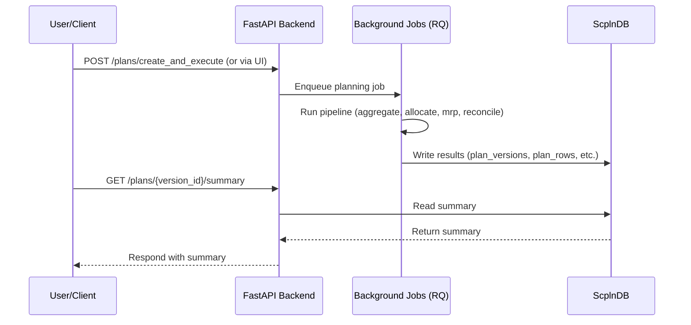

# 集約↔詳細 計画の統合・整合ガイド

本書の目的と範囲:

- 集約（AGG）と詳細（DET）を同一 `plan_version` で整合させるための設計・アルゴリズム・検証手順を体系化
- UI操作の流れは `docs/TUTORIAL-JA.md`、UX全体像は README の「Planning Hub」セクションで補完
- APIの呼び出し口は `docs/API-OVERVIEW-JA.md` を参照

ここでは保存則・カットオーバー・アンカー戦略・検証指針を詳細に扱い、README からリンクされる唯一の技術リファレンスとして整理しています。

## 目的・要件
- 一貫バージョン: 同一 `plan_version` に集約・詳細の両計画を格納し、相互参照・比較・整合を可能にする。
- 双方向整合:
  - 下り: 集約計画 → 詳細按分（制約・BOM・能力を考慮）
  - 上り: 詳細計画 → 集約ロールアップ（差異・残差の可視化）
- 境界整合: 直近（詳細）と先々（集約）の境目で、在庫・需要・バックログ・WIPが連続する。
- 保存則: 需要・供給・在庫収支のトータルは、レベル/粒度変換後も一致。
- 運用: 再現性（idempotency）、段階的な導入、計算時間の制御、監査可能なログ。

## Planning Hub 実行UXとRun API統一
- 単一入口で「編集→差分プレビュー→ドライラン→本適用→結果確認」を回せるよう、Run API (`POST /runs`) に実行経路を統合しています。
- 差分プレビューは需要・在庫・サービスレベル・MOQ/倍数・キャパシティ・PLを共通指標で提示し、ドライランの結果を確認した上で本適用へ遷移します。
- Planは `draft → aggregated → disaggregated → scheduled → executed` の状態遷移を持ち、上流タスクを編集すると下流成果物に「再生成待ち」フラグを立てます。
- 情報モデルはシナリオ（入力バージョン）、変更セット（ドラフト差分）、パイプライン（版管理DAG）、Run（シナリオ版×パイプライン版×条件）で構成し、監査ログ・アーティファクトをRun単位で保存します。
- UIからRun APIを呼ぶ際は、`mode=dry`（副作用なし）と `mode=apply`（確定書き込み）の二段階を標準化しています。



## 用語・前提
- レベル: `AGG`（集約）/`DET`（詳細）。
- 粒度: 時間（週・月 vs 日）、品目（ファミリ vs SKU）、場所（拠点/ネットワーク）。
- 境界日: `cutover_date`。`< cutover` は詳細、`≥ cutover` は集約を原則とする。
- 整合ウィンドウ: `recon_window_days`。境界前後の数日（例: ±3〜7日）で厳格整合を実施。

## データモデル（DB）
計画に関連する主要データは、以下のDBテーブルに正規化して格納されます。

- `plan_versions`: 計画バージョン全体のメタデータを管理します。
  - `version_id` (PK), `created_at`, `base_scenario_id`, `status`(draft/active/superseded), `cutover_date`, `recon_window_days`, `objective`, `note`。
- `plan_rows`: 計画の各行（タイムバケット、品目、拠点ごとの指標）を格納します。
  - 共通キー: `version_id`, `level`(AGG/DET), `time_bucket`(date or period), `item_key`(sku or family), `location_key`。
  - 指標: `demand`, `supply`, `prod_qty`, `ship_qty`, `inventory_open`, `inventory_close`, `backlog`, `capacity_used`, `cost_*`。
  - メタ: `source`(aggregate|allocate|mrp|recon|override), `lock_flag`, `quality_flag`。
- `reconciliation_log`: 整合性チェックの実行ログと差分詳細を記録します。
  - `version_id`, `window_start`, `window_end`, `delta_metric`, `delta_value`, `policy`, `run_id`, `summary`。

これらのデータは `POST /plans/create_and_execute` APIを通じて生成・永続化され、`GET /plans/{version_id}/...` APIで取得できます。

## Planningカレンダー仕様と活用
- 週境界や営業週の長さは Canonical設定内の `calendars` に `PlanningCalendarSpec` として保持します。各 `period` は `start_date` / `end_date` と `weeks[*]`（`week_code`, `sequence`, `start_date`, `end_date`, `weight`, 任意 `attributes`）を持ち、重み `weight` を比例配分に使用します。
- `planning_params` には `default_anchor_policy` や `recon_window_days` など、週配分と整合ステップで共通利用するパラメータを格納します。`core/config/models.PlanningCalendarSpec` が正規化したモデルを提供します。
- パイプライン各段（`allocate.py`, `mrp.py`, `reconcile.py`, `anchor_adjust.py`, `reconcile_levels.py`）は `scripts/calendar_utils` を通じて `planning_calendar.json` を読み込み、週順序・期間→週のマッピング・入荷日→週コード変換を共通化しました。
- Canonical設定から生成された `planning_calendar.json` が存在する場合、UI/API/CLI は `--calendar` を自動付与します。未提供の場合のみ `--weeks` で等分フォールバックを継続し、サマリー `inputs_summary.calendar_mode` に `fallback_weeks` を記録します。
- サンプルは `samples/planning/planning_calendar.json` に格納しており、ISO週跨ぎや5週月などの検証ケースを `tests/test_calendar_utils.py` でカバーしています。

## アーキテクチャとフロー
- フェーズ（標準）:
  1) Aggregate（粗粒度S&OP）
  2) Allocate（按分: 集約→詳細）
  3) MRP/CRPライト（詳細の資材・能力整合）
  4) Reconcile（詳細→集約ロールアップと差の解消）
  5) Report/KPI
- オーケストレーション: `plan_integrated(version_id, cutover_date, recon_window_days, policy)` を中核にDAG実行。
- 再実行: 入力/パラメタが同一なら同一 `version_id` で上書き可能（`lock_flag` がある行は保持）。

## 整合アルゴリズム（要点）
- 集約→詳細（Allocate）:
  - 時間粒度: 週/月→日配分（営業日/稼働日ウェイト、需要位相、リードタイム/キャパ制約）
  - 品目粒度: ファミリ→SKU配分（過去実績ミックス、プロモ、優先度、サービスレベル重み）
  - 丸め: `round=int|bankers`。残差は需要優先・在庫余力・コスト低の順に再配分。
- 詳細→集約（Roll-up）:
  - 同一 `version_id` のDETをロールアップし、AGGとの差分`Δ`を算出。
  - `|Δ| ≤ tol`（許容）なら採用。超過ならポリシー適用。
- ポリシー（例）:
  - `anchor=DET_near`：境界の前`N`日はDETを固定、AGG側を修正。
  - `anchor=AGG_far`：境界の後`M`期間はAGGを固定、DET側を再配分。
  - `blend`：整合ウィンドウでDET/AGGを重み付けブレンド（例: 三角重み）。
- 保存・連続条件:
  - 在庫連続: `INV_close(t-1) == INV_open(t)`（境界日に厳格チェック）。
  - 需要保存: 集約期間合計需要 = 詳細日合計需要。
  - 供給保存: 生産+調達+受入 = 出荷+在庫変動+廃棄。
  - バックログ連続: `BL_close(t-1) == BL_open(t)`。
- 制約反映:
  - 能力: 工程/リソース負荷を上限内に。DETでの超過はAGGに戻し抑制（mix見直し）。
  - BOM: 上位需要→下位展開量の整合、原材料在庫/リードタイム制約の逆伝播。

### 実装上の互換性と注意（PSI/分配・ロールアップ）

- 期間キーの互換（Aggregate.period と DETの対応）
  - 実装では、`(family, period)` の一致判定に以下を許容（いずれか一致で同一期間とみなす）：
    - `det.period == agg.period`（ISO週キー同士の一致、例: `2025-W03`）
    - `det.week == agg.period`（Aggregate側がISO週キーをperiodに持つ場合）
    - `_week_to_month(det.week) == agg.period`（週→月変換での一致、例: `2025-W01` → `2025-01`）
  - 目的: UI/CSV等で period 表記が `YYYY-MM` と `YYYY-Www` の混在でも、分配/ロールアップが途切れないようにするため。

- DETの供給フィールド名の互換
  - ロールアップ（reconcile_levels）では、DET側の供給は `supply` を優先、無ければ `supply_plan` を合算対象として使用。
  - PSI（detail）ではフィールド名 `supply_plan` を用いるため、AGGの `supply` と比較時は上記互換で集計される。

- 分配（Aggregate→Detail）の挙動
  - 標準は比例配分。重みは以下から選択（UI: weight_mode）
    - `current`（既存値比; 既存合計が0かつ目標>0のとき`equal`にフォールバック）
    - `equal`（等分）
    - `weights`（PSI Weightsに登録されたキー別重み; 合計0なら`current`へフォールバック）
    - 任意フィールド名（例: `demand`）を指定してその値比
  - ロック尊重: 行ロック/セルロックは分配対象外とし、未ロック行のみで再正規化して按分。
  - 丸め: フィールド別に丸め設定（nearest/floor/ceil + step）を適用可能。丸め後の残差は未ロック行で吸収する。

- トラブルシュートの要点（violationが残る/分配されない）
  - 期間キーの不一致: 上記互換が効くことを前提に、AggregateのperiodとDETのweek/period表記を確認。
  - ロック: Lock Managerで該当family×periodにロックが残っていないか確認。
  - 供給フィールド: DETが`supply_plan`のみでも合算される（reconcile_levels対応済）。
  - Tol: `tol_abs`/`tol_rel` を適切に設定して差分の性質を確認。
  - 認証: APIキー有効時は整合にも `X-API-Key` が必要（UIでは `localStorage.api_key`）。

### 現行ヒューリスティク（擬似コード）
- 週リスト `weeks` を `pre(<cutover)`, `at(=cutover月)`, `post(>cutover)` に分割。
- `adjust_segment(weeks, start_slack, start_spill, mode)` を用意。
  - `mode=forward`: 従来どおり spill を次週へ。slack も次週へ。
  - `mode=det_near|agg_far|blend`: 区間内で発生した spill を区間外へ吐き出し、戻り値 `end_spill` に集約。
- DET_near:
  - `pre=forward(…0,0) → at=det_near(start_slack=pre.slack, start_spill=pre.spill) → post=forward(start_slack=at.slack, start_spill=at.spill)`
- AGG_far:
  - `pre1=forward(…0,0) → at=agg_far(start_slack=pre1.slack, start_spill=pre1.spill)`
  - `pre2=forward(start_slack=0, start_spill=at.spill) → post=forward(start_slack=at.slack, start_spill=0)`
  - 採用: `pre=pre2` / `at` / `post`
- blend:
  - `pre1=forward(…0,0) → at=blend(start_slack=pre1.slack, start_spill=pre1.spill)`
  - `share_next =
      if --blend-split-next 指定: その値
      else: 週別 spill×近接重み（tri|lin|quad）から動的に算出（window内ほど大）`
  - `spill_prev=at.spill*(1-share_next), spill_next=at.spill*share_next`
  - `pre2=forward(start_slack=0, start_spill=spill_prev) → post=forward(start_slack=at.slack, start_spill=spill_next)`
  - 採用: `pre=pre2` / `at` / `post`

メモ:
- いずれも保存則（総量）は維持。`weekly_summary` に `zone/boundary_index/in_window_*` を付与し、境界の可視性を高める。
- 近接重み tri/lin は線形、quad は二次（近接を強調）。`win_w=ceil(window_days/7)` を半径に採用。

## 境界設計
- `cutover_date` 周辺の整合ウィンドウ `[cutover-W, cutover+W]` で以下を実施:
  - 前半（<cutover）: DET優先、AGGとの差分はAGGへ吸収（先々のmix/量を微調整）。
  - 後半（≥cutover）: AGG優先、DETの配分でAGGターゲットに合わせる。
  - 境界日: 在庫・バックログ・WIPの橋渡し（DETの`close`をAGGの`open`へ厳格一致）。
- 例外: 設備停止/販促等のイベントは境界で明示ロック（`lock_flag`）して上位/下位からの変更を禁止。

## 設定パラメタ（例）
- `cutover_date`: `YYYY-MM-DD`
- `recon_window_days`: `int`（既定: 7）
- `agg_time_bucket`: `week|month`、`det_time_bucket`: `day`
- `mix_source`: `history|manual|ml`
- `rounding`: `int|bankers`、`residual_policy`: `demand-priority|cost-min`
- `tol`: 許容誤差（相対/絶対）
- `anchor_policy`: `DET_near|AGG_far|blend`

## API/ジョブ（案）
- `POST /plans/create_and_execute`:
  - body: `{ version_id?, base_scenario_id, cutover_date, recon_window_days, params... }`
  - 実行: aggregate→allocate→mrp→reconcile。`version_id` を返却。
- `POST /plans/{version}/reconcile`（再整合のみ）
- `GET /plans/{version}/summary`（KPI・差分・整合ログ）
- `GET /plans/{version}/compare?level=AGG|DET`（ロールアップ比較）

## 入出力スキーマ（抜粋）
- 入力: 需要/在庫/能力/BOM/カレンダー/階層/ミックス。
- 出力: `AGG`/`DET` 計画配列＋整合ログ、KPI（サービスレベル、在庫回転、能力使用率、PL）。

## 検証・KPI
- ハードチェック: 在庫連続/保存、バックログ連続、能力超過なし。
- ソフトチェック: 期間別`Δ`、SKU×拠点×期間の偏差分布、丸め残差の最大/中央値。
- KPI: fill rate、backlog days、inventory turns、capacity util、COGS/variance。

## 実装ステップの概観
- 既存パイプラインに `version_id` を通し、DET→AGGロールアップ比較・整合ログ出力を追加。
- `cutover_date`・`recon_window_days`・`anchor_policy` を導入し、境界整合を実装。
- API/UI を統合して統合実行・差分可視化・ロック編集を提供。
- ヒューリスティクを高度化し、混雑コスト・優先度・サービスレベル最適化に対応。

## 失敗時リカバリ
- 仕様: idempotent再実行（同versionで一部上書き）。
- ロールバック: `status=superseded` で旧versionを保持し参照切替。
- ログ: `reconciliation_log` に差分とポリシー適用を記録。

## テスト指針
- 単体: 配分丸め/残差再配分、境界在庫連続、保存則、能力上限処理。
- 結合: サンプルデータで AGG⇄DET 差が tol 内に収まること、境界`open/close`一致。
- 退行: 既存の`aggregate→allocate→mrp→reconcile`が破壊されないこと。

## 付録: 最小例（イメージ）
- `cutover=2025-09-01`, `W=3`。
- 週次AGG需要: family=A, loc=TOKYO, 9/1週=700。
- 日次DET配分: sku=A1/A2、9/1..9/7で営業日ウェイト配分、能力・LTで微調整。
- ロールアップ: DET合計=700、差分=0、境界 8/31 close = 9/1 open を満たす。

---
既存スクリプト群（aggregate/allocate/mrp/reconcile）に `version_id` と `cutover`/`window` パラメタを順次付与し、整合ログを追加する実装を前提に統合整合を進めます。

## API実行と使い方

計画の生成と整合性チェックは、主に以下のAPIエンドポイントを通じて実行します。

- **一括実行:** `POST /plans/create_and_execute`
  - 計画パイプライン（集約、按分、MRP、整合）全体を実行し、結果をDBに保存します。
  - `cutover_date`や`anchor_policy`などのパラメータを指定することで、境界整合のロジックを制御できます。
  - **実行例:**
    ```bash
    curl -X POST http://localhost:8000/plans/create_and_execute -H 'Content-Type: application/json' -d '{
      "version_id": "v-demo-2",
      "cutover_date": "2025-09-01",
      "recon_window_days": 7,
      "anchor_policy": "DET_near",
      "apply_adjusted": true
    }'
    ```

- **結果の確認:**
  - `GET /plans/{version_id}/summary`: 整合結果のサマリ（KPI、差分概要）を取得します。
  - `GET /plans/{version_id}/compare`: AGG/DET間の詳細な差分リストを取得します。

- **UIでの確認:**
  - APIで生成された計画は、`/ui/plans/{version_id}`で視覚的に確認できます。
  - UI上からも同様のパラメータで計画を再実行したり、結果を比較したりすることが可能です。


