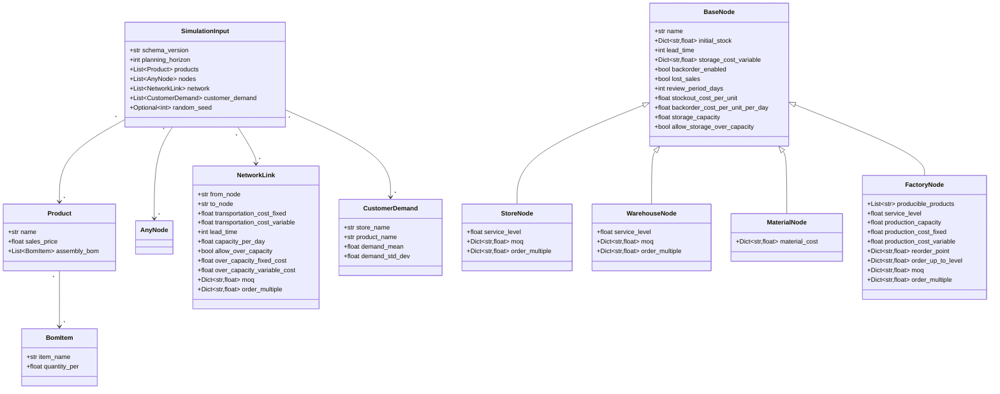
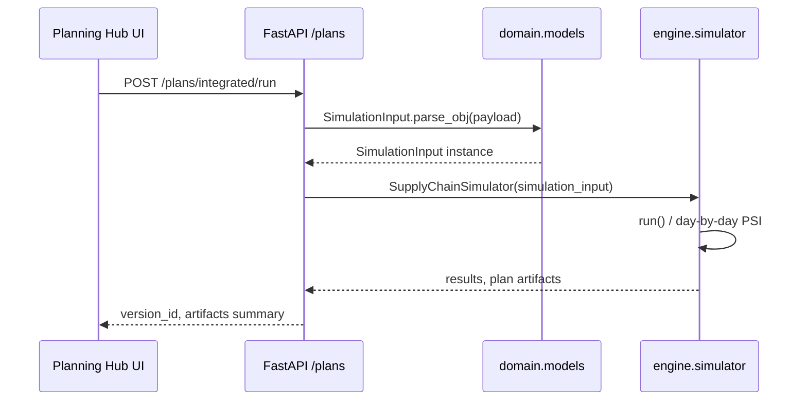
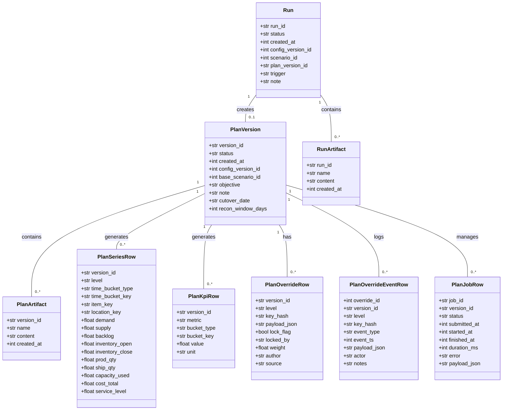

# Class Design Guide (SimulationInput family)

This document outlines the class structure for simulation input models and core engine components. The domain layer (`domain/models.py`) is the anchor, and engine usage patterns are described alongside it.

## Domain models (Pydantic)

### AnyNode discriminated union

`AnyNode` is a discriminated union (`Field(discriminator="node_type")`) that expands to `StoreNode`, `WarehouseNode`, `MaterialNode`, or `FactoryNode`. JSON payloads select the appropriate class based on `node_type`.

## Engine usage overview

## Extension guidelines

- To add new node types, inherit from `BaseNode`, assign a unique `node_type`, and include the class in the `AnyNode` union.
- When extending engine logic, either maintain `SimulationInput` schema compatibility or bump `schema_version` and implement compatibility handlers.
- The planning pipeline (aggregate / allocate / mrp / reconcile) exchanges JSON artifacts using the models above. Confirm consistency with `docs/AGG_DET_RECONCILIATION.md` when changing structures.

## Transaction model (Plan / Run)

Plans and runs are the core transactional entities that track simulation outputs, planning data, and operational history. They are persisted across multiple SQLite tables.

### Class diagram

### Entity descriptions

#### PlanVersion
Metadata for managing plan versions:
- `version_id`: unique plan ID.
- `status`: current state (e.g., active, archived).
- `created_at`: UNIX timestamp.
- `config_version_id`: configuration version used.
- `base_scenario_id`: originating scenario ID.
- `objective`: plan objective.
- `note`: free-form memo.
- `cutover_date`: cutover date.
- `recon_window_days`: reconciliation window in days.

#### PlanArtifact
Stores detailed data (JSON, etc.) linked to a plan version:
- `version_id`: associated plan ID.
- `name`: artifact name (e.g., `aggregate.json`, `sku_week.json`).
- `content`: serialized artifact content.
- `created_at`: timestamp.

#### PlanSeriesRow
Holds time-series planning data (PSI metrics):
- `version_id`: associated plan ID.
- `level`: aggregation level (e.g., aggregate, det).
- `time_bucket_type`: bucket type (week, month, etc.).
- `time_bucket_key`: bucket key (e.g., `2023-W01`, `2023-01`).
- `item_key`: item identifier.
- `location_key`: location identifier.
- `demand`: demand quantity.
- `supply`: supply quantity.
- `backlog`: backlog quantity.
- `inventory_open`: opening inventory.
- `inventory_close`: closing inventory.
- `prod_qty`: production quantity.
- `ship_qty`: shipment quantity.
- `capacity_used`: utilized capacity.
- `cost_total`: total cost.
- `service_level`: service level.

#### PlanKpiRow
Stores KPIs for a plan:
- `version_id`: associated plan ID.
- `metric`: KPI name (e.g., `total_cost`, `service_level_avg`).
- `bucket_type`: aggregation bucket type.
- `bucket_key`: aggregation bucket key.
- `value`: KPI value.
- `unit`: KPI unit.

#### PlanOverrideRow
Represents the current state of manual overrides:
- `version_id`: associated plan ID.
- `level`: override level (aggregate, det, etc.).
- `key_hash`: hash identifying the override target.
- `payload_json`: override payload.
- `lock_flag`: whether the override is locked.
- `locked_by`: user who locked it.
- `weight`: weight used for allocation logic.
- `author`: override creator.
- `source`: origin of the override.

#### PlanOverrideEventRow
Audit log for manual overrides:
- `override_id`: ID of the related `PlanOverrideRow`.
- `version_id`: associated plan ID.
- `level`: event level.
- `key_hash`: target hash.
- `event_type`: event type (e.g., edit, lock, unlock).
- `event_ts`: event timestamp (UNIX).
- `payload_json`: detailed payload.
- `actor`: user who performed the event.
- `notes`: additional notes.

#### PlanJobRow
Metadata for plan execution jobs:
- `job_id`: unique job ID.
- `version_id`: associated plan ID.
- `status`: job status (pending, running, completed, failed, etc.).
- `submitted_at`: submission timestamp.
- `started_at`: start timestamp.
- `finished_at`: finish timestamp.
- `duration_ms`: runtime in milliseconds.
- `error`: error message.
- `payload_json`: job payload.

#### Run
Metadata for simulations:
- `run_id`: unique run ID.
- `status`: current state.
- `created_at`: creation timestamp.
- `config_version_id`: configuration version used.
- `scenario_id`: scenario ID used.
- `plan_version_id`: plan version produced by the run.
- `trigger`: execution trigger.
- `note`: run memo.

#### RunArtifact
Stores artifacts related to a run:
- `run_id`: associated run ID.
- `name`: artifact name.
- `content`: artifact content.
- `created_at`: timestamp.
