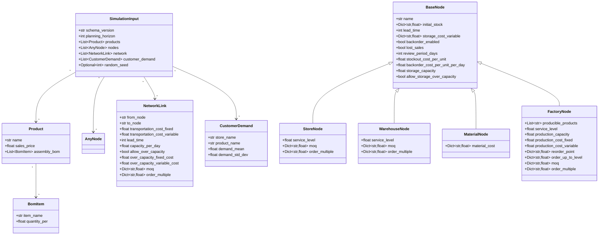
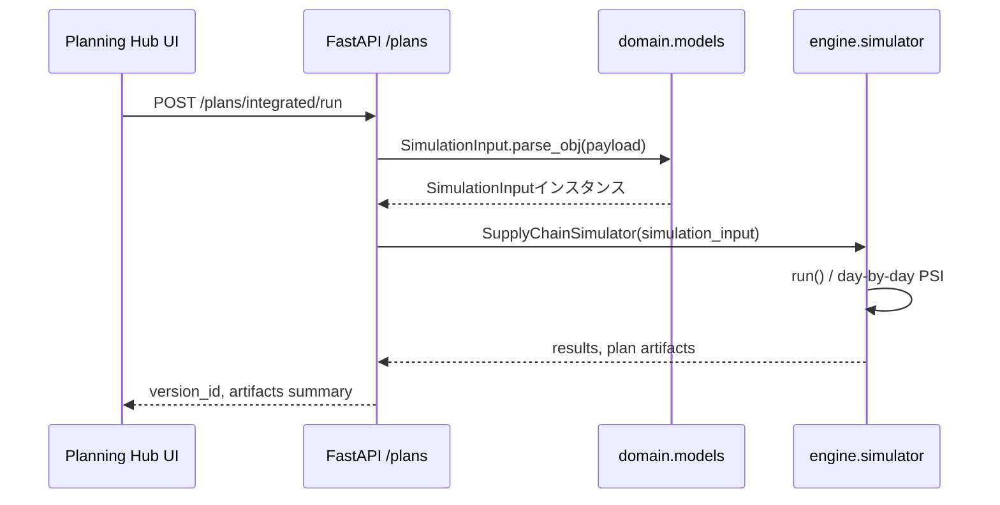

# クラス設計ガイド（SimulationInput系）

本ドキュメントは、シミュレーション入力モデルおよび主要なエンジン構成要素のクラス構造を示します。ドメイン層（`domain/models.py`）を基点とし、エンジン層での利用イメージも併記します。

## ドメインモデル（Pydantic）

### AnyNode 判別型

`AnyNode` は `StoreNode` / `WarehouseNode` / `MaterialNode` / `FactoryNode` の判別型 (`Field(discriminator="node_type")`) で定義されています。JSON入力では `node_type` に応じて適切なクラスが選択されます。

## エンジン利用イメージ

## 拡張時の指針

- ノード種別を追加する場合は `BaseNode` を継承し `node_type` を固有値で定義、`AnyNode` の Union に追加してください。
- エンジン側で計算ロジックを拡張する際は `SimulationInput` のスキーマ互換を維持するか、`schema_version` を更新し互換コードを実装してください。
- 計画パイプライン（aggregate / allocate / mrp / reconcile）は上記モデルをJSONアーティファクトとしてやり取りします。構造変更時は `docs/AGG_DET_RECONCILIATION_JA.md` との整合を確認してください。
