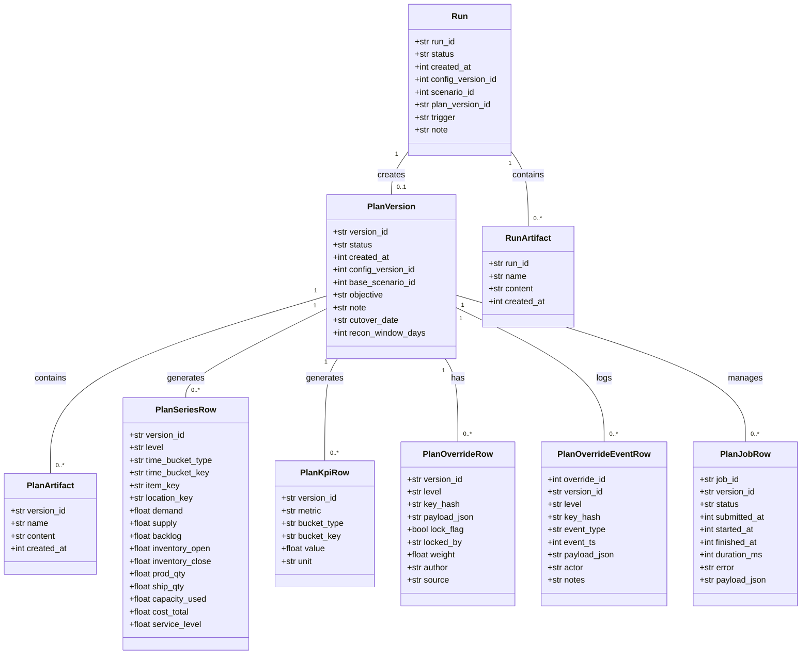

# クラス設計ガイド（SimulationInput系）

本ドキュメントは、シミュレーション入力モデルおよび主要なエンジン構成要素のクラス構造を示します。ドメイン層（`domain/models.py`）を基点とし、エンジン層での利用イメージも併記します。

## ドメインモデル（Pydantic）

### AnyNode 判別型

`AnyNode` は `StoreNode` / `WarehouseNode` / `MaterialNode` / `FactoryNode` の判別型 (`Field(discriminator="node_type")`) で定義されています。JSON入力では `node_type` に応じて適切なクラスが選択されます。

## エンジン利用イメージ

## 拡張時の指針

- ノード種別を追加する場合は `BaseNode` を継承し `node_type` を固有値で定義、`AnyNode` の Union に追加してください。
- エンジン側で計算ロジックを拡張する際は `SimulationInput` のスキーマ互換を維持するか、`schema_version` を更新し互換コードを実装してください。
- 計画パイプライン（aggregate / allocate / mrp / reconcile）は上記モデルをJSONアーティファクトとしてやり取りします。構造変更時は `docs/AGG_DET_RECONCILIATION_JA.md` との整合を確認してください。

## トランザクションモデル（Plan / Run）

PlanとRunは、シミュレーションの実行結果や計画データ、およびそれらに対する操作履歴を管理する主要なトランザクションエンティティです。これらは主にSQLiteデータベースの複数のテーブルに分散して格納されます。

### クラス図

### 各エンティティの説明

#### PlanVersion
計画のバージョン管理を行うためのメタデータ。
- `version_id`: 計画の一意なID。
- `status`: 計画の現在の状態（例: active, archived）。
- `created_at`: 作成日時（UNIXタイムスタンプ）。
- `config_version_id`: 計画が使用した設定のバージョンID。
- `base_scenario_id`: 計画のベースとなったシナリオID。
- `objective`: 計画の目的。
- `note`: 計画に関するメモ。
- `cutover_date`: カットオーバー日。
- `recon_window_days`: 再調整期間（日数）。

#### PlanArtifact
各PlanVersionに関連する詳細なデータ（JSON形式など）を格納します。
- `version_id`: 関連する計画のバージョンID。
- `name`: アーティファクトの名前（例: aggregate.json, sku_week.json）。
- `content`: アーティファクトの内容（JSON文字列など）。
- `created_at`: 作成日時。

#### PlanSeriesRow
時系列の計画データ（PSI: Production, Sales, Inventoryなど）を格納します。
- `version_id`: 関連する計画のバージョンID。
- `level`: データの集計レベル（例: aggregate, det）。
- `time_bucket_type`: 時間バケットのタイプ（例: week, month）。
- `time_bucket_key`: 時間バケットのキー（例: 2023-W01, 2023-01）。
- `item_key`: 品目キー。
- `location_key`: ロケーションキー。
- `demand`: 需要量。
- `supply`: 供給量。
- `backlog`: バックログ量。
- `inventory_open`: 期首在庫。
- `inventory_close`: 期末在庫。
- `prod_qty`: 生産量。
- `ship_qty`: 出荷量。
- `capacity_used`: 使用キャパシティ。
- `cost_total`: 総コスト。
- `service_level`: サービスレベル。

#### PlanKpiRow
計画の主要業績評価指標（KPI）を格納します。
- `version_id`: 関連する計画のバージョンID。
- `metric`: KPIの名称（例: total_cost, service_level_avg）。
- `bucket_type`: KPIの集計バケットタイプ。
- `bucket_key`: KPIの集計バケットキー。
- `value`: KPIの値。
- `unit`: KPIの単位。

#### PlanOverrideRow
計画に対する手動調整（オーバーライド）の現在の状態を格納します。
- `version_id`: 関連する計画のバージョンID。
- `level`: オーバーライドのレベル（例: aggregate, det）。
- `key_hash`: オーバーライド対象を一意に識別するハッシュキー。
- `payload_json`: オーバーライドの内容（JSON文字列）。
- `lock_flag`: ロックされているかどうかのフラグ。
- `locked_by`: ロックしたユーザー。
- `weight`: 分配計算などに使用される重み。
- `author`: オーバーライドの作成者。
- `source`: オーバーライドのソース。

#### PlanOverrideEventRow
計画に対する手動調整（オーバーライド）の履歴（監査ログ）を格納します。
- `override_id`: 関連するPlanOverrideRowのID。
- `version_id`: 関連する計画のバージョンID。
- `level`: イベントのレベル。
- `key_hash`: イベント対象のハッシュキー。
- `event_type`: イベントのタイプ（例: edit, lock, unlock）。
- `event_ts`: イベント発生日時（UNIXタイムスタンプ）。
- `payload_json`: イベントの詳細内容（JSON文字列）。
- `actor`: イベントを実行したユーザー。
- `notes`: イベントに関するメモ。

#### PlanJobRow
計画の実行ジョブに関するメタデータを格納します。
- `job_id`: ジョブの一意なID。
- `version_id`: 関連する計画のバージョンID。
- `status`: ジョブのステータス（例: pending, running, completed, failed）。
- `submitted_at`: ジョブが投入された日時。
- `started_at`: ジョブが開始された日時。
- `finished_at`: ジョブが終了した日時。
- `duration_ms`: ジョブの実行時間（ミリ秒）。
- `error`: エラーメッセージ。
- `payload_json`: ジョブのペイロード（JSON文字列）。

#### Run
シミュレーション実行のメタデータ。
- `run_id`: 実行の一意なID。
- `status`: 実行の現在の状態。
- `created_at`: 作成日時。
- `config_version_id`: 実行が使用した設定のバージョンID。
- `scenario_id`: 実行が使用したシナリオID。
- `plan_version_id`: 実行によって生成された計画のバージョンID。
- `trigger`: 実行のトリガー。
- `note`: 実行に関するメモ。

#### RunArtifact
各Runに関連する詳細なデータ（JSON形式など）を格納します。
- `run_id`: 関連する実行のID。
- `name`: アーティファクトの名前。
- `content`: アーティファクトの内容。
- `created_at`: 作成日時。
