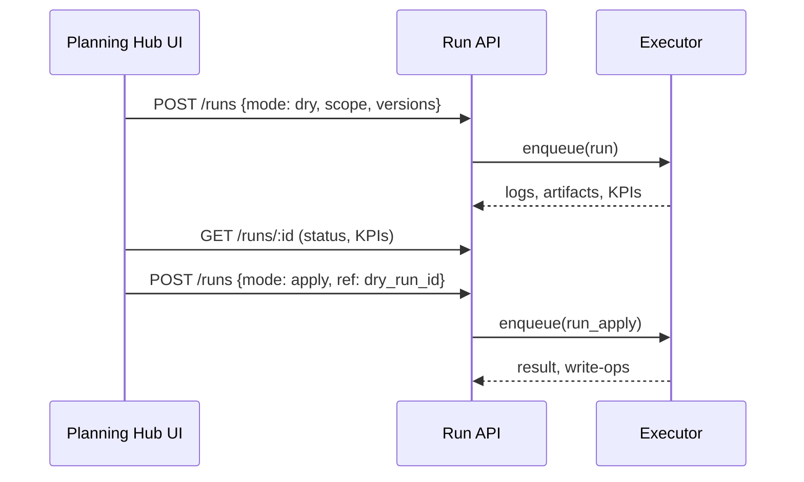
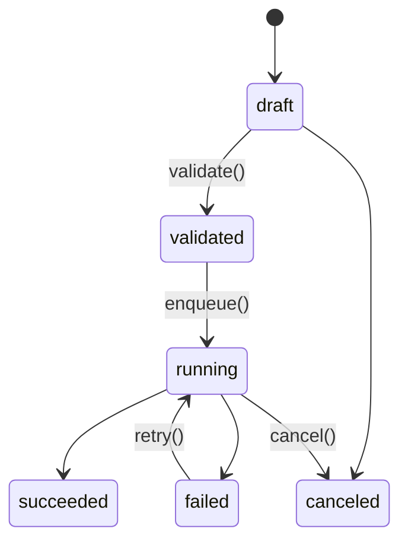

# Planning Hub: 計画立案と変更の統合UX 改修計画

本ドキュメントは、計画立案の入口が分散（Home実行/パイプライン実行/ジョブ実行）している現状を、単一の「Planning Hub」体験へ統合するための設計方針・移行計画・進捗管理をまとめたものです。以後の実装・検証・移行の基準とします。

## 背景と課題
- 入口が3つに分散し、目的差が曖昧で学習コストが高い。
- 実行と変更（編集）が分断され、何が変わるかの見通しが立ちにくい。
- 履歴・失敗時の再現性・再実行経路が分散し、運用負荷が高い。

## 目標（何を達成するか）
- 単一入口で「編集→差分確認→実行→結果確認」を一貫体験化。
- 実行前に差分/KPI影響を可視化し、安全に適用（ドライラン→本適用）。
- 実行経路を単一のRun API/状態機械に統一し、観測性と再現性を担保。

## UX原則（設計指針）
- 単一入口、文脈一貫、1アクション実行、後戻り可能。
- 差分プレビューを標準化（需要・在庫・発注・SL・制約・PL）。
- 用語の統一：シナリオ、パイプライン、タスク、ラン、変更セット、バージョン。

## 情報モデル（単一モデル）
- シナリオ：需要/在庫/政策/制約の構成とそのバージョン。
- 変更セット（Change set）：シナリオに対する差分（ドラフト→レビュー→適用/破棄）。
- パイプライン：版管理されたDAG（例：需要→供給→在庫→KPI→公開）。
- ラン（Run）：シナリオ版 × パイプライン版 × 条件（期間/スコープ/環境）。
- 監査：入力スナップショット、ログ、KPI差分、アーティファクト（CSV/画像等）。

### Plan中核コンセプト（追補）
- 中核オブジェクトを「Plan」として定義（Config/Run/JobをPlanに紐づけ集約）。
- Plan.state 遷移：`draft → aggregated → disaggregated → scheduled → executed`。
- 上位ステップ編集時は下位生成物を invalid（要再生成）としてマーキング。
- 旧来の「シナリオ＋変更セット」は Plan 内の編集・ドラフト管理として包含する。

```mermaid
flowchart LR
  A[編集: 変更セット(ドラフト)] --> B[バリデーション]
  B -->|OK| C[差分/KPIプレビュー]
  B -->|NG| A
  C --> D{実行モード}
  D -->|ドライラン| E[Run作成(副作用なし)]
  D -->|本適用| F[Run作成(Write適用)]
  E --> G[結果/KPI比較]
  F --> G
  G --> H{適用}
  H -->|承認/適用| I[バージョン確定]
  H -->|破棄| A
```

## 画面設計（Planning Hub）
- ヘッダ：シナリオ選択（版/タグ/環境）、期間/スコープ、テンプレ選択。
- タブ：
  - 設定：需要・政策・制約の編集（ドラフト）。バリデーションとテンプレ適用。
  - パイプライン：DAG可視化、範囲（全体/選択/このタスク以降）の指定。
  - プレビュー：変更セット差分（在庫ポジ/発注量/SL/MOQ/キャパ/PL）と影響ハイライト。
  - 実行/結果：進捗、ログ、所要時間、KPI比較、再実行/再開、成果物DL。
- 右ペイン：実行オプション（ドライラン/本番適用、スケジュール、承認）、主ボタン「実行」。
- 履歴：フィルタ（シナリオ/期間/結果）、固定リンク、再現/再実行。

### 追加：Plan Studio/Workspace（追補）
- ルート：
  - Plan Studio（一覧）: `/ui/plans`（検索/フィルタ/「+ 新規Plan」）
  - Plan Workspace（詳細）: `/ui/plans/{id}`
- Plan Workspace 構成：左サイドにステップナビ、右に内容＋右上アクション。
  - ステップ：Overview / Aggregate / Disaggregate / Schedule / Execute / Results
  - 右上固定アクション：Save / Validate / Plan & Run / More…

## 実行モデル/API統一
- すべての実行をRun APIへ集約：`POST /runs`、`GET /runs/:id`、`GET /runs/:id/logs`、`PATCH /runs/:id {cancel}`。
- 単一タスク実行＝部分ラン（diagnostic）として同APIに記録・可視化。
- ドライラン→差分/KPI確定→本適用（Write）の2段階を標準化。
- 実行はスナップショット（copy-on-write）で行い、公開時にトランザクション適用。



### Run API 仕様ドラフト（P-15）
- エンドポイント
  - `POST /runs`（新規ラン作成）
    - body: `{ mode: 'dry'|'apply'|'partial', scenario_id?, plan_version?, pipeline?: 'integrated'|'aggregate'|'allocate'|'mrp'|'reconcile', scope?: {...}, options?: {...} }`
    - options例: `{ weeks, lt_unit, cutover_date, recon_window_days, anchor_policy, tol_abs, tol_rel, calendar_mode, carryover, carryover_split, apply_adjusted }`
  - `GET /runs`（一覧・フィルタ）: `?scenario_id&config_id&offset&limit&sort=started_at&order=desc`
  - `GET /runs/{id}`（詳細）
  - `GET /runs/{id}/artifacts`（一覧）/ `GET /runs/{id}/{name}`（個別CSV/JSON）
  - `POST /runs/{id}/retry`（再実行）/ `POST /runs/{id}/cancel`（キャンセル）
  - `GET /runs/{id}/logs`（ログストリーム/テキスト、将来WebSocket）
- 状態機械
  - `draft → queued → running → succeeded|failed|canceled`
  - `failed → queued`（retry）
- 設計方針
  - 既存`/plans/integrated/run`（同期）と`/planning/run_job`（非同期）を`POST /runs`へ段階的に吸収。
  - ドライランはアーティファクト保存（DB/FS）と副作用（書込）の分離旗付けで実装。
  - partialは`pipeline`＋`scope`指定で単一/中間タスクの検証を許容。
  - 互換: 既存UIからは当面アダプタで透過的に移行。


## Execute/Results/Validate 仕様（追補）
- Execute：Run Now（同期）/ Queue Job（非同期）を同一フォームに統合。オプションは `random_seed`, `include_trace`, `plan_id`, `config_id` を保持。
- Results：KPI（fill_rate/profit/penalty など）＋ Plan Adherence（数量達成率/納期遵守/容量超過）＋ Compare 導線。
- Validate：量的整合性（Plan→Aggregation→Disaggregation→Schedule）と容量/MOQ/倍数の逸脱量を可視化（警告/ブロック判定）。
- クイック実行：Plan & Run（未実施ステップはデフォルト自動生成→即時実行、後から明示編集で上書き可能）。

## データモデル（差分提案）
> 既存テーブルは維持。必要最小限の追補のみ。
- `plans`（新規）：`id, name, state, config_id, horizon_days, tags_json, created_at, updated_at`。
- `plan_steps`（任意）：各状態の到達タイムスタンプ（aggregated_at など）。
- `runs`：`plan_id` FK を追加し、Run→Plan を明確に紐づけ。

## 移行計画（段階的・互換性重視）
- P1（併存期）：
  - Planning Hubを追加。既存3入口はHubへ案内（非破壊リダイレクト/トースト）。
  - バックエンドはRun APIに内部統一（既存経路はアダプタで接続）。
  - 計測を導入（入口別到達時間、クリック数、離脱率）。
- P2（統合期）：
  - パイプライン/ジョブ画面の要素をHubタブ内へ集約。
  - 既存3入口を非推奨化し、リンク先はHub内セクションへ。
- P3（整理期）：
  - Home実行エントリの撤去。ブックマーク互換の一時リダイレクト維持。
  - ドキュメント/チュートリアル/ヘルプを更新。用語を統一。

## MVPスコープ（最小で価値を出す）
- Run API統一（ドライラン/本適用/部分ラン）。
- Hubの「設定/パイプライン/実行」タブと主CTA統一。
- 差分/KPIプレビュー（在庫・発注・SLの主要指標）。
- 履歴/固定リンク/失敗時の再実行と簡易ログ。
- README更新（動線、用語、手順）。

## 将来拡張（次期）
- 承認ワークフロー（RBAC/レビュー）、スケジュール実行、WebSocketライブ更新。
- テンプレートギャラリー、パイプラインYAML編集と版固定。
- KPIウォーターフォール、制約違反の根因ナビ、PL影響の感度分析。

## KPI（効果検証）
- 入口選択の迷い時間/クリック数/離脱率の低下。
- ドライラン比率の上昇と本番失敗率の低下。
- 初回ラン作成時間と再実行時間の短縮。
- 「どこから実行すべきか」系サポート件数の減少。

### 計測イベント（追補）
- `plan_created`, `plan_validated`, `plan_auto_completed`, `plan_executed`, `plan_results_viewed`, `legacy_redirect_hit`

## リスクと対策
- 運用の混乱：段階移行、リダイレクト、ガイド/ツアー提示。
- 内部差異の露呈：Run APIで統一しアダプタ吸収、段階的デプリケーション。
- パフォーマンス：ドライランはサンプリング/集約、重計算は非同期化。

---

## 進捗管理（チェックリスト）

### マイルストーンとタスク

#### P1 併存期（Hub導入 + API統一）
- [x] P-01 `/ui/plans` 一覧（作成ボタン/検索）
- [x] P-02 新規Planダイアログ（Config選択/名称/期間）
- [x] P-03 `/ui/plans/{id}` 骨格（タブ/アクションバー）
- [x] P-04 Executeタブ：Run Now/Queue Job 統合
- [x] P-06 Home→Plan リダイレクト & バナー
- [x] P-15 Run API仕様ドラフト（エンドポイント/ペイロード/状態機械）
- [x] P-16 既存3入口→Run APIアダプタ実装（内部経路統一）
  - 実装: `POST /runs`（adapter）を追加。`pipeline=integrated` を `/plans/integrated/run`（同期）/ `JOB_MANAGER.submit_planning`（非同期）へ委譲。
- [ ] P-18 差分/KPIプレビューUI（MVP: 在庫・発注・SL）
  - 実装: Plans詳細のOverviewにMVP KPIカード（能力合計/負荷合計/能力利用率/スピル合計/違反件数）を表示。
  - 進捗: 2025-09-07 完了。`/ui/plans/{id}` で `kpi_preview` を表示（capacity_total/adjusted_total/util_pct/spill_in_total/spill_out_total/viol_before/viol_after/det_demand_total/det_supply_total/det_backlog_total/sl_pct/inv_initial_total/window_days/anchor_policy）。
  - 備考: `plan_final.weekly_summary` と `reconciliation_log(_adjusted).json`、`mrp.json` から軽量集計。データ欠落時はフェイルセーフで非表示。
- [x] P-19 計測イベント仕込み（到達時間/クリック/離脱）
  - 実装: `legacy_redirect_hit`（/→/ui/plans）, `plan_created`（/ui/plans/run, /runs 同期）, `run_queued`（/runs 非同期）, `plan_results_viewed`（/ui/plans/{id}）, `plan_executed`（再整合）を JSON ログ出力
- [x] P-20 README/ヘルプ更新（新動線の案内）

#### P2 統合期（画面統合 + 非推奨化）
- [ ] P-07 Aggregateタブ移植
- [ ] P-08 Disaggregateタブ移植
- [ ] P-09 Scheduleタブ移植（予定オーダ生成）
- [ ] P-21 既存リンクの非推奨バナー・Hub内セクションへの誘導
  - 進捗: 2025-09-07 レガシー画面 `/ui/planning` に非推奨バナーとHub誘導を追加。任意の「次回から自動でPlanning Hubに移動」設定（localStorage）を実装。ナビゲーション上のリンク整理は別途。
  - 進捗: 2025-09-07 ナビゲーションを整理。`/ui/planning` を「集約/詳細計画（レガシー）」、`/ui/plans` を「Planning Hub（推奨入口）」として明示（title属性で補足）。
- [ ] P-22 履歴・固定リンクの強化（フィルタ/再実行/共有）
  - 進捗: 2025-09-07 `/ui/plans` 一覧に固定リンクのコピー機能（summary/compare/violationsのURLをワンクリックでコピー）を追加。検索フィルタの入力値をlocalStorageに保存し、一覧再訪時に復元。
  - 進捗: 2025-09-07 `/ui/plans/{id}` 詳細に固定リンクのコピー（summary/compare/violations/carryover）と「最新2件Runの metrics/diffs 比較リンク」のコピーを追加。
  - 進捗: 2025-09-07 `/ui/plans` 一覧に簡易ソート（status/created_at/violations）を追加。選択ソートをlocalStorageへ保存。
  - 進捗: 2025-09-07 `/ui/plans` 一覧に「copy all」を追加（summary/compare(rel)/violations(abs) の3リンクを一括コピー）。ソート対象に policy を追加。既存の列インデックス不整合を修正（created_at/violations）。
  - 進捗: 2025-09-07 `/ui/plans/{id}` 詳細に「copy all」を追加（summary/compare(rel/abs)/carryover を一括コピー）。一覧のソート対象に cutover を追加。

#### P3 整理期（旧入口撤去 + ドキュメント）
- [ ] P-11 Plan & Run（自動補完）
- [ ] P-12 state 遷移/Invalidation 実装
- [ ] P-13 KPI/テレメトリ導入
- [ ] P-14 旧画面クローズ & 404 ガイド（Home実行エントリ撤去 + 一時リダイレクト含む）
- [ ] P-23 用語統一（UI/README/APIドキュメント）
- [ ] P-24 チュートリアル/ハンズオン更新

### ステータス基準
- 未着手 / 進行中 / レビュー中 / 完了（必要に応じラベル運用）

### 所属・責任（例）
- PM/UX：要件・KPI・ワイヤー承認
- BE：Run API・アダプタ・実行基盤
- FE：Hub実装・プレビューUI・履歴
- QA：検証計画・回帰テスト

### 成果物/レビュー項目
- ワイヤー図、API仕様書（OpenAPI草案可）、差分プレビュー要件、計測イベント一覧、移行計画メモ。

## WBS / タスク一覧（追補）
> ステータス: ☐ 未着手 / ◐ 進行中 / ✔ 完了

| ID | タスク | スプリント | 優先 | 状態 | 担当 | 期日 |
|---|---|---:|:---:|:---:|:---:|:---:|
| P-01 | `/ui/plans` 一覧（作成ボタン/検索） | S1 | P1 | ✔ | miumigy | 2025-09-14 |
| P-02 | 新規Planダイアログ（Config選択/名称/期間） | S1 | P1 | ✔ | miumigy | 2025-09-14 |
| P-03 | `/ui/plans/{id}` 骨格（タブ/アクションバー） | S1 | P1 | ✔ | miumigy | 2025-09-14 |
| P-04 | Executeタブ：Run Now/Queue Job 統合 | S1 | P1 | ✔ | miumigy | 2025-09-14 |
| P-06 | Home→Plan リダイレクト & バナー | S1 | P1 | ✔ | miumigy | 2025-09-14 |
| P-16 | 既存3入口→Run APIアダプタ実装（統一） | S1 | P1 | ✔ | miumigy | 2025-09-14 |
 | P-05 | Resultsタブ：最新Run表示＆Compare導線 | S1 | P2 | ✔ | miumigy | 2025-09-14 |
| P-07 | Aggregateタブ移植 | S2 | P1 | ☐ | miumigy | 2025-09-21 |
| P-08 | Disaggregateタブ移植 | S2 | P1 | ☐ | miumigy | 2025-09-21 |
| P-09 | Scheduleタブ移植（予定オーダ生成） | S2 | P1 | ☐ | miumigy | 2025-09-21 |
| P-10 | Validate（量・容量・MOQ/倍数） | S2 | P2 | ☐ | miumigy | 2025-09-21 |
| P-11 | Plan & Run（自動補完） | S3 | P1 | ☐ | miumigy | 2025-09-28 |
| P-12 | state 遷移/Invalidation 実装 | S3 | P1 | ☐ | miumigy | 2025-09-28 |
| P-13 | KPI/テレメトリ導入 | S3 | P2 | ☐ | miumigy | 2025-09-28 |
| P-14 | 旧画面クローズ & 404 ガイド | S3 | P2 | ☐ | miumigy | 2025-09-28 |
| P-15 | Run API仕様ドラフト（EP/ペイロード/状態機械） | S1 | P1 | ✔ | miumigy | 2025-09-14 |
| P-16 | 既存3入口→Run APIアダプタ実装（統一） | S1 | P1 | ✔ | miumigy | 2025-09-14 |
| P-18 | 差分/KPIプレビューUI（MVP: 在庫・発注・SL） | S1 | P1 | ✔ | miumigy | 2025-09-14 |
| P-19 | 計測イベント仕込み（到達時間/クリック/離脱） | S1 | P2 | ✔ | miumigy | 2025-09-14 |
| P-20 | README/ヘルプ更新（新動線の案内） | S1 | P2 | ✔ | miumigy | 2025-09-14 |
| P-21 | 非推奨バナー・Hub内セクション誘導 | S2 | P2 | ☐ | miumigy | 2025-09-21 |
| P-22 | 履歴/固定リンクの強化（フィルタ/再実行/共有） | S2 | P2 | ☐ | miumigy | 2025-09-21 |
| P-23 | 用語統一（UI/README/APIドキュメント） | S3 | P2 | ☐ | miumigy | 2025-09-28 |
| P-24 | チュートリアル/ハンズオン更新 | S3 | P2 | ☐ | miumigy | 2025-09-28 |

## 受入テスト（AT・E2E観点）
- AT-01: `/ui/plans` から Plan 作成→Execute→Results 一連が完了。
- AT-02: Home の「実行」導線→Plan 作成へ誘導。
- AT-03: 旧パイプラインURL→Plan該当タブへリダイレクト。
- AT-04: 未完ステップでも Plan & Run で実行可能（自動補完ログ確認）。
- AT-05: Validate が主要不整合を検知・表示。
- AT-06: Compare に Plan 紐づきで遷移可能。
- AT-07: KPI 計測イベントが発火し、ダッシュで集計可能。

## ロールアウト計画・コミュニケーション（追補）
- アナウンスノート（README/CHANGELOG/お知らせバナー）。
- 30秒ツアー（GIF または3ステップガイド）。
- 旧UIからの移行ガイド（FAQ：どこに行った？どうやる？）。

## 文言（UIコピーガイド）
- 新規作成: 「計画をはじめる（Create Plan）」
- 保存: 「保存（Save）」 / 検証: 「整合性チェック（Validate）」
- 実行: 「計画どおり実行（Plan & Run）」/「ジョブとして実行（Queue Job）」
- 逸脱: 「計画との乖離（Plan Adherence）」/「容量超過（Overage）」

### 付録：UIワイヤ（簡易）
```
/ui/plans/{id}
┌───────────────┬────────────────────────────┐
│  Steps         │  [Plan Name]  [Save] [Validate] [Plan&Run] │
│  - Overview ✓  │────────────────────────────────────────────│
│  - Aggregate   │  <Tab content>                             │
│  - Disaggregate│                                            │
│  - Schedule    │                                            │
│  - Execute     │  Run Now / Queue Job フォーム               │
│  - Results     │  KPI / Plan Adherence / Compare            │
└───────────────┴────────────────────────────┘
```

---

## 付録

### 用語
- シナリオ：計画対象データの論理セットと版。
- 変更セット：シナリオへの差分（ドラフト→レビュー→適用/破棄）。
- パイプライン：計算DAG。ノード＝タスク。
- ラン：パイプラインの一回の実行（ドライ/本適用/部分）。

### 参考：状態機械（Run）



### 変更履歴
- 2025-09-07: 初版作成（MVP範囲、移行P1–P3、進捗管理）
